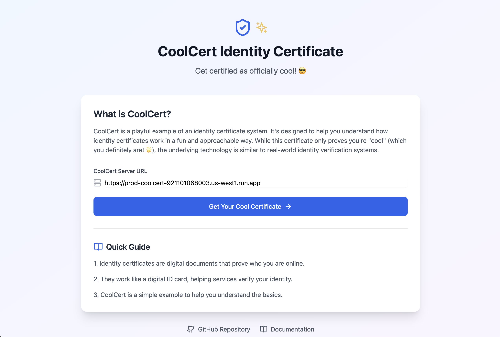
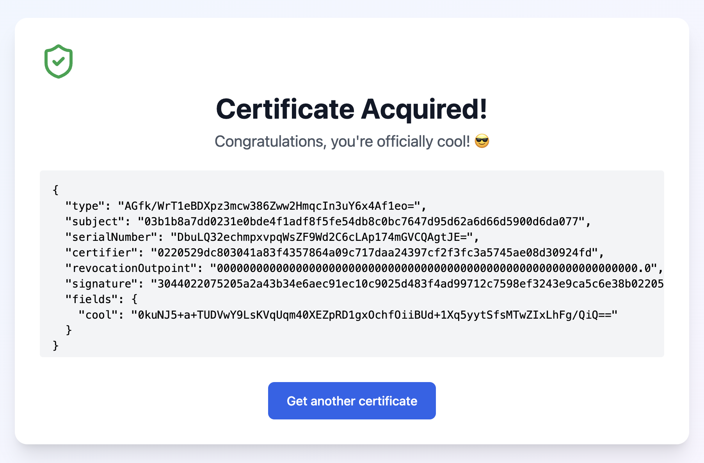

# CoolCert Onboarding Guide

**Status:** Production
**Last Updated:** October 2025
**Contact/Support:** [Babbage Systems](https://coolcert.babbage.systems/) | [GitHub](https://github.com/p2ppsr)

---

## 1. What Is CoolCert?

CoolCert is a playful yet functional identity certification system built on the BSV blockchain. It demonstrates how digital identity certificates can be issued and verified using blockchain-backed attestation. While the "cool" certificate is lighthearted, the underlying technology showcases real-world identity verification suitable for serious applications.

**Key Features:**
- **Digital Identity Certificates** - Issue blockchain-backed identity proofs
- **Blockchain Verification** - Cryptographically verifiable certificates
- **Integration Ready** - Use certificates with other BSV applications
- **API Access** - Programmatic certificate issuance and verification
- **Educational Example** - Learn blockchain identity concepts through hands-on experience
- **GitHub Documentation** - Open-source code for learning and development

**Target Users:** Developers learning blockchain identity systems, users needing identity verification for BSV applications like MarsCast, and anyone interested in decentralized identity proof-of-concept demonstrations.

---

## 2. Before You Begin

### Prerequisites
- **BSV Wallet:** BRC-100 compatible wallet (Metanet Desktop recommended)
- **Web Browser:** Modern browser with JavaScript enabled
- **BSV Balance:** Small amount of BSV for certificate issuance transaction

### Supported Platforms
- **Web-based:** Access via https://coolcert.babbage.systems/
- **Cross-platform:** Works on desktop and mobile browsers
- **No Installation Required:** Pure web application
- **API Available:** Programmatic access for developers

### Understanding Digital Certificates
CoolCert demonstrates how blockchain-based identity certificates work:
- **Issuance:** Certificate is created and signed on BSV blockchain
- **Verification:** Anyone can verify authenticity using blockchain
- **Portability:** Use certificate across compatible applications
- **Immutability:** Certificate record cannot be altered or forged

---

## 3. Getting Started: Step-by-Step

### Step 1: Access CoolCert
1. Navigate to **https://coolcert.babbage.systems/** in your web browser
2. Ensure your BSV Desktop wallet is running in the background
3. The main page displays the certificate dashboard

### Step 2: Issue Your CoolCert Certificate
1. Click **"Issue Certificate"** or **"Get CoolCert"** button
2. The system will connect to your BSV wallet
3. Review the certificate details:
   - Your identity key
   - Certificate type (officially "cool")
   - Blockchain timestamp
4. Confirm the small transaction fee in your wallet
5. Your certificate is issued and recorded on the blockchain

### Step 3: View Your Certificate
1. After issuance, your certificate appears in the dashboard
2. View certificate details:
   - Certificate ID
   - Issue date and blockchain height
   - Your identity information
   - Verification status
3. Share certificate ID with others for verification

### Step 4: Verify Certificates
1. Enter any certificate ID in the verification field
2. Click **"Verify"** to check blockchain records
3. System confirms:
   - Certificate validity
   - Issuer information
   - Timestamp and blockchain proof
4. Use this to verify certificates from others

### Step 5: Use Certificate with Other Apps
1. Many BSV applications require identity verification
2. Use your CoolCert for apps like [MarsCast](./MarsCast.md)
3. When prompted, provide your certificate ID
4. App verifies your identity via blockchain
5. Gain access to identity-restricted features

---

## 4. Advanced Features

### API Integration
CoolCert provides API access for developers:
- Programmatic certificate issuance
- Automated verification workflows
- Integration with custom applications
- Identity management systems

### Educational Use Cases
- **Learning Tool:** Understand blockchain identity concepts
- **Development Example:** Study code on GitHub for implementation patterns
- **Teaching Resource:** Demonstrate digital identity to students
- **Prototype Base:** Build real-world identity systems using CoolCert principles

### Certificate Applications
While CoolCert is playful, the technology demonstrates:
- Professional credential verification
- Access control for applications
- Age verification systems
- Membership proof systems
- KYC (Know Your Customer) implementations

### GitHub Resources
- **Source Code:** Review implementation on GitHub
- **Documentation:** Learn how certificates are created and verified
- **Contributions:** Participate in open-source development
- **Customization:** Fork and adapt for your own identity needs

---

## 5. Troubleshooting & FAQs

### Common Issues

| Problem | Cause | Solution |
|---------|-------|----------|
| Unable to fetch certificate | Browser compatibility or network issue | Use latest browser version; check internet connection |
| Wallet not connecting | BSV Desktop not running | Launch BSV Desktop and ensure it's connected to mainnet |
| Certificate not appearing | Blockchain confirmation delay | Wait a few seconds for transaction confirmation; refresh page |
| Verification fails | Incorrect certificate ID | Double-check ID; ensure it's from valid CoolCert issuance |
| API not responding | Network or service issue | Check API status; verify endpoint URL is correct |

### Important Notes
- **Example System:** CoolCert is a demonstration; use for learning purposes
- **Underlying Technology:** The certification mechanism is production-ready
- **Real Applications:** Same principles apply to serious identity systems
- **Open Source:** Review GitHub for learning and customization opportunities

### Getting Help
- **Website:** [https://coolcert.babbage.systems/](https://coolcert.babbage.systems/)
- **GitHub:** [https://github.com/p2ppsr](https://github.com/p2ppsr)
- **BSV Community:** Forums and support channels
- **Babbage Systems:** Technical documentation and resources

---

## 6. Learn More / Next Steps

### Integration Examples
- Use CoolCert-provided digital IDs in partner apps like [MarsCast](./MarsCast.md)
- Integrate certificate verification in your own applications
- Build identity-gated features using CoolCert as template
- Explore other Babbage Systems identity tools

### For Developers
- **Review on GitHub:** Study source code for learning purposes
- **Build Extensions:** Create additional certificate types
- **API Integration:** Implement programmatic issuance and verification
- **Contribute:** Help improve the open-source project

### Real-World Applications
CoolCert demonstrates technology suitable for:
- Professional certifications and credentials
- Educational achievement verification
- Membership and access control systems
- Age and identity verification
- Decentralized KYC solutions

### Related BSV Apps
- [MarsCast](./MarsCast.md) - Uses CoolCert for API access authentication
- [SocialCert](./SocialCert.md) - Multi-platform identity verification
- [Metanet Desktop](../metanet-desktop-mainnet.md) - BSV wallet and identity management

---

**Quick Links:**
[BSV Desktop Guide](../metanet-desktop-mainnet.md) | [BSV Getting Started](../README.md) | [MarsCast Guide](./MarsCast.md)

---

*CoolCert - Demonstrating blockchain-based digital identity certification with BSV.*
