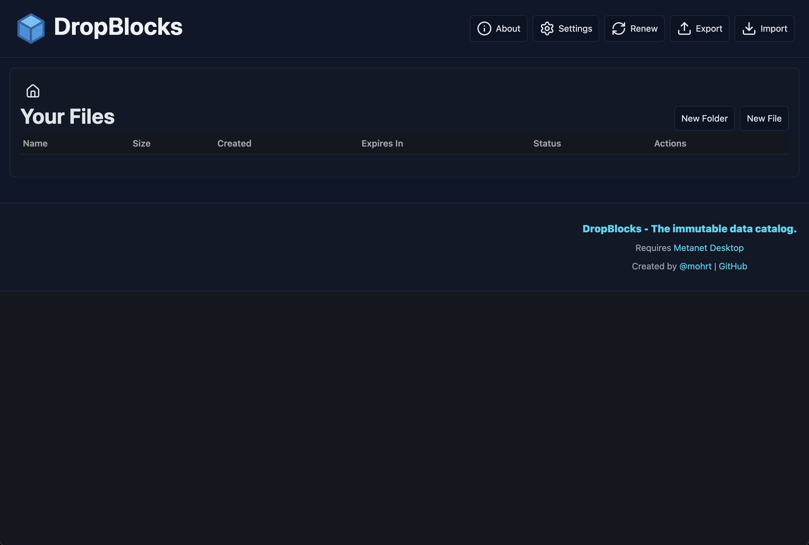
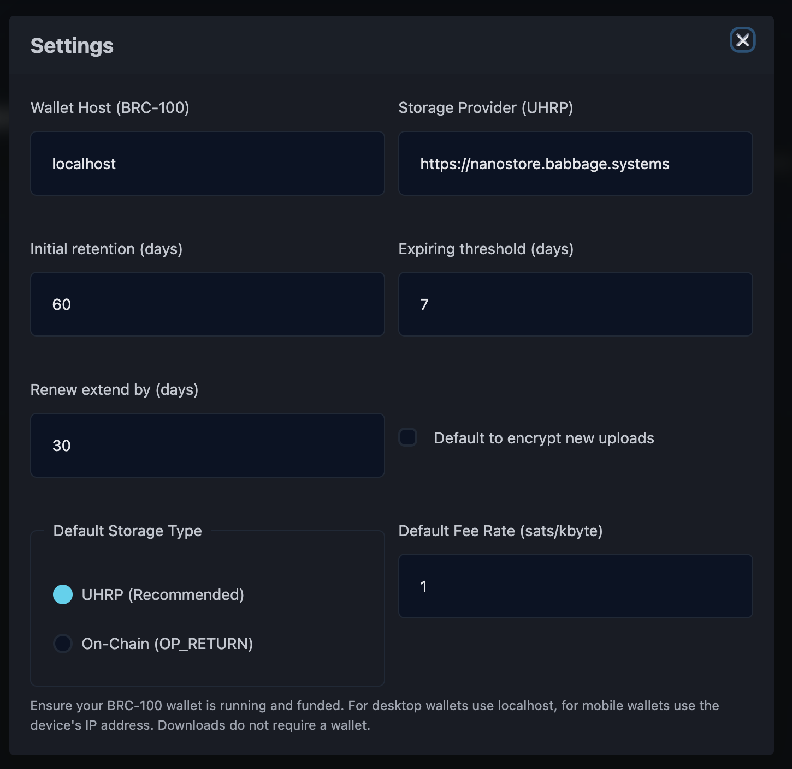
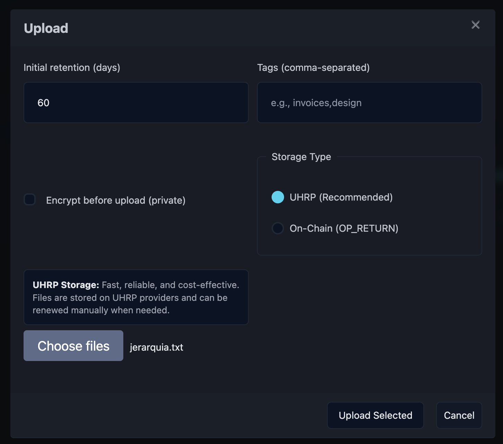
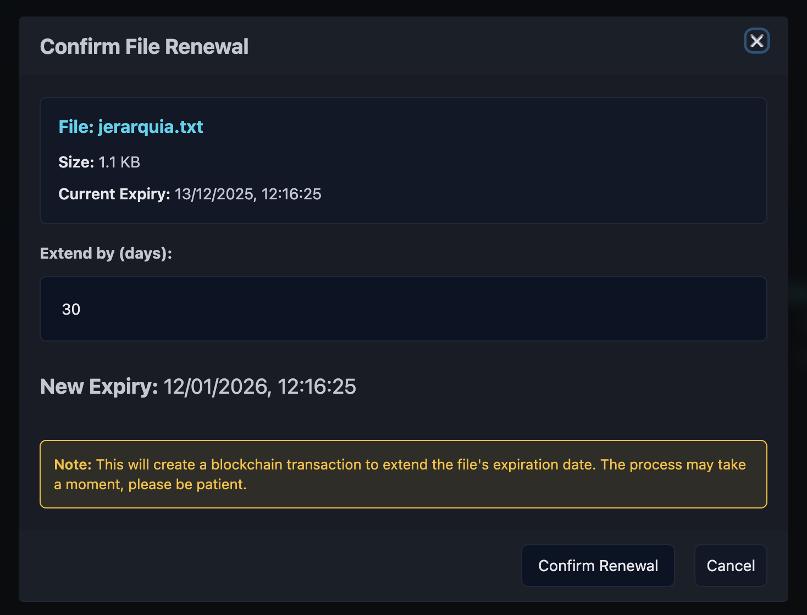

# DropBlocks Onboarding Guide

**Status:** Production
**Last Updated:** October 2025
**Contact/Support:** [@mohrt](https://x.com/mohrt) | [DropBlocks Website](https://dropblocks.org/)

---

## 1. What Is DropBlocks?

DropBlocks is a decentralized file storage application built on the BSV blockchain that provides permanent, verifiable file storage using the UHRP (Universal Hash-Resolved Protocol). Unlike traditional cloud storage, your files are stored off-chain with blockchain timestamping for provenance, giving you true ownership and control of your data.

**Key Features:**
- **Decentralized File Storage** - Files stored using UHRP with blockchain timestamping
- **File Organization** - Create folders and manage your file catalog
- **Encryption Support** - Optional file encryption for privacy
- **Flexible Retention** - Choose storage duration with renewal options
- **Export/Import Catalog** - Backup and restore your file catalog
- **UHRP URLs** - Content-addressed links ensure file integrity
- **Multiple Storage Options** - Choose between UHRP or on-chain storage

**Target Users:** Anyone needing secure, decentralized file storage - developers, content creators, businesses, and individuals who want true ownership of their digital files without relying on centralized cloud providers.

---

## 2. Before You Begin

### Prerequisites
- **BSV Wallet:** BRC-100 compatible wallet (Metanet Desktop recommended)
- **Web Browser:** Modern browser with JavaScript enabled
- **BSV Balance:** Small amount of BSV for storage fees (varies by file size and retention period)

### Supported Platforms
- **Web-based:** Access via https://dropblocks.org/
- **Cross-platform:** Works on desktop and mobile browsers
- **No Installation Required:** Pure web application

### Wallet Setup
If you don't have a BSV wallet yet, follow the [BSV Desktop Onboarding Guide](../metanet-desktop-mainnet.md) to get started. Make sure your wallet is running and funded before using DropBlocks.

---

## 3. Getting Started: Step-by-Step

### Step 1: Access DropBlocks
1. Navigate to **https://dropblocks.org/** in your web browser
2. The main interface displays your file catalog

### Step 2: Configure Settings
1. Click **Settings** in the navigation menu
2. Set your **Wallet Host**:
   - For desktop: Use `localhost`
   - For mobile: Enter your mobile device IP address
3. Configure default upload settings (storage type, retention period)
4. Ensure your wallet is connected and funded with BSV

### Step 3: Upload Your First File
1. Click **"New File"** or **"Upload"** button
2. Choose your file from your device
3. Configure upload options:
   - **Storage Type:** UHRP (off-chain) or On-Chain
   - **Retention Period:** How long to store the file
   - **Encryption:** Optional file encryption
   - **Fee Rate:** Transaction fee setting
4. Click **"Upload"** to proceed
5. Confirm the payment in your wallet

### Step 4: Organize Files with Folders
1. Click **"New Folder"** to create a folder
2. Name your folder for organization
3. Drag and drop files into folders
4. Create nested folder structures as needed

### Step 5: Manage File Renewals
1. View expiring files in your catalog
2. Click **"Renew"** on files approaching expiration
3. Set new retention period
4. Confirm renewal payment

### Step 6: Export/Import Catalog
- **Export:** Backup your file catalog to preserve UHRP URLs and metadata
- **Import:** Restore your catalog when changing devices or browsers

---

## 4. Advanced Features

### Storage Options
- **UHRP Storage:** Files stored off-chain with UHRP URLs for decentralized access
- **On-Chain Storage:** Files written directly to BSV blockchain (best for small files)

### File Encryption
- Enable encryption during upload for sensitive files
- Encrypted files require your key for access
- Provides additional privacy layer beyond blockchain security

### UHRP URLs
- Each file gets a unique UHRP URL (e.g., `uhrp://...`)
- UHRP URLs are content-addressed and verifiable
- Share URLs for decentralized file access
- URLs work across UHRP-compatible applications

### Catalog Management
- **Export Catalog:** Download JSON file with all file references
- **Import Catalog:** Restore files list on new device
- Always export catalog backups regularly

---

## 5. Troubleshooting & FAQs

### Common Issues

| Problem | Cause | Solution |
|---------|-------|----------|
| Wallet not connecting | BSV wallet not running or incorrect host | Ensure wallet is running; check wallet host in Settings |
| Upload fails | Insufficient BSV balance | Add BSV to your wallet |
| File not accessible | File expired | Renew file before expiration or re-upload |
| Cannot see files | Catalog not imported | Import your catalog backup on new device |
| Payment confirmation pending | Blockchain confirmation delay | Wait for transaction confirmation (usually seconds) |

### Important Tips
- **Always backup files separately** - DropBlocks manages references, keep original files safe
- **Monitor expiration dates** - Set reminders to renew important files
- **Export catalog regularly** - Backup your catalog to avoid losing file references
- **Use encryption for sensitive data** - Add extra privacy layer for confidential files

### Getting Help
- **Twitter/X:** [@mohrt](https://x.com/mohrt) for support
- **Community:** BSV blockchain community forums
- **Documentation:** Check DropBlocks website for updates

---

## 6. Learn More / Next Steps

### Best Practices
- Organize files into logical folder structures
- Choose appropriate retention periods based on file importance
- Use UHRP storage for larger files to reduce costs
- Export catalog backups before major changes
- Share UHRP URLs instead of file copies for verifiable distribution

### Integration Opportunities
- Combine with other UHRP-compatible apps
- Use with BSV blockchain applications for complete workflows
- Build automated file management systems using DropBlocks

### Explore the BSV Ecosystem
- Learn about UHRP protocol: [BRC-26 Specification](https://bsv.brc.dev/overlays/0026)
- Try [UHRP Storage](./UHRP%20Storage.md) for additional storage options
- Explore more apps at [Metanet Apps Catalog](https://metanetapps.com/)

---

**Quick Links:**
[BSV Desktop Guide](../metanet-desktop-mainnet.md) | [BSV Getting Started](../README.md) | [UHRP Storage Guide](./UHRP%20Storage.md)

---

*DropBlocks - Decentralized file storage with true ownership, powered by BSV blockchain and UHRP.*
