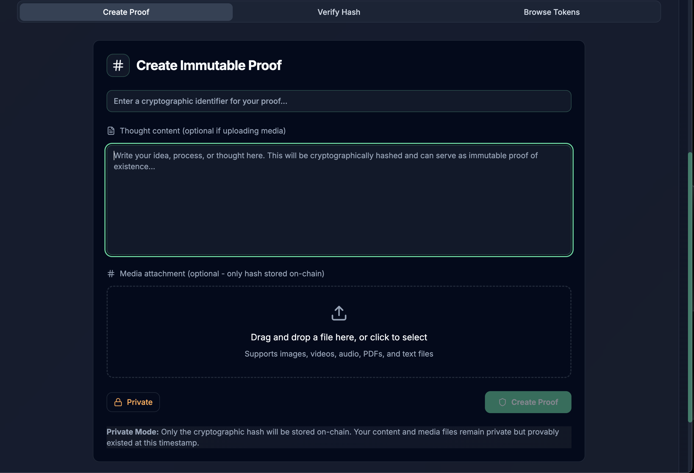
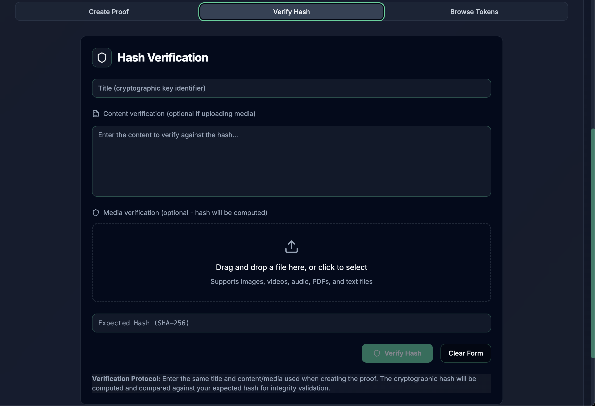

# Immutify Onboarding Guide

**Status:** Production
**Last Updated:** October 2025
**Contact/Support:** [Immutify Website](https://immutify.metanet.app/)

---

## 1. What Is Immutify?

Immutify is a powerful blockchain-based proof-of-existence platform that enables you to create cryptographically secure, timestamped records of ideas, documents, and media on the BSV blockchain. By creating an immutable proof of your intellectual property at a specific point in time, Immutify provides verifiable evidence that can be used for copyright protection, patent documentation, creative work authentication, and legal purposes.

**Key Features:**
- **Cryptographic Proof-of-Existence** - Create blockchain-verified timestamps for any content
- **Text and Media Support** - Prove ownership of ideas, documents, images, videos, and audio
- **Private Mode** - Store only the cryptographic hash, keeping content confidential
- **Hash Verification** - Verify the authenticity of previously immutified content
- **Blockchain Timestamping** - Immutable, tamper-proof records with precise timestamps
- **Intellectual Property Protection** - Establish priority claims for innovations and creations
- **Legal Documentation** - Create verifiable proof for legal and compliance purposes

**Target Users:** Inventors, creators, writers, artists, researchers, businesses, and anyone needing to prove they possessed specific information at a particular time. Essential for intellectual property protection, prior art documentation, creative work authentication, and compliance record-keeping.

---

## 2. Before You Begin

### Prerequisites
- **BSV Wallet:** BSV Desktop Wallet for payment of blockchain storage fees
- **Web Browser:** Modern browser with JavaScript enabled
- **Content to Protect:** Ideas, documents, images, or media you want to timestamp
- **BSV Balance:** Small amount of BSV for blockchain transaction fees

### Supported Platforms
- **Web-based:** Access via https://immutify.metanet.app/
- **Cross-platform:** Works on desktop and mobile browsers
- **No Installation Required:** Pure web application
- **Universal Access:** Verify proofs from any device with internet connection

### Understanding Proof-of-Existence
Before using Immutify, understand the key concepts:
- **Hash:** A unique cryptographic fingerprint of your content
- **Timestamp:** The exact date and time recorded on blockchain
- **Immutability:** Once recorded, the proof cannot be altered or deleted
- **Privacy:** In private mode, only the hash is stored, not your actual content
- **Verification:** Anyone can verify a proof using the original content or hash

---

## 3. Getting Started: Step-by-Step

### Step 1: Access Immutify
1. Navigate to **https://immutify.metanet.app/** in your web browser
2. The Immutify main interface loads
3. Ensure your BSV Desktop Wallet is running for payment processing
4. Review the main dashboard options

### Step 2: Choose Your Content Type
Immutify supports multiple content types for proof creation:

**Text-Based Content:**
- Written ideas and concepts
- Document text and manuscripts
- Code snippets and algorithms
- Business plans and proposals
- Research notes and findings

**Media Content:**
- Images and photographs
- Video files
- Audio recordings
- Design files
- Any digital file format

### Step 3: Create Your First Immutable Proof

#### For Text Content:
1. Select **"Create Immutable Proof"** option
2. Choose **Text/Idea** mode
3. Enter your content in the text field:
   - Type or paste your idea
   - Include as much detail as needed
   - Add identifiers like project names or version numbers
4. Review your content carefully (this will be what's hashed)
5. Decide between **Public** or **Private** mode:
   - **Public:** Content stored on blockchain (fully transparent)
   - **Private:** Only hash stored (content remains confidential)

#### For Media Content:
1. Select **"Create Immutable Proof"** for media
2. Click **Upload** or drag and drop your file
3. Supported formats typically include:
   - Images: JPG, PNG, GIF, etc.
   - Video: MP4, AVI, MOV, etc.
   - Audio: MP3, WAV, etc.
   - Documents: PDF, DOCX, etc.
4. Choose **Private** mode for sensitive files (recommended)
5. The system generates a cryptographic hash of your file

### Step 4: Submit to Blockchain
1. Review your proof details:
   - Content or file name
   - Privacy setting
   - Estimated blockchain fee
2. Click **"Submit to Blockchain"** or **"Create Proof"**
3. BSV Desktop Wallet prompts for payment confirmation
4. **Approve the transaction** (typically a very small fee)
5. Wait for blockchain confirmation (usually seconds to minutes)
6. Your proof is now permanently timestamped on BSV blockchain

**Important Notes:**
- Once submitted, the proof cannot be removed or altered
- Save your proof details and transaction ID
- In private mode, keep your original content safe for future verification
- The timestamp proves you possessed this content at this specific moment

### Step 5: Save Your Proof Details
After successful submission, Immutify provides:
1. **Transaction ID (TXID)** - Blockchain record reference
2. **Cryptographic Hash** - Unique fingerprint of your content
3. **Timestamp** - Exact date and time of proof creation
4. **Blockchain Link** - Direct link to view transaction on block explorer

**Save these details securely:**
- Screenshot the confirmation page
- Copy and save the TXID and hash
- Download any provided certificates
- Store in multiple secure locations

### Step 6: Verify Document or Media Hash
To verify existing content or check if something has been immutified:

1. Navigate to the **"Verify Hash"** section
2. Choose verification method:
   - **Upload original file** for automatic hash comparison
   - **Enter hash directly** if you have the hash value
3. Click **"Verify"** or **"Check Hash"**
4. Immutify searches the blockchain
5. Results show:
   - **Match found:** Content was immutified with timestamp details
   - **No match:** Content has no existing proof on blockchain

**Verification Use Cases:**
- Prove when you created something
- Verify authenticity of received documents
- Check if content has been previously registered
- Validate timestamps for legal purposes
- Confirm content hasn't been tampered with

---

## 4. Advanced Features

### Intellectual Property Protection
- **Prior Art Documentation:** Establish evidence for patent applications
- **Copyright Claims:** Prove authorship and creation date for creative works
- **Trade Secret Timestamps:** Document confidential business information existence
- **Innovation Tracking:** Record R&D progress and discoveries
- **Version Control:** Create proofs for different versions of evolving work

### Legal and Compliance Applications
- **Contract Existence:** Prove contract terms existed at specific date
- **Disclosure Documentation:** Record when information was disclosed
- **Audit Trails:** Create verifiable compliance records
- **Evidence Preservation:** Maintain tamper-proof evidence for legal proceedings
- **Regulatory Compliance:** Document adherence to regulatory requirements

### Privacy and Security Features
- **Private Mode Protection:** Content never leaves your device in private mode
- **Hash-Only Storage:** Blockchain contains only cryptographic fingerprint
- **Content Confidentiality:** Maintain secrecy while proving existence
- **Selective Disclosure:** Reveal content only when needed for verification
- **Multi-Layer Security:** Combine with encryption for enhanced protection

### Verification and Authentication
- **Third-Party Verification:** Anyone can verify proofs independently
- **Blockchain Transparency:** All timestamps are publicly auditable
- **Hash Collision Resistance:** Cryptographically impossible to fake
- **Cross-Platform Verification:** Verify on any blockchain explorer
- **Permanent Records:** Proofs exist as long as BSV blockchain exists

---

## 5. Troubleshooting & FAQs

### Common Issues

| Problem | Cause | Solution |
|---------|-------|----------|
| Hash verification fails | Wrong file or modified content | Ensure exact original file is used; any modification changes hash |
| Upload too slow | Large file size | Compress files when possible; private mode only uploads hash |
| Payment doesn't process | Wallet not connected | Launch BSV Desktop and ensure connection; check BSV balance |
| Hash mismatch error | Content altered since proof | Verify you're using the exact original content, including metadata |
| Cannot find proof | Incorrect hash or TXID | Double-check hash format; verify TXID from original confirmation |
| Blockchain confirmation delayed | Network congestion | Wait a few minutes; BSV typically confirms quickly but delays can occur |

### Tips for Effective Use
- **Document Everything:** Keep detailed records of all proofs created
- **Regular Backups:** Maintain backups of TXIDs, hashes, and original content
- **Consistent Formatting:** Use consistent file formats to avoid hash mismatches
- **Metadata Awareness:** File metadata can affect hashes; preserve original files exactly
- **Test Verification:** Verify your proofs immediately after creation to ensure process works

### Getting Help
- **Website:** Visit [Immutify](https://immutify.metanet.app/) for documentation
- **BSV Community:** Join BSV forums for intellectual property protection discussions
- **Legal Guidance:** Consult legal professionals for proper use in legal contexts
- **Technical Support:** Contact through BSV developer channels for technical issues
- **Best Practices:** Review blockchain proof-of-existence best practices documentation

---

## 6. Learn More / Next Steps

### Best Practices for Proof-of-Existence
- **Immediate Protection:** Create proofs as soon as intellectual property is created
- **Comprehensive Coverage:** Timestamp all significant versions and iterations
- **Secure Storage:** Maintain multiple secure backups of proof details and original content
- **Regular Verification:** Periodically verify your proofs remain accessible
- **Documentation Context:** Include contextual information in text proofs for clarity
- **Legal Preparation:** Understand how blockchain proofs work in your jurisdiction

### Common Use Cases

**Creative Professionals:**
- Timestamp artwork before public release
- Protect manuscript drafts and story concepts
- Document photography ownership
- Establish music composition dates

**Researchers and Academics:**
- Record research findings and hypotheses
- Document experimental data and results
- Protect unpublished research
- Establish discovery priority

**Business Applications:**
- Timestamp product designs and concepts
- Document business processes and methods
- Protect trade secrets and confidential information
- Create audit trails for compliance

**Legal and Compliance:**
- Document disclosure events
- Preserve evidence integrity
- Create verifiable compliance records
- Establish timeline of events

### Integration Opportunities
- **UHRP Storage:** Combine with decentralized storage for complete file management
- **SocialCert:** Link proof ownership to verified social identities
- **BSV Desktop:** Manage all blockchain interactions from unified wallet
- **Document Management Systems:** Integrate Immutify into existing workflows
- **Copyright Services:** Complement traditional copyright registration

### Understanding the Technology
- **Cryptographic Hashing:** Learn how SHA-256 creates unique content fingerprints
- **Blockchain Immutability:** Understand why blockchain records can't be altered
- **Timestamp Servers:** Study how blockchain provides trusted timestamping
- **Public Key Cryptography:** Explore how ownership is proven cryptographically
- **Merkle Trees:** Understand how blockchain efficiently stores hash data

### Related Resources
- **BSV Blockchain:** Explore why BSV is ideal for data storage and proof-of-existence
- **Intellectual Property Law:** Research how blockchain proofs fit into IP protection
- **Patent Prior Art:** Learn about using blockchain proofs for patent applications
- **Copyright Registration:** Understand relationship between blockchain proofs and copyright
- **Legal Technology:** Discover how blockchain is transforming legal evidence

### Stay Updated
- **Immutify Updates:** Monitor for new features and improved verification tools
- **Legal Developments:** Follow legal recognition of blockchain proofs in various jurisdictions
- **BSV Protocol:** Stay informed about blockchain improvements affecting proof-of-existence
- **Use Case Studies:** Learn from others' successful use of blockchain timestamping
- **Integration Examples:** Discover new ways to incorporate Immutify into workflows

---

**Quick Links:**
[BSV Desktop Guide](../metanet-desktop-mainnet.md) | [BSV Getting Started](../README.md) | [UHRP Storage](UHRP%20Storage.md) | [BSV Blockchain Tools](https://bsvblockchain.org/features/tools-libraries/)

---

*Immutify transforms the BSV blockchain into your personal notary service - proving what you knew, when you knew it, with cryptographic certainty that lasts forever.*
