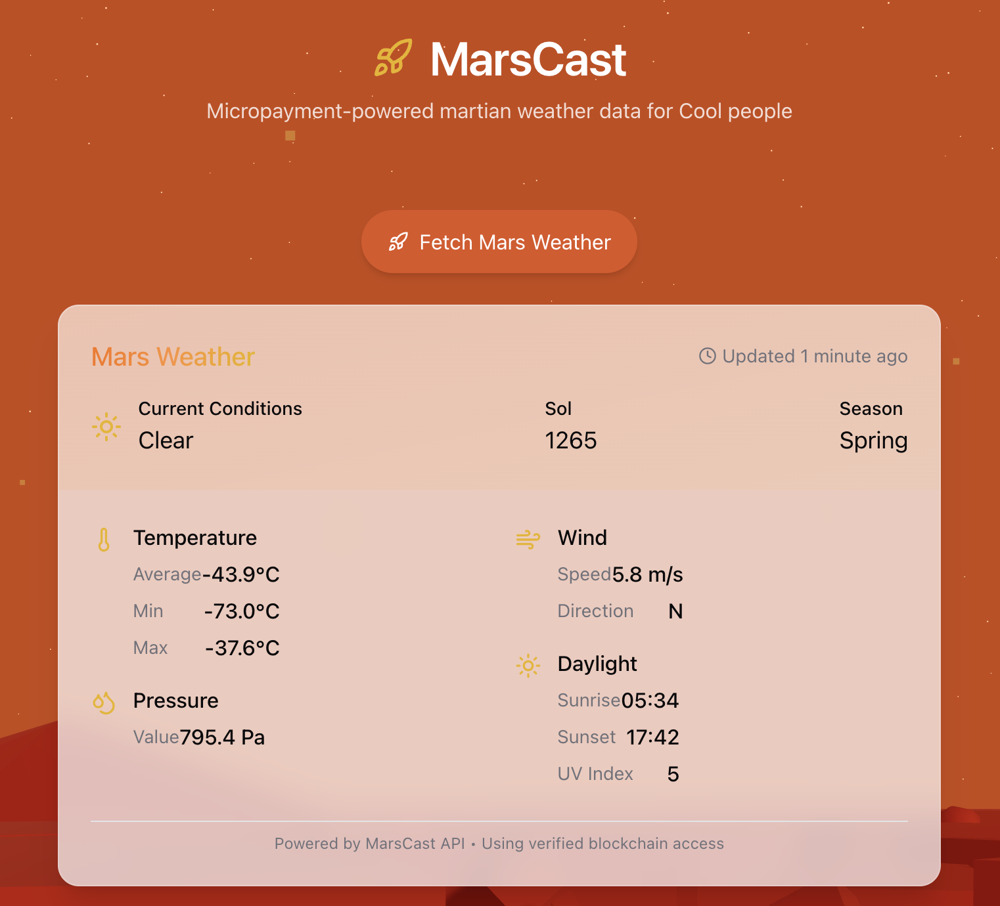
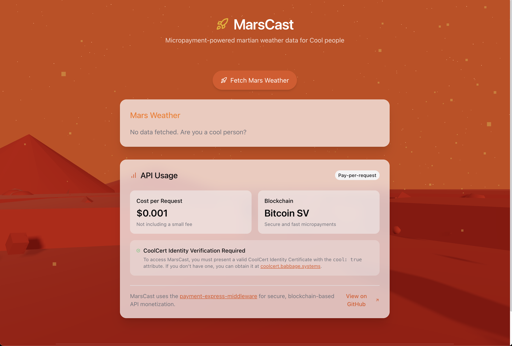

### MarsCast.md

***
**Status:** Production
**Last Updated:** October 2025
**Contact/Support:** Babbage Systems

***
# MarsCast Onboarding Guide

MarsCast delivers Mars weather data via a blockchain-secured API; requires a valid CoolCert identity for access.

## Key Features
- Latest Mars weather and planetary API
- Pay-per-request micropayments on BSV
- Requires CoolCert identity certificate

## Getting Started

1. Visit [https://marscast.babbage.systems/](https://marscast.babbage.systems/)
2. Obtain your identity certificate at [https://coolcert.babbage.systems/](https://coolcert.babbage.systems/) if needed
3. Request Mars weather data (API charges $0.001/request)
4. View results and transaction confirmations

## Screenshots

## Tips
- Use pay-per-request for fast, secure access

## Troubleshooting
- Missing certificate: Visit CoolCert and reissue
- API issues: Check micropayment status, connectivity

## Next Steps
- Integrate MarsCast data with analytics or educational dashboards
- Demo API monetization to students/developers

***
