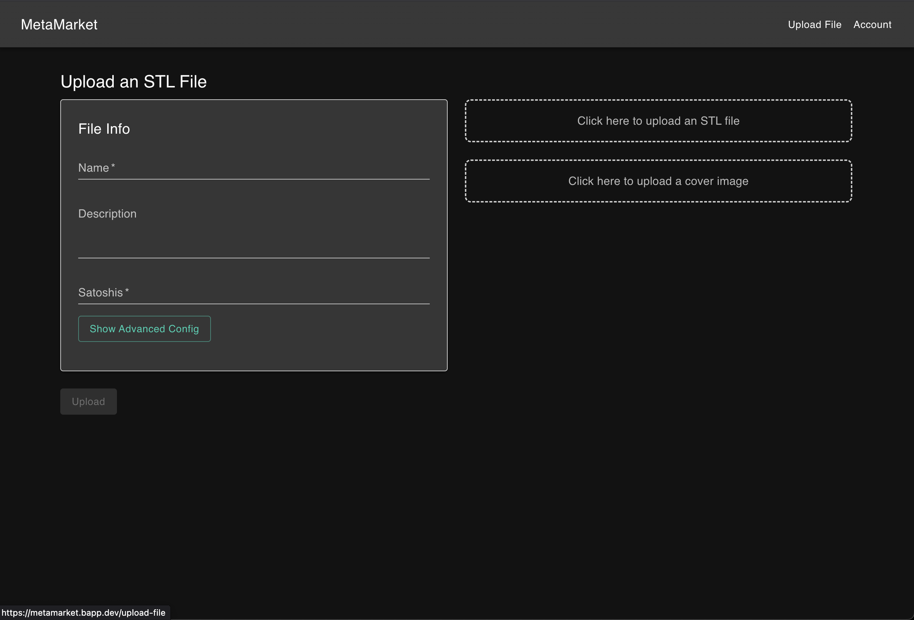

# MetaMarket Onboarding Guide

**Status:** Production
**Last Updated:** October 2025
**Contact/Support:** [MetaMarket](https://metamarket.bapp.dev/)

---

## 1. What Is MetaMarket?

MetaMarket is a decentralized marketplace built on the BSV blockchain for uploading, sharing, and selling files and data. Unlike traditional centralized marketplaces, MetaMarket gives creators full control over their content with blockchain-backed pricing, searchable catalogs, and direct peer-to-peer transactions.

**Key Features:**
- **File/Data Upload** - Share any type of file or data with custom descriptions and pricing
- **Decentralized Marketplace** - No intermediaries, direct creator-to-buyer transactions
- **Browsable Catalog** - Searchable and filterable file listings
- **Custom Pricing** - Set your own prices in satoshis for each upload
- **Account Management** - Manage your uploads and notification preferences
- **Blockchain Persistence** - All listings and transactions recorded on BSV
- **BSV Micropayments** - Enable pay-per-download monetization

**Target Users:** Content creators, developers, data providers, and anyone looking to monetize digital files and datasets through a decentralized marketplace without platform fees or intermediaries.

---

## 2. Before You Begin

### Prerequisites
- **BSV Wallet:** BRC-100 compatible wallet (Metanet Desktop recommended)
- **Web Browser:** Modern browser with JavaScript enabled
- **BSV Balance:** Small amount of BSV for upload transactions and purchases
- **Files/Data:** Digital content you want to share or sell

### Supported Platforms
- **Web-based:** Access via https://metamarket.bapp.dev/
- **Cross-platform:** Works on desktop and mobile browsers
- **No Installation Required:** Pure web application

### Wallet Setup
If you don't have a BSV wallet yet, follow the [BSV Desktop Onboarding Guide](../metanet-desktop-mainnet.md) to get started. Ensure your wallet is running and funded before uploading or purchasing files.

---

## 3. Getting Started: Step-by-Step

### Step 1: Access MetaMarket
1. Navigate to **https://metamarket.bapp.dev/** in your web browser
2. Ensure your BSV Desktop wallet is running in the background
3. The homepage displays the browsable file catalog

### Step 2: Browse the Marketplace
1. View available files and data in the catalog
2. Use the **search function** to find specific content by name or description
3. Click on listings to see details:
   - File name
   - Description
   - Price (in satoshis)
   - Creator information
4. Filter results to narrow your search

### Step 3: Upload Your First File
1. Click **"Upload File"** button
2. Select the file from your device
3. Enter file details:
   - **Name:** Clear, descriptive title
   - **Description:** Detailed explanation of contents and value
   - **Price:** Set price in satoshis (can be free with 0 sats)
4. Review the upload transaction fee
5. Click **"Upload"** and confirm in your BSV wallet
6. Your file is now listed in the marketplace

### Step 4: Manage Your Account
1. Click on **"Account"** or profile section
2. View your uploaded files
3. Configure notification settings:
   - Sales notifications
   - Download alerts
   - Marketplace updates
4. Edit or remove your listings as needed

### Step 5: Purchase Files
1. Browse the catalog to find desired content
2. Click on a listing to view details
3. Click **"Purchase"** or **"Download"** button
4. Confirm payment in your BSV wallet
5. Download file immediately after payment confirmation
6. Access your purchased files from your account history

---

## 4. Advanced Features

### Pricing Strategies
- **Free Distribution:** Set price to 0 satoshis for public sharing
- **Micropayments:** Use low prices (10-1,000 sats) for widespread accessibility
- **Premium Content:** Higher prices (10,000+ sats) for valuable datasets or specialized content
- **Bundle Pricing:** Upload related files and price appropriately

### Content Optimization
- **Descriptive Titles:** Use clear, searchable names for better discoverability
- **Detailed Descriptions:** Explain file contents, format, size, and use cases
- **Proper Categorization:** Tag content appropriately for filtering
- **Preview Information:** Include sample data or screenshots in description

### Marketplace Discovery
- **Search by Keywords:** Use specific terms to find relevant content
- **Filter Options:** Narrow results by price range, upload date, or creator
- **Trending Content:** Discover popular and recently uploaded files
- **Creator Following:** Track favorite creators for new uploads

### Notification Management
- **Sales Alerts:** Get notified when someone purchases your content
- **Download Tracking:** Monitor how many times files are accessed
- **Account Activity:** Track all marketplace interactions
- **Custom Preferences:** Configure notification frequency and channels

---

## 5. Troubleshooting & FAQs

### Common Issues

| Problem | Cause | Solution |
|---------|-------|----------|
| Upload fails | File too large or insufficient BSV | Check file size limits; ensure wallet has sufficient balance |
| Cannot find uploaded file | Not yet confirmed on blockchain | Wait a few seconds for blockchain confirmation; refresh page |
| Purchase not completing | Insufficient BSV or network issue | Check wallet balance; verify internet connection |
| Account errors | Wallet not connected properly | Re-authenticate wallet; refresh browser |
| Search returns no results | Incorrect search terms | Try broader keywords; browse catalog manually |

### Important Tips
- **Set competitive pricing:** Research similar content to price appropriately for marketplace reach
- **Update descriptions regularly:** Keep file information current and accurate
- **Monitor your listings:** Check account regularly for sales and activity
- **Backup important files:** MetaMarket stores references; keep original files secure
- **Clear file names:** Use descriptive, unique names for better searchability

### Getting Help
- **Website:** [https://metamarket.bapp.dev/](https://metamarket.bapp.dev/)
- **BSV Community:** Community forums for marketplace questions
- **Technical Support:** MetaMarket Dev Team via community channels

---

## 6. Learn More / Next Steps

### Best Practices for Sellers
- Upload high-quality, valuable content
- Write comprehensive descriptions with keywords
- Price competitively based on content value and market
- Respond to buyer inquiries promptly
- Update listings with new versions or corrections

### Best Practices for Buyers
- Review file descriptions carefully before purchase
- Check creator reputation and previous uploads
- Start with lower-priced items to test quality
- Leave feedback to help the community
- Save purchased files immediately after download

### Use Cases
- **Data Providers:** Sell datasets, APIs, research data
- **Content Creators:** Distribute ebooks, courses, templates, graphics
- **Developers:** Share code libraries, scripts, development tools
- **Researchers:** Publish datasets, papers, analyses
- **Artists:** Sell digital art, music, videos

### Integration Opportunities
- Explore interoperability with other marketplace partners
- Combine with [UHRP Storage](./UHRP%20Storage.md) for file hosting
- Use with [DropBlocks](./DropBlocks.md) for decentralized file management
- Integrate with other BSV apps for complete workflows

### Explore the BSV Ecosystem
- Try [UHRP Storage](./UHRP%20Storage.md) for decentralized file storage
- Explore [DropBlocks](./DropBlocks.md) for file organization
- Learn more at [Metanet Apps Catalog](https://metanetapps.com/)

---

**Quick Links:**
[BSV Desktop Guide](../metanet-desktop-mainnet.md) | [BSV Getting Started](../README.md) | [UHRP Storage Guide](./UHRP%20Storage.md)

---

*MetaMarket - Decentralized marketplace for files and data, powered by BSV blockchain and micropayments.*
