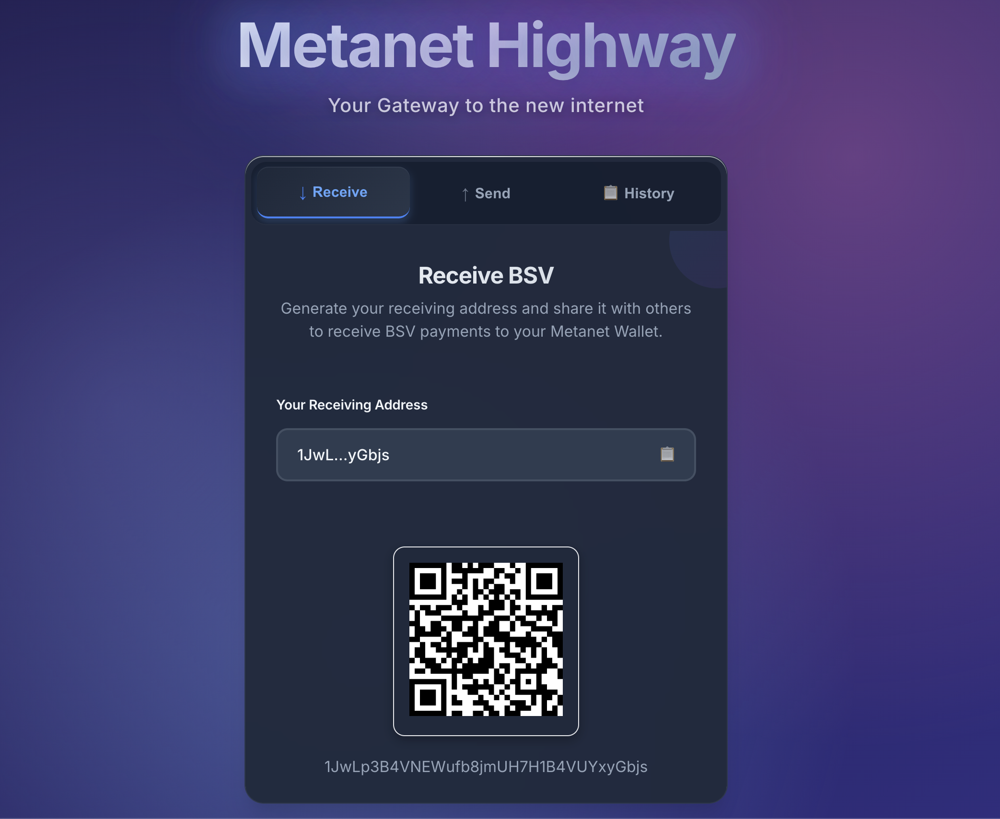
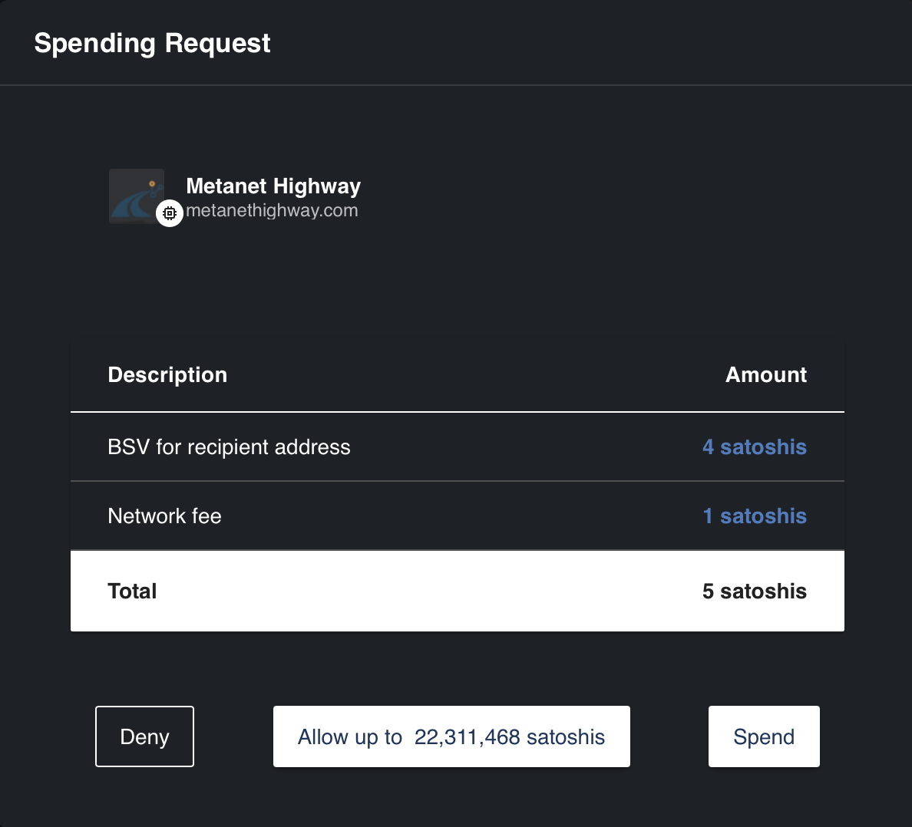

# Metanet Highway Onboarding Guide

**Status:** Production
**Last Updated:** October 2025
**Contact/Support:** [Metanet Highway Website](https://metanethighway.com/)

---

## 1. What Is Metanet Highway?

Metanet Highway is a powerful BSV blockchain wallet application designed for seamless payment management and transaction handling. Built on the robust BSV infrastructure, it provides users with an intuitive interface for generating blockchain addresses, managing funds, and tracking transaction history.

**Key Features:**
- **Address Generation** - Create unique blockchain addresses for receiving payments
- **Transaction Management** - Send and receive BSV with ease
- **Secure Wallet Infrastructure** - Built on proven blockchain security protocols
- **Transaction History** - Complete audit trail of all wallet activities
- **Metanet Integration** - Seamlessly connects with other Metanet ecosystem applications
- **Real-time Balance Tracking** - Monitor your BSV holdings instantly

**Target Users:** Individuals and businesses seeking a reliable, straightforward BSV wallet solution for payments, receipts, and blockchain transaction management. Ideal for those new to BSV as well as experienced users who need a dependable wallet interface.

---

## 2. Before You Begin

### Prerequisites
- **Web Browser:** Modern browser (Chrome, Firefox, Safari, or Edge) with JavaScript enabled
- **Internet Connection:** Stable connection for blockchain interactions
- **BSV Basics:** Basic understanding of blockchain addresses and transactions (optional but helpful)

### Supported Platforms
- **Web-based:** Access via https://metanethighway.com/
- **Cross-platform:** Works on desktop and mobile browsers
- **No Installation Required:** Pure web application accessible from any device

### Initial Setup Information
Metanet Highway uses browser-based wallet technology. Your wallet keys are stored securely in your browser, so ensure you:
- Use a secure device with up-to-date browser
- Consider backing up your wallet information
- Keep your private keys confidential

---

## 3. Getting Started: Step-by-Step

### Step 1: Access Metanet Highway
1. Navigate to **https://metanethighway.com/** in your web browser
2. The platform will initialize your wallet interface
3. You'll see the main wallet dashboard upon successful load

### Step 2: Understanding the Dashboard
The wallet dashboard displays:
- **Current Balance** - Your available BSV funds
- **Wallet Address** - Your primary receiving address
- **Transaction History** - Recent incoming and outgoing transactions
- **Action Buttons** - Quick access to send and receive functions

### Step 3: Generate a Receiving Address
1. Locate the **Receive** button on the dashboard
2. Click to generate a new receiving address
3. Your unique blockchain address will be displayed
4. **Copy the address** to share with others for receiving payments
5. Each address is cryptographically linked to your wallet

The receiving address can be shared safely with anyone who needs to send you BSV payments.

### Step 4: Sending BSV Payments
1. Click the **Send** button on the dashboard
2. Enter the **recipient's BSV address**
3. Input the **amount to send** in BSV or satoshis
4. Review the transaction details carefully
5. Confirm and authorize the payment
6. Wait for blockchain confirmation (typically seconds to minutes)

### Step 5: Monitoring Transaction History
1. Navigate to the **Transaction History** section
2. View all incoming (received) transactions
3. Review all outgoing (sent) transactions
4. Check transaction status (pending, confirmed)
5. Click on individual transactions for detailed information including:
   - Transaction ID (TXID)
   - Timestamp
   - Amount
   - Sender/Recipient addresses
   - Confirmation status

### Step 6: Security Best Practices
- **Never share** your private keys or wallet backup phrases
- **Verify addresses** before sending payments (especially large amounts)
- **Test with small amounts** first when sending to new addresses
- **Keep your browser updated** for the latest security patches
- **Log out** when using shared or public computers

---

## 4. Advanced Features

### Address Management
- **Multiple Addresses:** Generate multiple receiving addresses for different purposes
- **Address Labeling:** Organize addresses with custom labels for easy identification
- **Address Reuse:** While addresses can be reused, generating new addresses enhances privacy
- **QR Code Generation:** Share addresses via QR codes for mobile scanning

### Transaction Details and Verification
- **Block Explorer Integration:** View transactions on BSV block explorers
- **Transaction Receipts:** Download or export transaction records for accounting
- **Confirmation Tracking:** Real-time monitoring of transaction confirmations
- **Fee Estimation:** Preview transaction fees before sending

### Wallet Integration Features
- **Metanet Compatibility:** Works seamlessly with other Metanet ecosystem applications
- **Identity Integration:** Connect with BSV identity services for enhanced functionality
- **Payment Protocols:** Supports standard BSV payment protocols for merchant transactions
- **API Access:** Developers can integrate with Metanet Highway for custom workflows

### Privacy and Control
- **Self-Custody:** You maintain full control of your private keys
- **No KYC Required:** Basic wallet functionality available without identity verification
- **Transaction Privacy:** Standard blockchain privacy features
- **Backup Options:** Export wallet data for secure storage

---

## 5. Troubleshooting & FAQs

### Common Issues

| Problem | Cause | Solution |
|---------|-------|----------|
| Address doesn't appear | Browser loading issue | Refresh the page and wait for full wallet initialization |
| Transaction pending too long | Network congestion | Wait for network confirmation; BSV typically confirms within minutes |
| Cannot send transaction | Insufficient balance | Verify you have enough BSV to cover amount plus transaction fees |
| Wallet not loading | Browser compatibility | Try a different browser or clear cache and cookies |
| Lost wallet access | Browser data cleared | Restore from backup if available; prevention: always backup wallet data |
| Transaction shows wrong amount | Display currency settings | Check if viewing in BSV or satoshis; adjust display settings |

### Tips for Smooth Operation
- **Regular Backups:** Export and securely store wallet backups periodically
- **Test Transactions:** Send small amounts first when using new features
- **Network Status:** Check BSV network status if experiencing delays
- **Browser Compatibility:** Use latest browser versions for best performance
- **Connection Issues:** Ensure stable internet connection for blockchain synchronization

### Getting Help
- **Website:** Visit [Metanet Highway](https://metanethighway.com/) for updates and documentation
- **Community Support:** Join BSV community forums and Discord channels
- **Technical Issues:** Check BSV network status at blockchain explorers
- **Best Practices:** Consult BSV Blockchain Association resources for security guidelines

---

## 6. Learn More / Next Steps

### Best Practices for Wallet Management
- **Security First:** Never expose private keys or seed phrases
- **Organized Records:** Maintain transaction records for accounting and tax purposes
- **Address Hygiene:** Generate new addresses regularly for enhanced privacy
- **Balance Management:** Keep only necessary amounts in hot wallets; consider cold storage for large holdings
- **Verification Habits:** Always double-check addresses before confirming transactions

### Common Use Cases
- **Personal Payments:** Send and receive BSV from friends and family
- **Merchant Payments:** Accept BSV payments for goods and services
- **Micropayments:** Leverage BSV's low fees for small-value transactions
- **Cross-Border Transfers:** Send money globally without traditional banking intermediaries
- **Savings Storage:** Hold BSV securely in your self-custody wallet

### Integration Opportunities
- **ToolBSV:** Use Metanet Highway to fund AI micropayments on ToolBSV
- **UHRP Storage:** Pay for decentralized file storage using your Metanet Highway wallet
- **PeerPay:** Connect with other BSV applications for peer-to-peer payments
- **Metanet Ecosystem:** Explore the full range of Metanet-compatible applications
- **BSV Desktop:** Consider upgrading to BSV Desktop for advanced features and integrations

### Related Resources
- **BSV Blockchain:** Learn more about the underlying technology at [BSV Blockchain](https://www.bsvblockchain.org/)
- **Payment Protocols:** Understand BSV payment standards and protocols
- **Developer Resources:** Explore APIs and integration documentation
- **Community:** Join BSV community channels for support and updates

---

**Quick Links:**
[BSV Desktop Guide](../metanet-desktop-mainnet.md) | [BSV Getting Started](../README.md) | [Metanet Apps Catalog](https://metanetapps.com/)

---

*Metanet Highway provides a straightforward, secure gateway to the BSV blockchain - manage your payments with confidence on a proven, scalable blockchain infrastructure.*
