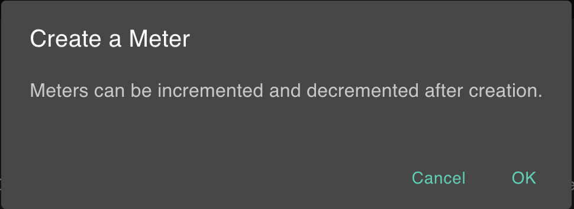

### Meter.md

***
**Status:** Production
**Last Updated:** October 2025
**Contact/Support:** Meter App Team

***
# Meter Onboarding Guide

Meter creates, increments, and decrements blockchain-based counters that persist by identity.

## Key Features
- Create counters (meters), each tied to an identity key
- Increment/decrement with visual feedback
- Track state changes on-chain

## Getting Started

1. Visit [https://meter.bapp.dev/](https://meter.bapp.dev/)
2. Click “Create Meter” to make a new counter
3. Use “+” and “–” to adjust value
4. Identity key tracks each meter

## Screenshots

## Tips
- Use meters for gamified tasks, ledger or reputation tracking

## Troubleshooting
- Not incrementing? Wait for blockchain confirmation

## Next Steps
- Code review on GitHub for custom applications

***
