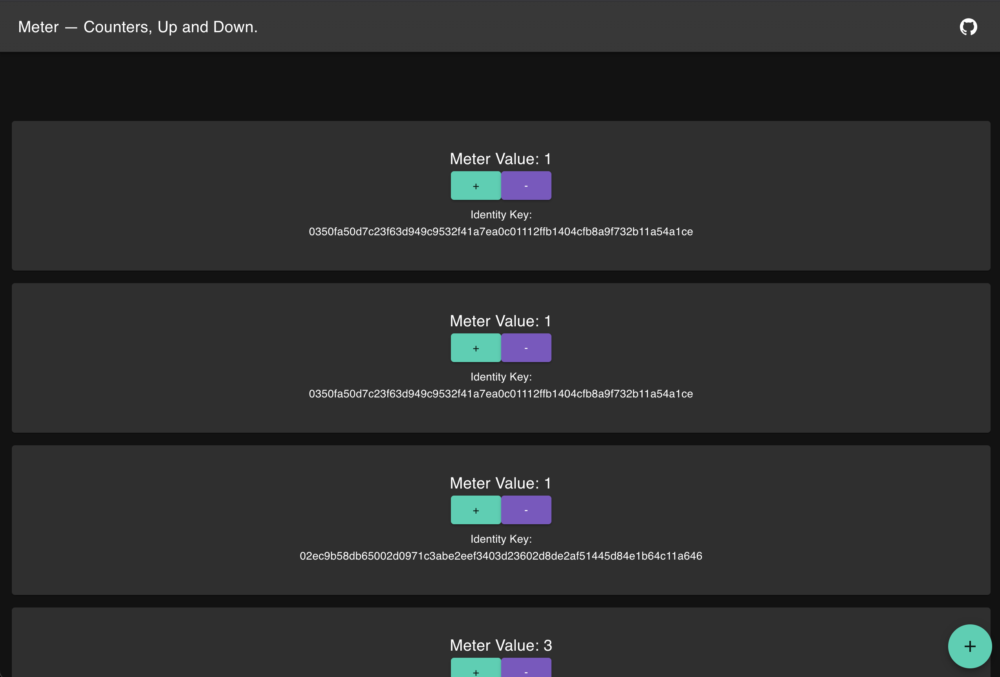

# Meter Onboarding Guide

**Status:** Production
**Last Updated:** October 2025
**Contact/Support:** [Meter App](https://meter.bapp.dev/) | [GitHub Repository](https://github.com/p2ppsr/meter)

---

## 1. What Is Meter?

Meter is a blockchain-based counter application that enables you to create, increment, and decrement persistent counters (meters) tied to your BSV identity. Each meter maintains its state on the BSV blockchain, providing tamper-proof tracking of numerical values with full transparency and auditability. Whether tracking personal goals, managing inventory, monitoring events, or implementing reputation systems, Meter provides a simple yet powerful tool for blockchain-based counting.

**Key Features:**
- **Persistent Counters** - Create unlimited meters that maintain state on blockchain
- **Identity-Linked** - Each meter is cryptographically tied to your BSV identity key
- **Increment/Decrement Operations** - Simple +/- controls for adjusting values
- **Visual Feedback** - Real-time display of meter values and changes
- **Blockchain Verification** - All state changes recorded transparently on BSV
- **Multiple Meters** - Create and manage different meters for various purposes
- **Immutable History** - Complete audit trail of all counter changes

**Target Users:** Anyone needing reliable, transparent counting or tracking - gamification developers, task trackers, inventory managers, reputation system builders, habit trackers, event counters, or anyone requiring verifiable numerical state management on blockchain.

---

## 2. Before You Begin

### Prerequisites
- **BSV Wallet:** BSV Desktop Wallet or Babbage-compatible wallet
- **BSV Identity:** Identity key for meter ownership and state management
- **Web Browser:** Modern browser with JavaScript enabled
- **BSV Balance:** Small amount for blockchain transaction fees (typically minimal)

### Supported Platforms
- **Web-based:** Access via https://meter.bapp.dev/
- **Cross-platform:** Works on desktop and mobile browsers
- **Babbage SDK Integration:** Built on Babbage infrastructure for identity management
- **No Installation Required:** Pure web application

### Understanding Meter Concepts
Before creating your first meter, understand these key concepts:

**Meter:** A named counter with a current value, owner identity, and blockchain history

**State:** The current numerical value of a meter at any given time

**Increment:** Increase the meter value by a specified amount (default: 1)

**Decrement:** Decrease the meter value by a specified amount (default: 1)

**Identity Key:** Your BSV identity that owns and controls your meters

**Blockchain Persistence:** All meter changes are recorded as blockchain transactions

---

## 3. Getting Started: Step-by-Step

### Step 1: Access Meter
1. Navigate to **https://meter.bapp.dev/** in your web browser
2. The Meter application interface loads
3. Ensure your BSV Desktop Wallet is running in the background
4. The app automatically detects your Babbage-enabled wallet

### Step 2: Connect Your Wallet
1. Meter requests permission to connect to your wallet
2. **Grant permission** in BSV Desktop when prompted
3. Your identity key is linked to the Meter application
4. The main dashboard appears showing any existing meters
5. Your identity status displays as "Connected"

**First Time Users:** If this is your first visit, the dashboard will be empty - ready for you to create your first meter.

### Step 3: Create Your First Meter
1. Locate the **"Create Meter"** button on the dashboard
2. Click to open the meter creation dialog
3. Enter a **name for your meter**:
   - Choose descriptive names (e.g., "Daily Tasks", "Inventory Count", "Points")
   - Names help you identify meters when managing multiple counters
4. Optionally set an **initial value** (default: 0)
5. Click **"Create"** or **"Confirm"**
6. BSV Desktop prompts for transaction approval
7. **Approve the blockchain transaction** (small fee)
8. Wait for blockchain confirmation (typically seconds)
9. Your new meter appears on the dashboard

**Naming Tips:**
- Use clear, descriptive names
- Consider adding context (e.g., "2025 Gym Visits" vs just "Gym")
- Avoid special characters that might cause display issues
- Keep names reasonably short for easy viewing

### Step 4: Increment Your Meter
1. Find your meter on the dashboard
2. Locate the **"+"** (plus/increment) button
3. Click to increase the meter value
4. The interface shows the increment operation
5. Approve the blockchain transaction in BSV Desktop
6. Wait for confirmation (usually very fast)
7. Watch the meter value update in real-time
8. The new value is now permanently recorded on blockchain

**Common Increment Use Cases:**
- Completed tasks or activities
- Items added to inventory
- Points earned in a game
- Events attended
- Habits maintained (daily streak counter)

### Step 5: Decrement Your Meter
1. Select the meter you want to decrease
2. Locate the **"−"** (minus/decrement) button
3. Click to decrease the meter value
4. The operation requires blockchain confirmation
5. **Approve in BSV Desktop**
6. Wait for transaction confirmation
7. Meter value decreases and updates on screen
8. Change is recorded immutably on blockchain

**Common Decrement Use Cases:**
- Items removed from inventory
- Tasks unmarked or reversed
- Points spent or deducted
- Corrections to previous counts
- Decreasing availability counters

### Step 6: Manage Multiple Meters
1. Create additional meters using the "Create Meter" button
2. Each meter appears as a separate card or entry on dashboard
3. All meters display simultaneously with:
   - Meter name
   - Current value
   - Increment/decrement controls
   - Last updated timestamp (if shown)
4. Interact with each meter independently
5. All meters are tied to your identity key
6. Track different activities or quantities simultaneously

**Multi-Meter Strategies:**
- **Activity Tracking:** Different meters for different goals
- **Inventory Management:** Separate meters for different item types
- **Gamification:** Multiple point or achievement counters
- **Team Tracking:** Each team member maintains their own meters
- **Project Metrics:** Different metrics for project monitoring

---

## 4. Advanced Features

### Blockchain State Management
- **Immutable History:** Every increment/decrement creates a permanent blockchain record
- **State Verification:** Anyone can verify meter values by checking blockchain
- **Transaction Audit:** Complete history of all meter changes with timestamps
- **Ownership Proof:** Identity key cryptographically proves meter ownership
- **Dispute Resolution:** Blockchain provides indisputable record of changes

### Identity-Based Meters
- **Personal Ownership:** Only you can modify your meters
- **Multi-Device Access:** Access same meters from any device with your identity
- **Identity Portability:** Meters follow your identity across applications
- **Privacy Control:** Choose what meter data to share publicly
- **Delegation Possibilities:** Advanced users can implement meter sharing schemes

### Use Case Implementations

**Personal Productivity:**
- Daily habit tracking meters
- Task completion counters
- Goal progress monitoring
- Time tracking (sessions counted)
- Achievement unlocking

**Inventory and Resources:**
- Stock level tracking
- Resource consumption monitoring
- Budget tracking (funds remaining)
- Capacity management
- Allocation counting

**Gamification Systems:**
- Player score tracking
- Achievement counters
- Level progression metrics
- In-game currency
- Competition leaderboards

**Community and Social:**
- Reputation scoring
- Contribution tracking
- Attendance records
- Community engagement metrics
- Voting or polling systems

### Developer Integration
- **Babbage SDK:** Build custom applications using Meter as backend
- **API Access:** Programmatically create and modify meters
- **Smart Contract Integration:** Use meters within complex blockchain logic
- **Custom UI:** Build tailored interfaces for specific meter use cases
- **Cross-App Integration:** Share meter data across multiple applications

---

## 5. Troubleshooting & FAQs

### Common Issues

| Problem | Cause | Solution |
|---------|-------|----------|
| Meter not incrementing | Blockchain confirmation pending | Wait 30-60 seconds for confirmation; avoid rapid clicking |
| Cannot create meter | Insufficient BSV balance | Add BSV to wallet to cover transaction fees |
| Meter value doesn't update | Page not refreshed | Refresh browser or wait for automatic update |
| Lost access to meters | Different identity key | Ensure using same wallet/identity as when meters were created |
| Transaction rejected | Network issue or fee too low | Retry operation; check network status; ensure adequate balance |
| Meters not loading | Wallet not connected | Reconnect BSV Desktop wallet; refresh page |

### Tips for Effective Use
- **Wait for Confirmation:** Don't click increment/decrement rapidly; wait for each transaction to confirm
- **Blockchain Awareness:** Each operation has a small cost and requires brief confirmation time
- **Identity Consistency:** Always use the same wallet/identity to maintain meter access
- **Regular Monitoring:** Check meters regularly to ensure values are as expected
- **Backup Identity:** Securely backup your identity key to prevent meter access loss

### Getting Help
- **GitHub Repository:** [Meter on GitHub](https://github.com/p2ppsr/meter) for technical documentation
- **Babbage Systems:** Contact Babbage for infrastructure-related issues
- **Community Forums:** Join BSV developer communities for tips and support
- **Application Page:** Visit [meter.bapp.dev](https://meter.bapp.dev/) for updates
- **Code Review:** Examine open-source code for integration examples

---

## 6. Learn More / Next Steps

### Best Practices for Meter Usage
- **Meaningful Names:** Create descriptive meter names for easy identification
- **Regular Updates:** Update meters consistently for accurate tracking
- **Value Verification:** Periodically verify meter values match expectations
- **Identity Security:** Protect your identity key as it controls your meters
- **Strategic Organization:** Group related meters conceptually for easier management
- **Documentation:** Keep notes about what each meter tracks and why

### Common Use Cases

**Personal Development:**
- Track meditation or exercise sessions
- Count books read or courses completed
- Monitor productivity streaks
- Measure skill practice hours
- Achievement and milestone counting

**Business Applications:**
- Customer interaction tracking
- Service delivery counting
- Product inventory management
- Task completion monitoring
- Quality control metrics

**Gaming and Gamification:**
- Player experience points
- Achievement counters
- In-game currency tracking
- Quest completion metrics
- Competition scoring

**Research and Data:**
- Experiment trial counting
- Data collection metrics
- Event occurrence tracking
- Observation recording
- Sample counting

### Integration Opportunities
- **Custom Applications:** Build specialized counter apps using Meter backend
- **PeerPay:** Combine with payments for paid increment/decrement operations
- **SocialCert:** Link meters to verified identities for trusted tracking
- **Thryll Arcade:** Use as score or achievement tracking system
- **Your Files and Stuff:** Integrate with file/folder counting systems
- **Business Dashboards:** Incorporate into analytics and reporting tools

### Understanding the Technology
- **Blockchain State:** Learn how blockchain maintains application state
- **UTXO Model:** Understand how BSV transactions track values
- **Identity Keys:** Study cryptographic identity and ownership
- **Babbage SDK:** Explore the SDK powering Meter's identity features
- **Smart Contracts:** Investigate how counters can be part of complex logic

### Development and Customization
- **Fork the Code:** Customize Meter for your specific requirements
- **Build Custom UIs:** Create specialized interfaces for particular use cases
- **Extend Functionality:** Add features like meter sharing, graphs, or alerts
- **API Integration:** Connect Meter to other services and applications
- **Open Source Contribution:** Contribute improvements back to the project

### Related Resources
- **Babbage SDK Documentation:** Learn the underlying technology
- **BSV Smart Contracts:** Explore advanced blockchain state management
- **Identity Systems:** Study decentralized identity implementations
- **Use Case Studies:** Review examples of blockchain-based tracking
- **Developer Community:** Connect with others building on Babbage

### Stay Updated
- **GitHub Releases:** Monitor repository for updates and new features
- **Babbage Announcements:** Follow infrastructure improvements
- **Community Innovations:** Discover creative uses of Meter by others
- **Integration Examples:** Learn from applications incorporating Meter
- **BSV Ecosystem:** Explore related tools and applications on BSV

---

**Quick Links:**
[BSV Desktop Guide](../metanet-desktop-mainnet.md) | [BSV Getting Started](../README.md) | [PeerPay](PeerPay.md) | [Babbage SDK](https://babbage.systems/)

---

*Meter brings reliable, transparent counting to the blockchain - track what matters with the confidence that your data is permanently recorded and verifiable.*
