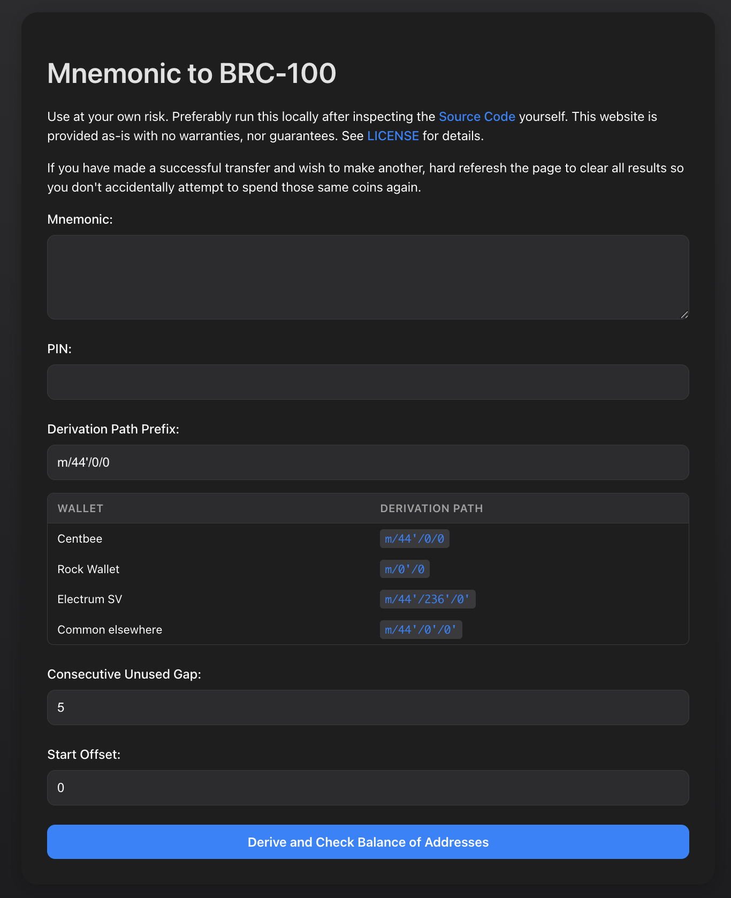

# Mnemonic to BRC-100 Onboarding Guide

**Status:** Production
**Last Updated:** October 2025
**Contact/Support:** [GitHub Project](https://github.com/p2ppsr) | [Live App](https://mnemonic-brc100.vercel.app/)

---

## 1. What Is Mnemonic to BRC-100?

Mnemonic to BRC-100 is a utility tool for deriving BRC-100 compatible wallet addresses from mnemonic seed phrases. It supports multiple wallet types including Centbee, Rock Wallet, and Electrum SV, allowing users to recover addresses and manage coins across different wallet implementations using standardized derivation paths.

**Key Features:**
- **Multi-Wallet Support** - Compatible with Centbee, Rock Wallet, Electrum SV, and common derivation paths
- **Mnemonic Recovery** - Derive addresses from 12 or 24-word seed phrases
- **Adjustable Gap/Offset** - Find unused addresses with configurable gap limits
- **PIN Support** - Optional PIN/passphrase for additional security
- **Address Generation** - Generate multiple addresses from a single mnemonic
- **UTXO Management** - View and manage unspent transaction outputs
- **Browser-Based** - Runs entirely in your browser for privacy

**Target Users:** Cryptocurrency users recovering wallet access, developers working with HD wallets, anyone needing to derive addresses from mnemonics across different wallet implementations.

---

## 2. Before You Begin

### Prerequisites
- **Mnemonic Phrase:** 12 or 24-word seed phrase from your wallet
- **Web Browser:** Modern browser with JavaScript enabled (Chrome, Firefox, Safari, Edge)
- **Wallet Type Knowledge:** Know which wallet generated your mnemonic (Centbee, Rock Wallet, etc.)
- **Optional PIN:** If your wallet uses a PIN or passphrase

### Supported Platforms
- **Web-based:** Access via https://mnemonic-brc100.vercel.app/
- **Cross-platform:** Works on desktop and mobile browsers
- **No Installation Required:** Pure web application
- **Offline Capable:** Can be run offline for enhanced security

### Security Considerations
- **Never share your mnemonic:** This tool processes mnemonics locally in your browser
- **Use offline when possible:** Download and run locally for maximum security
- **Clear browser after use:** Clear cache and history after using the tool
- **Private environment:** Use in a secure, private location

---

## 3. Getting Started: Step-by-Step

### Step 1: Access the Tool
1. Navigate to **https://mnemonic-brc100.vercel.app/** in your web browser
2. For maximum security, consider downloading the page for offline use
3. The main form will appear with input fields

### Step 2: Enter Your Mnemonic
1. Enter your **12 or 24-word mnemonic phrase** in the designated field
2. Words should be space-separated
3. Ensure correct spelling - mnemonics are case-sensitive
4. If your wallet uses a **PIN** or passphrase, enter it in the optional PIN field

### Step 3: Select Wallet Type and Derivation Path
Choose the correct derivation path for your wallet type:

| Wallet        | Derivation Path     | Use When |
|---------------|---------------------|----------|
| **Centbee**   | `m/44'/0'/0`        | Recovering Centbee wallet addresses |
| **Rock Wallet** | `m/0'/0`          | Recovering Rock Wallet addresses |
| **Electrum SV** | `m/44'/236'/0'`   | Recovering Electrum SV wallet addresses |
| **Common**    | `m/44'/0'/0'`       | Standard BIP44 Bitcoin derivation path |

1. Select your wallet type from the dropdown or radio buttons
2. The derivation path will be automatically set
3. Advanced users can manually enter custom derivation paths if needed

### Step 4: Configure Gap Limit (Optional)
1. Set the **gap limit** or offset for address discovery
2. Gap limit determines how many unused addresses to check
3. Default is usually 20; increase if you've generated many addresses
4. Higher gap limits take longer but find more addresses

### Step 5: Generate Addresses
1. Click **"Generate"** or **"Derive Addresses"** button
2. The tool will derive addresses based on your mnemonic and settings
3. View the generated addresses in the results section
4. Each address shows:
   - Address string
   - Derivation index
   - Balance (if connected to blockchain)
   - UTXO information

### Step 6: Manage Your Coins
1. Review generated addresses and their balances
2. Identify addresses with UTXOs (unspent coins)
3. Use this information to:
   - Import addresses into wallets
   - Track down missing funds
   - Understand address usage
   - Plan transactions

---

## 4. Advanced Features

### Custom Derivation Paths
Advanced users can specify custom BIP32/BIP44 derivation paths:
- **Format:** `m/purpose'/coin_type'/account'/change/address_index`
- **Experimentation:** Try different paths for recovery scenarios
- **Documentation:** Research BIP32, BIP44, and BIP49 standards

### Gap Limit Optimization
- **Small Gap (1-10):** Quick address generation for recently used wallets
- **Medium Gap (20-50):** Standard recovery scenarios
- **Large Gap (100+):** Comprehensive search for heavily-used wallets
- **Performance:** Higher gaps increase computation time

### Security Best Practices
- **Run Locally:** Download and run on offline computer for sensitive operations
- **Clear Browser:** Delete browsing data after use
- **Verify Results:** Always verify addresses on-chain before transactions
- **Test First:** Use test mnemonics to understand the tool before real use

### Wallet Integration
- **Export Addresses:** Copy addresses to import into other wallets
- **Balance Checking:** Verify funds before attempting recovery
- **Transaction Planning:** Identify which addresses hold your coins

---

## 5. Troubleshooting & FAQs

### Common Issues

| Problem | Cause | Solution |
|---------|-------|----------|
| No addresses generated | Incorrect mnemonic or derivation path | Verify mnemonic spelling; try different wallet types |
| Wrong addresses shown | Wrong derivation path selected | Try all wallet types; check if PIN is required |
| Balance not appearing | Not connected to blockchain or network issue | Refresh page; check internet connection; verify address on-chain |
| Tool not loading | Browser compatibility | Use latest Chrome, Firefox, Safari, or Edge |
| Mnemonic rejected | Invalid word or format | Check spelling; ensure words are BIP39-compatible |

### Important Tips
- **Refresh after spending:** Refresh page after making transactions to update balances
- **Verify on-chain:** Always verify addresses and balances on a blockchain explorer
- **Run code locally:** Download and run offline for best security practices
- **Document your wallet type:** Remember which wallet created your mnemonic
- **Test before trusting:** Practice with a small amount first

### Security Warnings
- **Never share mnemonics:** Anyone with your mnemonic controls your funds
- **Beware of phishing:** Only use the official tool URL
- **Use private network:** Don't use public WiFi for mnemonic operations
- **Clear history:** Remove all traces after use on shared computers

### Getting Help
- **GitHub:** [Project repository](https://github.com/p2ppsr) for issues and documentation
- **BSV Community:** Forums for wallet recovery assistance
- **Documentation:** BIP32/BIP44 standards for understanding derivation paths

---

## 6. Learn More / Next Steps

### Recovery Scenarios
- **Lost Wallet Access:** Recover addresses when wallet app is inaccessible
- **Multi-Wallet Migration:** Find addresses across different wallet implementations
- **Balance Discovery:** Locate funds when unsure which addresses hold coins
- **Wallet Debugging:** Troubleshoot address generation issues

### For Developers
- **Study HD Wallets:** Learn about hierarchical deterministic wallet structures
- **BIP Standards:** Research BIP32, BIP39, and BIP44 specifications
- **Integration:** Understand how to derive addresses programmatically
- **Code Review:** Examine source code on GitHub for implementation details

### Best Practices
- Apply derived addresses with other wallets and applications
- Keep backup copies of both mnemonic and derivation paths
- Document which wallet type generated your mnemonic
- Test recovery process periodically
- Use hardware wallets for long-term storage

### Related Resources
- **Wallet Guides:** [BSV Desktop](../metanet-desktop-mainnet.md) for modern wallet usage
- **Security Tools:** [Secure ATX Systems](./Secure-ATX-Systems.md) for backup strategies
- **BSV Blockchain:** [BSV Documentation](https://docs.bsvblockchain.org/) for technical details

### Educational Value
- Understand how HD wallets generate addresses
- Learn about BIP32/BIP44 derivation paths
- Explore differences between wallet implementations
- Study cryptographic key derivation

---

**Quick Links:**
[BSV Desktop Guide](../metanet-desktop-mainnet.md) | [Secure ATX Systems](./Secure-ATX-Systems.md) | [BSV Getting Started](../README.md)

---

*Mnemonic to BRC-100 - Derive wallet addresses from seed phrases across multiple wallet types and derivation paths.*
