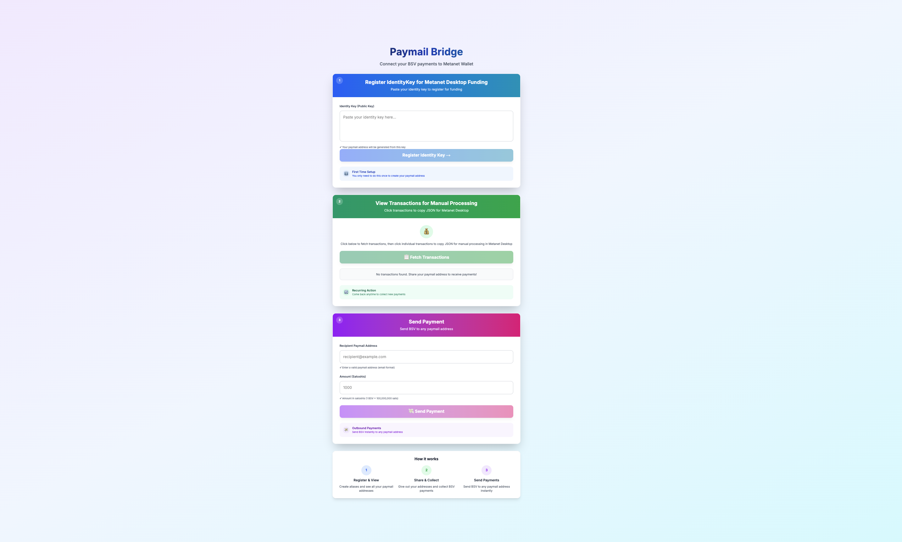
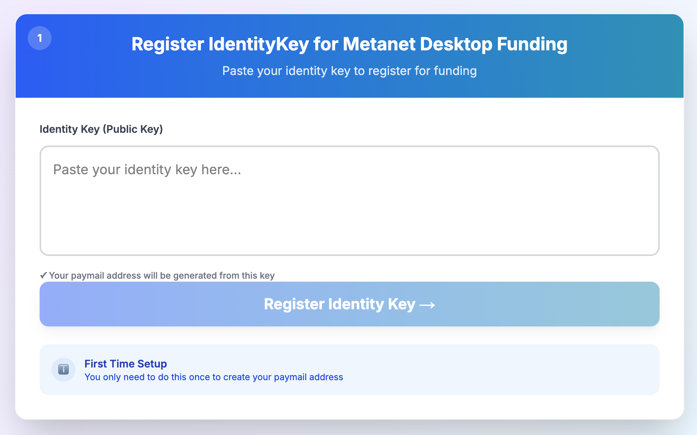
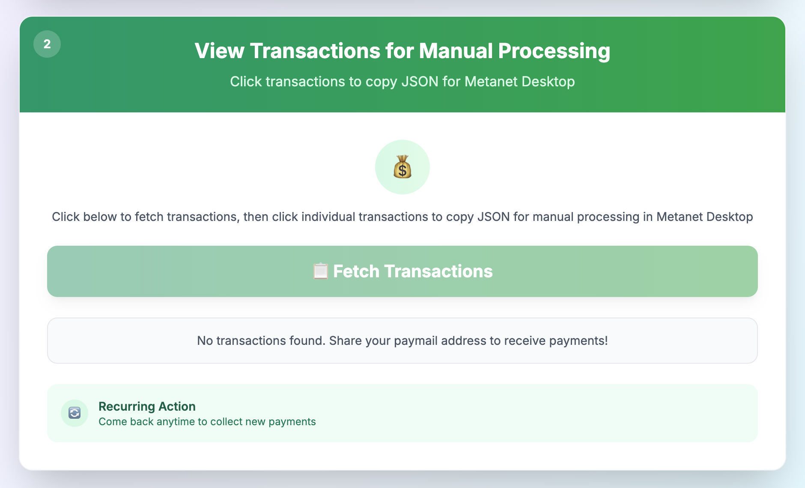
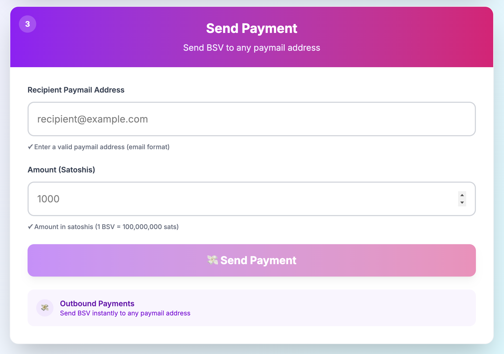

# Paymail.us Onboarding Guide

**Status:** Production
**Last Updated:** October 2025
**Contact/Support:** [Paymail Bridge](https://paymail.us/)

---

## 1. What Is Paymail.us?

Paymail.us (Paymail Bridge) is a user-friendly platform that simplifies BSV payments by providing memorable paymail addresses. Instead of sharing long, complex Bitcoin addresses, you can use a simple email-like paymail address (e.g., `yourname@paymail.us`) to send and receive BSV payments instantly.

**Key Features:**
- **Simple Paymail Registration** - Create your unique `@paymail.us` address
- **Easy Payment Collection** - Receive BSV payments using your memorable paymail
- **Instant Sending** - Send BSV to any paymail address with just a name and amount
- **Transaction History** - Track all incoming and outgoing payments
- **No Complex Addresses** - Share your paymail instead of long Bitcoin addresses
- **BSV Wallet Integration** - Works with BRC-100 compatible wallets

**Target Users:** Anyone who wants to simplify BSV payments - individuals, businesses, content creators, and developers who need an easy way to send and receive Bitcoin payments without dealing with complex addresses.

---

## 2. Before You Begin

### Prerequisites
- **BSV Wallet:** BRC-100 compatible wallet (Metanet Desktop recommended)
- **Web Browser:** Modern browser with JavaScript enabled
- **BSV Balance:** Small amount of BSV for payments (transactions cost fractions of cents)

### Supported Platforms
- **Web-based:** Access via https://paymail.us/
- **Cross-platform:** Works on desktop and mobile browsers
- **No Installation Required:** Pure web application

### Understanding Paymail
Paymail is a protocol that makes Bitcoin addresses as easy to use as email addresses. Instead of:
- Complex address: `1A1zP1eP5QGefi2DMPTfTL5SLmv7DivfNa`
- You use paymail: `alice@paymail.us`

This makes it much easier to share and remember payment addresses.

---

## 3. Getting Started: Step-by-Step

### Step 1: Access Paymail.us
1. Navigate to **https://paymail.us/** in your web browser
2. You'll see three main sections: Register Alias, Collect Payments, and Send Payments
3. Ensure your BSV Desktop wallet is running in the background

### Step 2: Register Your Paymail Alias
1. Click on **"Register Alias"** section
2. Choose your desired username (letters, numbers, hyphens, and underscores only)
3. Your full paymail will be: `yourusername@paymail.us`
4. Click **"Register"** to create your paymail
5. Confirm the small registration fee in your BSV wallet
6. Your paymail is now active and ready to receive payments

### Step 3: Collect Payments
1. Click on **"Collect Payments"** section
2. Share your paymail address (`yourusername@paymail.us`) with anyone who wants to send you BSV
3. Click **"Collect Payments"** button to retrieve payments sent to your paymail
4. View transaction list showing:
   - Amount received (in satoshis)
   - Sender information
   - Transaction timestamp
5. Payments are automatically credited to your connected wallet

### Step 4: Send Payments
1. Click on **"Send Payments"** section
2. Enter the **recipient's paymail address** (e.g., `bob@paymail.us` or any other paymail)
3. Enter the **amount in satoshis** (remember: 1 BSV = 100,000,000 satoshis)
4. Click **"Send"** to initiate payment
5. Confirm the transaction in your BSV wallet
6. Payment is sent instantly to the recipient's paymail

---

## 4. Advanced Features

### Payment Conversion
Understanding satoshi amounts:
- 1 BSV = 100,000,000 satoshis
- 0.01 BSV = 1,000,000 satoshis (common micropayment amount)
- 0.001 BSV = 100,000 satoshis
- 0.0001 BSV = 10,000 satoshis

### Transaction History
- Access your complete payment history through the Collect Payments section
- Track incoming payments with timestamps
- Monitor payment confirmations on BSV blockchain
- Export transaction data for accounting purposes

### Multiple Paymails
- You can register multiple paymail aliases for different purposes
- Use different paymails for business vs personal transactions
- Easy management of multiple payment identities

### Integration with Other Services
- Use your `@paymail.us` address with any paymail-compatible service
- Works across the BSV ecosystem
- Compatible with wallets that support paymail protocol

---

## 5. Troubleshooting & FAQs

### Common Issues

| Problem | Cause | Solution |
|---------|-------|----------|
| Alias registration fails | Username already taken or invalid characters | Try a different username; use only letters, numbers, hyphens, underscores |
| No transactions found | Payments not yet received or collected | Wait for sender to complete payment; click "Collect Payments" to retrieve |
| Send payment fails | Insufficient BSV balance or incorrect paymail | Check wallet balance; verify recipient's paymail address is correct |
| Wallet not connecting | BSV Desktop not running | Launch BSV Desktop and ensure it's connected to mainnet |
| Payment not appearing | Blockchain confirmation delay | Wait a few seconds for transaction confirmation |

### Important Tips
- **Double-check paymail addresses** - Sending to wrong paymail cannot be reversed
- **Remember satoshi conversion** - 1 BSV = 100,000,000 sats to avoid decimal errors
- **Share your paymail widely** - It's safe to share your paymail publicly
- **Collect payments regularly** - Check for incoming payments periodically
- **Keep wallet funded** - Maintain small BSV balance for transaction fees

### Getting Help
- **Website:** [https://paymail.us/](https://paymail.us/)
- **BSV Community:** Community forums and support channels
- **Paymail Protocol:** Learn more about paymail at [bsvalias.org](https://bsvalias.org/)

---

## 6. Learn More / Next Steps

### Best Practices
- Use descriptive usernames for business accounts (e.g., `storename@paymail.us`)
- Keep personal and business paymails separate
- Share your paymail on social media, websites, and business cards
- Test with small amounts before making large payments
- Save frequently-used paymail addresses for quick access

### Use Cases
- **Content Creator Tips:** Share your paymail for audience donations
- **Business Payments:** Accept payments without complex payment processors
- **Peer-to-Peer Transfers:** Send money to friends and family easily
- **Micropayments:** Enable pay-per-content or service models
- **International Transfers:** Send BSV globally without traditional banking

### Integration Opportunities
- Combine with [PeerPay](./PeerPay.md) for enhanced peer-to-peer payments
- Use with [Metanet Desktop](../metanet-desktop-mainnet.md) for full wallet features
- Explore other BSV payment apps for complete financial workflows

### Learn More About Paymail
- Paymail Protocol: [bsvalias.org](https://bsvalias.org/)
- BSV Blockchain: [Learn about BSV](https://www.bsvblockchain.org/)
- Metanet Apps: [Explore more apps](https://metanetapps.com/)

---

**Quick Links:**
[BSV Desktop Guide](../metanet-desktop-mainnet.md) | [BSV Getting Started](../README.md) | [PeerPay Guide](./PeerPay.md)

---

*Paymail.us - Making BSV payments as easy as email, powered by the Paymail protocol.*
