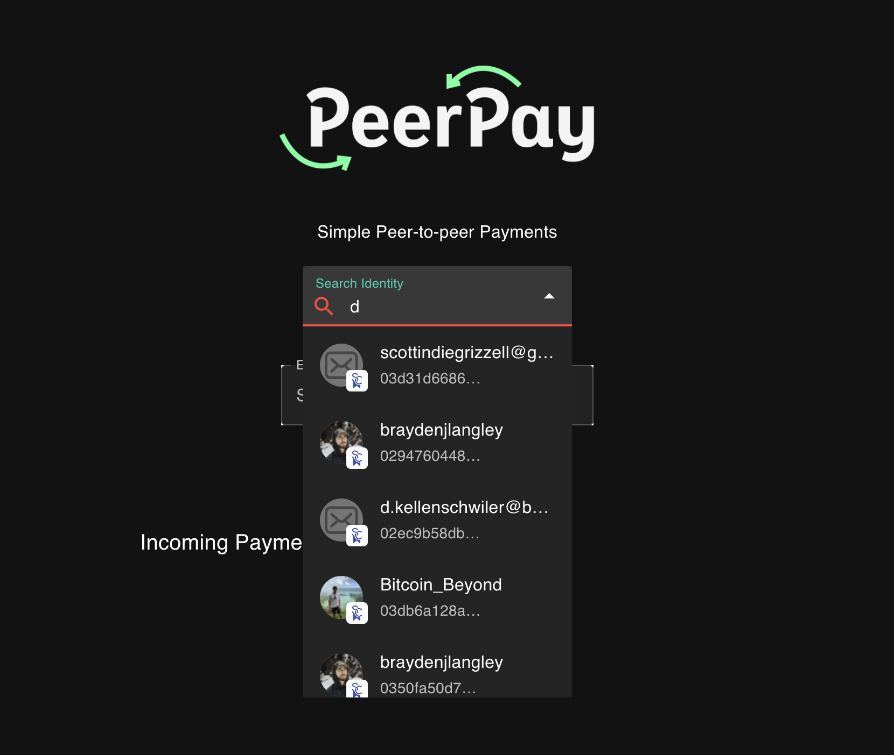

# PeerPay Onboarding Guide

**Status:** Production
**Last Updated:** October 2025
**Contact/Support:** [PeerPay GitHub](https://github.com/p2ppsr/peerpay) | [Babbage Systems](https://babbage.systems/)

---

## 1. What Is PeerPay?

PeerPay is a peer-to-peer payment application that revolutionizes how individuals send and receive BSV cryptocurrency. Built on the Babbage SDK infrastructure, PeerPay eliminates the complexity of blockchain addresses by using identity-based payments - simply search for someone by their identity key and send them SATS instantly.

**Key Features:**
- **Identity-Based Payments** - Send money using identity keys instead of complex blockchain addresses
- **Instant Peer Discovery** - Search and find users by their BSV identity
- **SATS Transactions** - Send and receive payments in satoshis (the smallest unit of BSV)
- **Complete Transaction History** - Track all incoming and outgoing payments
- **Payment Dashboard** - Clean interface for managing all your P2P transactions
- **No Intermediaries** - Direct peer-to-peer transfers without third-party involvement
- **Transparent Records** - All transactions recorded on BSV blockchain

**Target Users:** Anyone needing to send or receive BSV payments between individuals - friends splitting bills, family members exchanging money, freelancers receiving payments, or anyone seeking a simple alternative to traditional payment apps with the benefits of blockchain technology.

---

## 2. Before You Begin

### Prerequisites
- **BSV Wallet:** BSV Desktop Wallet or compatible Babbage-enabled wallet
- **BSV Identity:** Identity key for receiving payments and user discovery
- **Web Browser:** Modern browser with JavaScript enabled
- **BSV Balance:** SATS for sending payments (minimal amounts for testing)
- **Identity Understanding:** Basic familiarity with BSV identity system (helpful but not required)

### Supported Platforms
- **Web-based:** Access via https://peerpay.babbage.systems/
- **Cross-platform:** Works on desktop and mobile browsers
- **Babbage SDK Integration:** Compatible with all Babbage-enabled wallets
- **No Installation Required:** Pure web application

### Babbage Identity Setup
PeerPay relies on the Babbage identity system for peer discovery. If you're using BSV Desktop Wallet, your identity is already configured. For other wallets:
- Ensure your wallet supports Babbage SDK
- Verify your identity key is active
- Share your identity key with people who need to send you payments

---

## 3. Getting Started: Step-by-Step

### Step 1: Access PeerPay
1. Navigate to **https://peerpay.babbage.systems/** in your web browser
2. The PeerPay interface will load
3. Ensure your BSV wallet is running in the background
4. The application will automatically detect your Babbage-enabled wallet

### Step 2: Connect Your Wallet
1. PeerPay will request connection to your BSV wallet
2. **Grant permission** when prompted by your wallet application
3. Your identity key will be linked to PeerPay
4. The main dashboard appears once connected
5. Your current balance and identity status display in the interface

### Step 3: Find a Peer by Identity
1. Locate the **Search** or **Find User** field
2. Enter the recipient's **BSV identity key**
3. The system searches the Babbage identity network
4. Matching user(s) appear in search results
5. Verify you've selected the correct recipient
6. Click on the user to proceed to payment

**Finding Identity Keys:**
- Recipients can share their identity key directly with you
- Identity keys are unique identifiers in the BSV ecosystem
- Some BSV applications display user identity keys in profiles
- Identity keys are different from blockchain addresses

### Step 4: Send Your First Payment
1. With recipient selected, enter the **payment amount in SATS**
2. Review the payment details:
   - Recipient identity key
   - Amount to send
   - Current network fee (typically very small)
3. Add an optional **payment note or description** if desired
4. Click **Send Payment** or **Confirm**
5. Your wallet prompts for payment authorization
6. **Approve the transaction** in your wallet
7. Payment processes instantly on BSV blockchain
8. Confirmation appears in PeerPay interface

**SATS Conversion:**
- 1 BSV = 100,000,000 SATS
- Example: 10,000 SATS = 0.0001 BSV
- PeerPay displays amounts in SATS for precision

### Step 5: Receive Payments
1. Share your **BSV identity key** with the sender
2. Incoming payments automatically appear in your dashboard
3. No action required to receive - payments arrive automatically
4. Your wallet balance updates in real-time
5. Review incoming payment details in the transaction history

**Sharing Your Identity:**
- Find your identity key in BSV Desktop or your wallet settings
- Share via secure channels (messaging apps, email, etc.)
- Your identity key is safe to share publicly (unlike private keys)
- Consider creating a payment link or QR code for easier sharing

### Step 6: Review Transaction History
1. Access the **Payments Dashboard** or **History** section
2. View complete transaction list with:
   - **Sent payments** - outgoing transactions
   - **Received payments** - incoming transactions
   - Timestamps for all transactions
   - Payment amounts and descriptions
   - Transaction status (pending, confirmed)

**History Features:**
- Filter by date range or transaction type
- Search for specific payments
- Export transaction history for records
- Click transactions for blockchain verification

---

## 4. Advanced Features

### Identity Management
- **Multiple Identities:** Some wallets support multiple identity keys for different purposes
- **Identity Verification:** Use with SocialCert to verify identity authenticity
- **Contact Lists:** Save frequently used identities for quick access
- **Identity Aliases:** Some systems allow naming identities for easier recognition

### Payment Features
- **Recurring Payments:** Set up regular payment schedules (if supported)
- **Payment Requests:** Request specific amounts from other users
- **Payment Notes:** Add descriptions to organize transaction purposes
- **Bulk Payments:** Send to multiple recipients in sequence
- **Payment Confirmations:** Receive blockchain confirmation proof for all transactions

### Transaction Management
- **Real-time Status:** Monitor payment progress from initiation to blockchain confirmation
- **Transaction Details:** View complete blockchain data for any payment
- **Export Options:** Download transaction history in various formats
- **Receipt Generation:** Create payment receipts for accounting purposes
- **Dispute Documentation:** Blockchain records provide immutable transaction proof

### Developer Integration
- **Babbage SDK:** Build custom applications using the same payment infrastructure
- **API Access:** Integrate PeerPay functionality into other applications
- **GitHub Repository:** Access open-source code for customization
- **Payment Protocols:** Implement standardized payment flows
- **Testing Environment:** Development tools available for testing integrations

---

## 5. Troubleshooting & FAQs

### Common Issues

| Problem | Cause | Solution |
|---------|-------|----------|
| Cannot find recipient | Invalid identity key | Double-check identity key format; verify recipient has active Babbage identity |
| Payment fails to send | Insufficient SATS balance | Check wallet balance; ensure enough SATS to cover amount plus fees |
| Wallet not connecting | BSV wallet not running | Launch BSV Desktop or compatible wallet; refresh PeerPay page |
| Payment stuck pending | Network delay | Wait for blockchain confirmation; BSV typically confirms within minutes |
| Identity search returns no results | Recipient not on Babbage network | Verify recipient uses Babbage-compatible wallet; check identity key accuracy |
| History not loading | Browser cache issue | Clear browser cache; refresh page; check internet connection |

### Tips for Smooth Transactions
- **Verify Identity Keys:** Always confirm recipient identity before sending
- **Start Small:** Test with small amounts when sending to new recipients
- **Note Descriptions:** Add payment notes for your own record-keeping
- **Network Awareness:** BSV transactions are fast but allow time for blockchain confirmation
- **Balance Management:** Keep sufficient SATS balance for payments and fees

### Getting Help
- **GitHub Repository:** [PeerPay GitHub](https://github.com/p2ppsr/peerpay) for technical documentation
- **Babbage Systems:** Contact [Babbage Systems](https://babbage.systems/) for infrastructure support
- **Community Forums:** Join BSV developer communities for peer assistance
- **Wallet Support:** Contact your wallet provider for connection issues
- **Documentation:** Review Babbage SDK documentation for technical details

---

## 6. Learn More / Next Steps

### Best Practices for Peer-to-Peer Payments
- **Identity Verification:** Use SocialCert to verify recipient identities when possible
- **Record Keeping:** Export transaction history regularly for financial records
- **Security Awareness:** Never share private keys; only share identity keys
- **Communication:** Confirm payments with recipients through separate channels
- **Amount Confirmation:** Always review payment amounts carefully before confirming

### Common Use Cases
- **Bill Splitting:** Share expenses with friends and family instantly
- **Freelance Payments:** Receive project payments directly without intermediaries
- **Micropayments:** Send tiny amounts for services, tips, or content
- **International Transfers:** Send money globally without traditional banking delays
- **Instant Settlements:** Complete transactions in seconds instead of days
- **Allowances and Gifts:** Send money to family members easily

### Integration Opportunities
- **SocialCert:** Verify payment recipient identities with social credentials
- **Metanet Highway:** Use for additional wallet management features
- **BSV Desktop:** Full-featured wallet with PeerPay integration
- **ToolBSV:** Combine identity-based payments with AI service micropayments
- **Business Applications:** Integrate PeerPay into custom business workflows

### Development and Customization
- **Fork on GitHub:** Customize PeerPay for your specific needs
- **Babbage SDK Integration:** Build new applications with identity-based payments
- **Payment Workflows:** Design custom payment processes for your use case
- **UI Modifications:** Adapt the interface for your branding or requirements
- **API Extensions:** Add new features using the Babbage infrastructure

### Related Resources
- **Babbage SDK Documentation:** Learn about the underlying technology
- **BSV Identity System:** Understand how BSV identity works
- **Payment Protocols:** Study BSV payment standards and best practices
- **Smart Contracts:** Explore more advanced blockchain payment mechanisms
- **Community Projects:** Discover other Babbage-powered applications

### Stay Updated
- **GitHub Releases:** Watch the repository for updates and new features
- **Babbage Announcements:** Follow Babbage Systems for infrastructure updates
- **BSV Development:** Stay informed about BSV protocol improvements
- **Community Contributions:** Contribute to or suggest improvements for PeerPay
- **Integration Examples:** Look for new use cases and integration tutorials

---

**Quick Links:**
[BSV Desktop Guide](../metanet-desktop-mainnet.md) | [BSV Getting Started](../README.md) | [SocialCert Identity](SocialCert.md) | [Babbage SDK](https://babbage.systems/)

---

*PeerPay simplifies blockchain payments by focusing on people, not addresses - send money as easily as sending a message, with all the security and transparency of BSV blockchain.*
