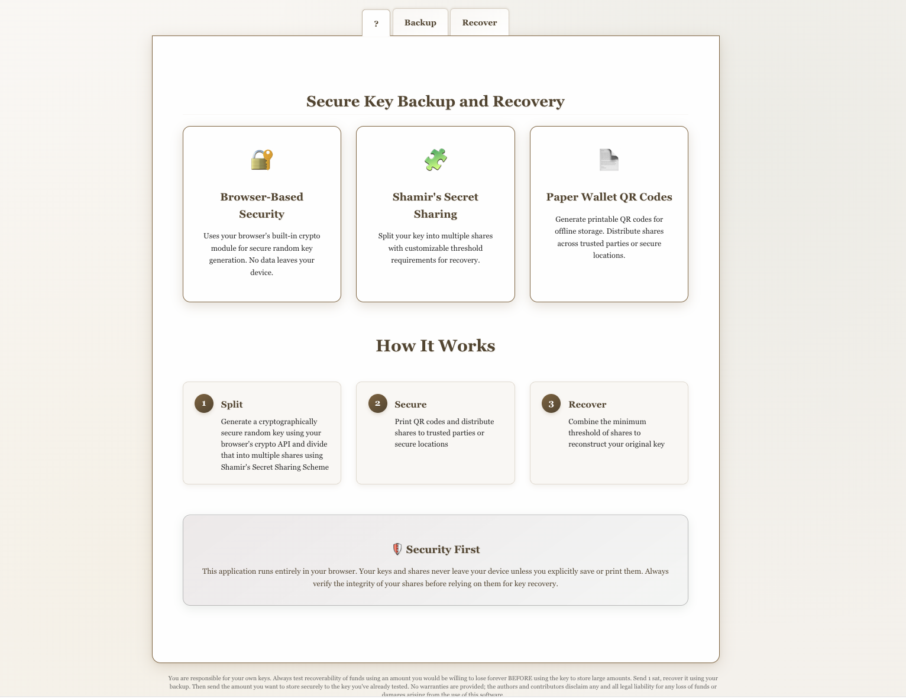
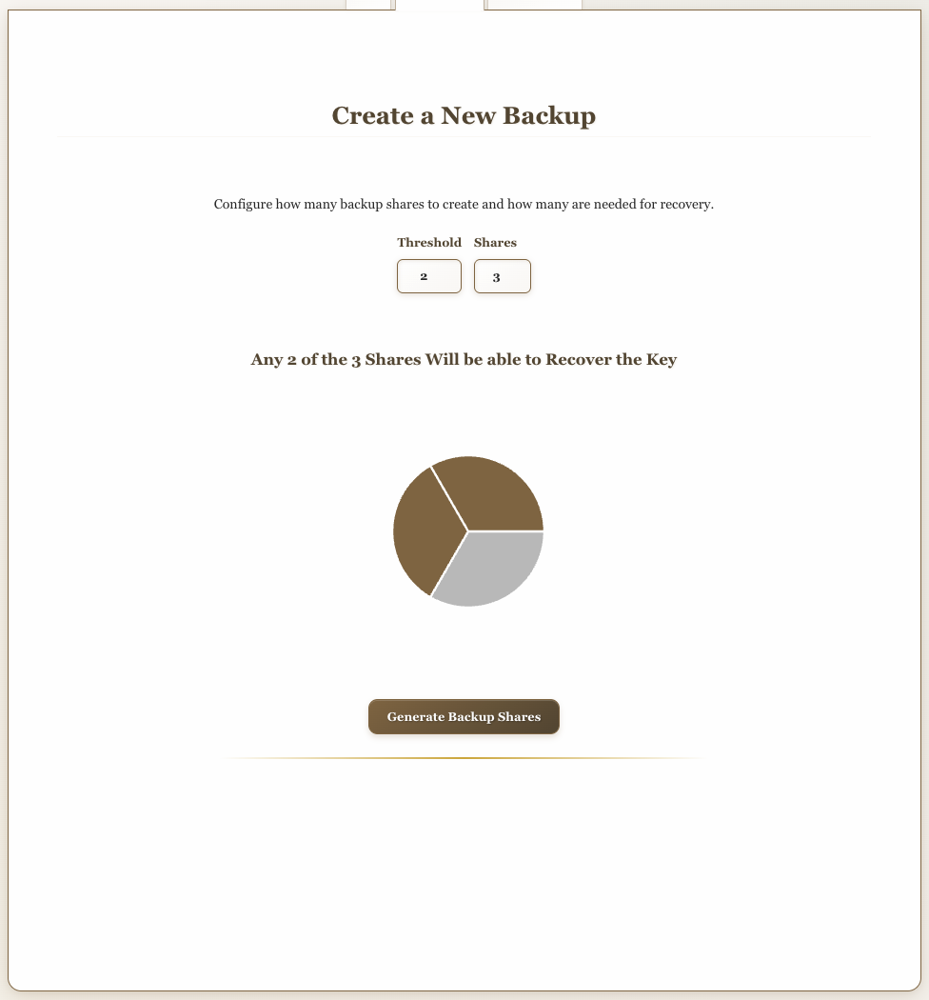
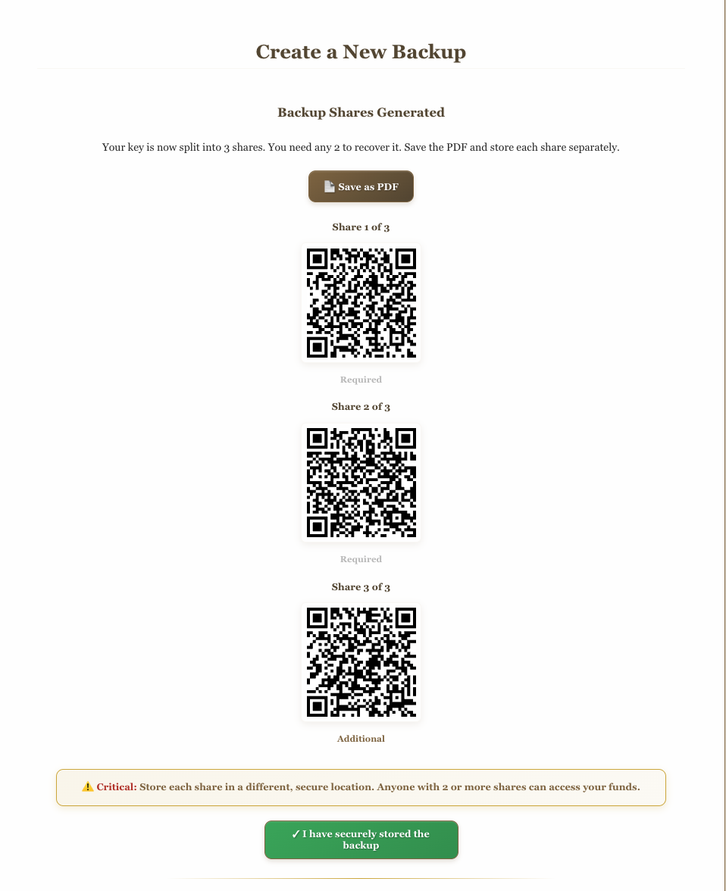
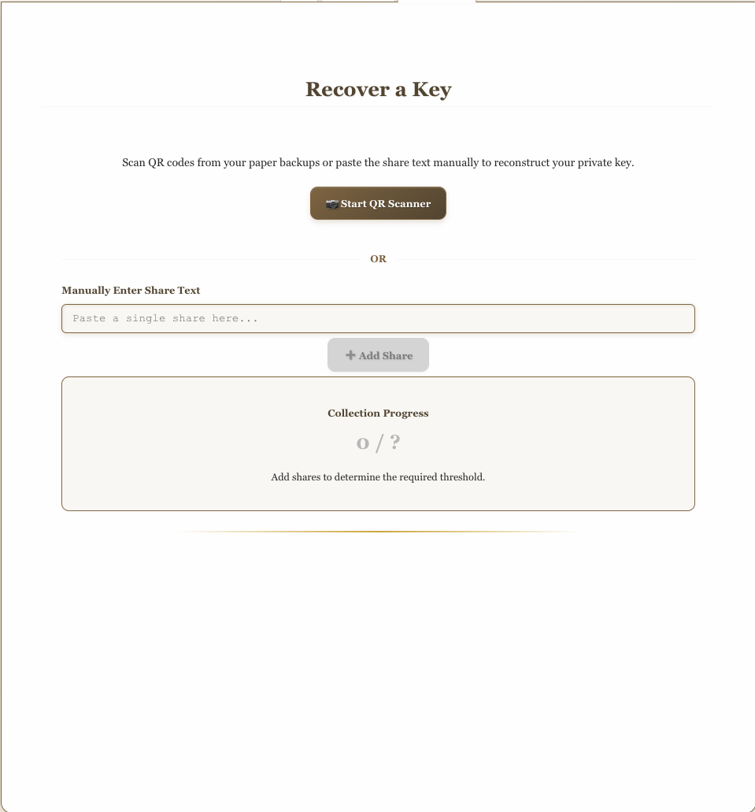
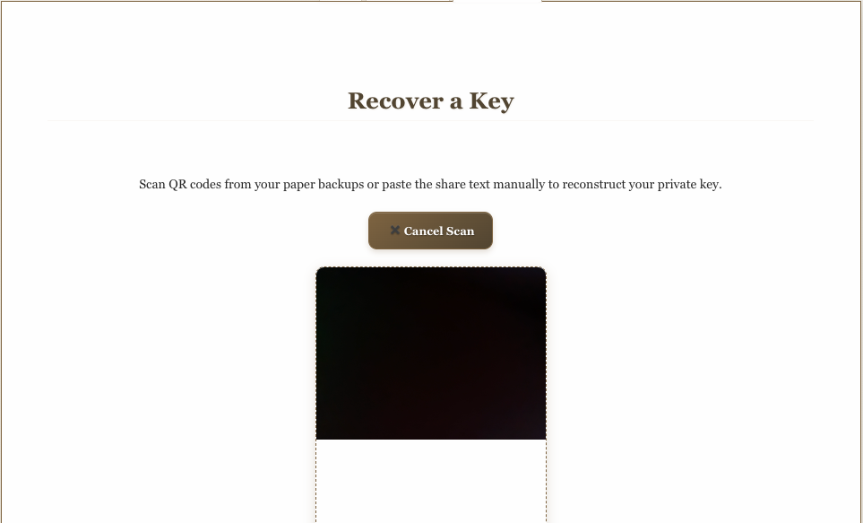

# Secure ATX Systems Onboarding Guide

**Status:** Production
**Last Updated:** October 2025
**Contact/Support:** [Secure ATX Systems](https://secure.atx.systems/)

---

## 1. What Is Secure ATX Systems?

Secure ATX Systems is a browser-based key management and backup solution that uses Shamir's Secret Sharing Scheme (SSSS) to split cryptographic keys into multiple shares. This allows you to create secure backups of sensitive keys (like wallet seed phrases or private keys) that require a minimum number of shares to reconstruct, providing both security and redundancy.

**Key Features:**
- **Shamir's Secret Sharing** - Split secrets into multiple shares with configurable threshold
- **QR Code Generation** - Create printable QR codes for each share
- **Threshold Recovery** - Reconstruct secrets from minimum number of shares
- **Browser-Local Cryptography** - All operations happen in your browser (no server transmission)
- **Offline Capable** - Can be used completely offline for maximum security
- **Printable Paper Wallets** - Generate physical backups of key shares

**Target Users:** Anyone needing secure key backup and recovery - cryptocurrency users, developers, businesses, and security-conscious individuals who want to protect sensitive keys with distributed backup schemes.

---

## 2. Before You Begin

### Prerequisites
- **Web Browser:** Modern browser with JavaScript enabled (Chrome, Firefox, Safari, Edge)
- **Printer:** For creating physical QR code backups (recommended)
- **Secret/Key:** The private key, seed phrase, or secret you want to secure

### Supported Platforms
- **Web-based:** Access via https://secure.atx.systems/
- **Offline Use:** Download the page for completely offline operation
- **Cross-platform:** Works on desktop and mobile browsers
- **No Installation Required:** Pure web application

### Understanding Shamir's Secret Sharing
Shamir's Secret Sharing splits a secret into N shares where any K shares can reconstruct the secret:
- **Example:** Split into 5 shares with threshold of 3
  - Any 3 shares can recover the secret
  - 2 or fewer shares reveal nothing
  - Provides both security (no single point of failure) and redundancy (can lose up to 2 shares)

---

## 3. Getting Started: Step-by-Step

### Step 1: Access Secure ATX Systems
1. Navigate to **https://secure.atx.systems/** in your web browser
2. You'll see two main options: **Backup** (split secret) and **Recover** (reconstruct secret)
3. For maximum security, consider using in an offline environment

### Step 2: Backup Your Secret (Split into Shares)

#### Step 2a: Enter Your Secret
1. Click **"Backup"** to begin the split process
2. Enter the secret you want to protect:
   - Private key
   - Seed phrase (12 or 24 words)
   - Passphrase
   - Any sensitive text data
3. **Warning:** This is sensitive data - ensure you're in a secure environment

#### Step 2b: Configure Sharing Parameters
1. Set **Number of Shares (N):** How many total shares to create
   - Common values: 3, 5, or 7 shares
2. Set **Threshold (K):** Minimum shares needed to recover
   - Common setup: 5 shares with threshold of 3
   - This means: any 3 of 5 shares can recover, can lose 2 shares safely
3. Click **"Generate Shares"**

#### Step 2c: Generate and Save QR Codes
1. System generates unique QR codes for each share
2. Each QR code contains one encrypted share
3. **Print** each QR code on separate paper
4. Optionally **download** digital copies
5. Label each share (Share 1 of 5, Share 2 of 5, etc.)

#### Step 2d: Distribute Shares Securely
1. Store each share in a different secure location:
   - Safe deposit boxes
   - With trusted family members
   - Different physical locations
   - Encrypted cloud storage (different providers)
2. **Never store all shares in one location**
3. Keep threshold number secure but accessible

### Step 3: Recover Your Secret (Reconstruct from Shares)

#### Step 3a: Access Recovery Mode
1. Go to **https://secure.atx.systems/**
2. Click **"Recover"** to begin reconstruction
3. Have your required number of shares ready (threshold amount)

#### Step 3b: Scan or Enter Shares
1. **Option A:** Scan QR codes using your device camera
   - Click "Scan QR Code"
   - Allow camera access
   - Point at each share QR code
2. **Option B:** Manually enter share data
   - Type or paste share strings
3. Continue until you've entered the threshold number of shares

#### Step 3c: Reconstruct Secret
1. Once threshold is met, click **"Recover Secret"**
2. Your original secret is reconstructed and displayed
3. **Copy your secret immediately**
4. Clear the screen when done for security

---

## 4. Advanced Features

### Security Best Practices
- **Offline Operation:** Download the page and use on an air-gapped computer
- **Private Environment:** Use in a private location without cameras or observers
- **Temporary Usage:** Clear browser cache and history after use
- **Physical Security:** Store printed shares in fireproof, waterproof containers

### Share Distribution Strategies

**5-of-9 Strategy (High Security):**
- Create 9 shares, any 5 needed to recover
- Distribute to 9 different locations
- Can lose up to 4 shares and still recover

**3-of-5 Strategy (Balanced):**
- Create 5 shares, any 3 needed to recover
- Good balance of security and convenience
- Common for personal use

**2-of-3 Strategy (Convenience):**
- Create 3 shares, any 2 needed to recover
- Faster recovery, but less redundancy
- Good for less critical secrets

### Validation Testing
Before relying on your backup:
1. Create test shares with dummy secret
2. Practice recovery process
3. Verify reconstruction works correctly
4. Only then use for real secrets

### Integration with BSV Wallets
Use Secure ATX to backup:
- BSV wallet seed phrases (12 or 24 words)
- Private keys from Metanet Desktop
- BRC-42 identity keys
- Any cryptographic material

---

## 5. Troubleshooting & FAQs

### Common Issues

| Problem | Cause | Solution |
|---------|-------|----------|
| Recovery fails | Not enough shares or incorrect shares | Ensure you have threshold number of valid shares |
| QR code won't scan | Poor print quality or lighting | Use manual entry or reprint QR codes |
| Can't print QR codes | Printer not connected | Save as PDF first, then print later |
| Secret not reconstructing | Wrong shares from different backups | Ensure all shares are from the same backup session |
| Browser compatibility issues | Outdated browser | Use latest Chrome, Firefox, Safari, or Edge |

### Important Security Notes
- **Never take photos of all shares together** - defeats the purpose
- **Test recovery before trusting** - verify process works with test data
- **Use threshold > 50%** - e.g., 3 of 5, not 2 of 5 (prevents easy compromise)
- **Distribute geographically** - protect against single location disasters
- **Update shares if compromised** - if any share is exposed, create new backup

### Getting Help
- **Website:** [https://secure.atx.systems/](https://secure.atx.systems/)
- **Shamir's Secret Sharing:** [Wikipedia](https://en.wikipedia.org/wiki/Shamir%27s_Secret_Sharing)
- **BSV Community:** For wallet-specific backup questions

---

## 6. Learn More / Next Steps

### Recommended Configurations by Use Case

**Personal BSV Wallet Backup:**
- 5 shares, threshold of 3
- Keep 2 at home (different locations), 1 with family, 1 in safe deposit box, 1 in cloud

**High-Value Keys (Business/Enterprise):**
- 7 shares, threshold of 4
- Distribute across multiple executives, locations, and secure facilities

**Moderate Security (Personal Use):**
- 3 shares, threshold of 2
- One at home, one with trusted person, one in cloud backup

### Related Resources
- Combine with [BSV Desktop Wallet](../metanet-desktop-mainnet.md) for key backup
- Use with [Legacy ATX Systems](./Legacy-ATX-Systems.md) for address management
- Learn about [BRC-42 Key Derivation](https://bsv.brc.dev/wallet/0042)

### Educational Resources
- Understanding threshold cryptography
- Key management best practices
- Disaster recovery planning for cryptocurrency
- Physical security for paper wallets

---

**Quick Links:**
[BSV Desktop Guide](../metanet-desktop-mainnet.md) | [BSV Getting Started](../README.md) | [Legacy ATX Systems](./Legacy-ATX-Systems.md)

---

*Secure ATX Systems - Protecting your keys with Shamir's Secret Sharing and distributed backup.*
