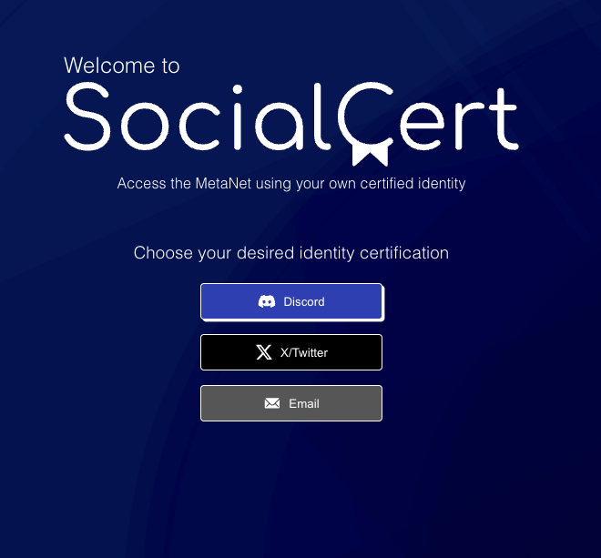
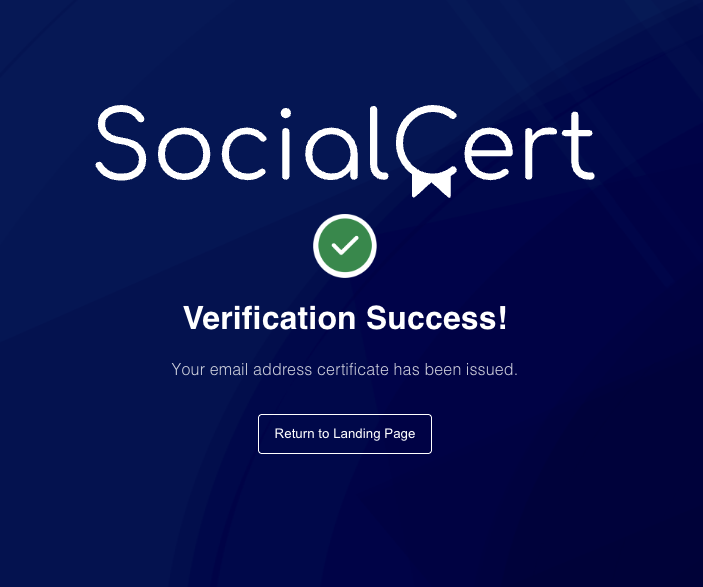

# SocialCert Onboarding Guide

**Status:** Production
**Last Updated:** October 2025
**Contact/Support:** [SocialCert Website](https://socialcert.net/)

---

## 1. What Is SocialCert?

SocialCert is a blockchain-based identity verification platform that issues verifiable digital certificates by linking your BSV identity to your social media accounts and email addresses. By creating cryptographically signed certificates that prove you control specific social accounts, SocialCert enables trusted identity verification across the BSV ecosystem without centralized authority or invasive KYC requirements.

**Key Features:**
- **Multi-Platform Verification** - Connect and verify Discord, X (Twitter), and Email accounts
- **Blockchain Certificates** - Immutable, cryptographically signed identity proofs
- **Decentralized Identity** - No centralized database; certificates stored on BSV blockchain
- **Public Verification** - Anyone can verify certificate authenticity and attributes
- **Privacy-Preserving** - Share only what you choose; control your identity disclosure
- **Ecosystem Integration** - Use certificates across BSV and Metanet applications
- **Revocation Support** - Update or revoke certificates as needed

**Target Users:** Anyone participating in the BSV ecosystem who wants to establish trusted identity credentials - developers accessing platforms, community members proving membership, content creators verifying authenticity, or anyone seeking reputation portability across decentralized applications.

---

## 2. Before You Begin

### Prerequisites
- **BSV Wallet:** BSV Desktop Wallet for certificate signing and small blockchain fees
- **Social Accounts:** Active accounts on platforms you want to verify (X, Discord, Email)
- **Web Browser:** Modern browser with JavaScript enabled
- **Account Access:** Ability to receive verification messages on accounts you're verifying

### Supported Platforms
- **Web-based:** Access via https://socialcert.net/
- **Cross-platform:** Works on desktop and mobile browsers
- **No Installation Required:** Pure web application
- **Universal Verification:** Certificates verifiable from any BSV-compatible application

### Verification Methods Available
SocialCert currently supports three primary verification types:

1. **X (Twitter) Verification**
   - Links your BSV identity to your X/Twitter account
   - Proves account ownership via OAuth authentication
   - Enables reputation portability from social media

2. **Discord Verification**
   - Connects your BSV identity to Discord account
   - Useful for community access and role assignment
   - Enables Discord-based authentication for BSV apps

3. **Email Verification**
   - Links your BSV identity to email address
   - Provides traditional contact method verification
   - Enables email-based recovery and communication

---

## 3. Getting Started: Step-by-Step

### Step 1: Access SocialCert
1. Navigate to **https://socialcert.net/** in your web browser
2. The SocialCert interface loads showing verification options
3. Ensure your BSV Desktop Wallet is running
4. Connect your wallet when prompted

### Step 2: Choose Verification Type
Select which account type you want to verify first:
- **X/Twitter** - For social media identity linking
- **Discord** - For community and server access
- **Email** - For contact verification

**Recommendation:** Start with the verification type most relevant to your immediate needs. You can complete multiple verifications over time to build a comprehensive identity profile.

### Step 3: Complete X (Twitter) Verification

#### Process:
1. Click on **"Verify X Account"** or similar button
2. SocialCert redirects to X OAuth authentication
3. **Log in to your X account** if not already logged in
4. Review the **permission request** from SocialCert
5. **Authorize the application** to verify account ownership
6. You're redirected back to SocialCert
7. SocialCert creates a certificate linking your BSV identity to X handle
8. **Approve the blockchain transaction** in BSV Desktop
9. Certificate is issued and recorded on blockchain

**What's Included in Certificate:**
- Your BSV identity key
- Your X/Twitter handle
- Verification timestamp
- Certificate signature
- Certificate ID for future reference

### Step 4: Complete Discord Verification

#### Process:
1. Select **"Verify Discord Account"**
2. SocialCert initiates Discord OAuth flow
3. **Log in to Discord** if not already authenticated
4. Review **permissions requested** by SocialCert bot
5. **Authorize** the connection
6. Discord authentication completes
7. Return to SocialCert interface
8. SocialCert generates Discord verification certificate
9. **Approve certificate creation** in BSV Desktop
10. Certificate recorded on blockchain with Discord account info

**Discord Benefits:**
- Automatic role assignment in BSV Discord servers
- Proof of community membership
- Discord-based authentication for applications

### Step 5: Complete Email Verification

#### Process:
1. Click on **"Verify Email"**
2. Enter your **email address** in the verification form
3. Click **"Send Verification"**
4. Check your **email inbox** (and spam/junk folder)
5. Open the verification email from SocialCert
6. Click the **verification link** in the email
7. Browser returns to SocialCert with confirmation
8. SocialCert creates email verification certificate
9. **Approve the transaction** in BSV Desktop
10. Email certificate issued to blockchain

**Email Verification Tips:**
- Check spam folder if email doesn't arrive within minutes
- Ensure email address is typed correctly
- Use email you have reliable access to
- Consider using email associated with your other accounts

### Step 6: View and Manage Your Certificates
1. After verification completes, navigate to **"My Certificates"** or similar section
2. View all your issued certificates:
   - Certificate type (X, Discord, Email)
   - Associated account information
   - Issuance timestamp
   - Certificate status (active, revoked)
   - Blockchain transaction ID
3. Check **certificate attributes** - data included in each certificate
4. **Export certificate details** for use in other applications
5. **Revoke certificates** if needed (account change, security concerns)

**Certificate Management:**
- Download certificate data for local storage
- Share certificate IDs with applications requiring verification
- Monitor certificate status regularly
- Update certificates when changing accounts

---

## 4. Advanced Features

### Certificate Verification and Validation
- **Public Verification:** Anyone can verify certificate authenticity using blockchain data
- **Attribute Inspection:** Review specific claims made in certificates
- **Expiration Management:** Some certificates may have validity periods
- **Signature Validation:** Cryptographic signatures prove certificate legitimacy
- **Chain of Trust:** Certificates link back to BSV identity key cryptographically

### Identity Portability
- **Cross-Application Use:** Use certificates across multiple BSV applications
- **Reputation Transfer:** Carry verified identity across platforms
- **Single Sign-On:** Some applications use SocialCert for authentication
- **Selective Disclosure:** Choose which certificates to present to each application
- **Unified Profile:** Build comprehensive verified identity across channels

### Integration with BSV Ecosystem
- **MarsCast Access:** Verified identities may grant access to content platforms
- **Metanet Applications:** Many Metanet apps recognize SocialCert credentials
- **Community Privileges:** Discord verification enables automated role assignments
- **Developer APIs:** Applications can programmatically verify your certificates
- **Payment Linkage:** Combine verified identity with payment credentials for trusted commerce

### Privacy and Security Controls
- **Selective Sharing:** Choose which certificates to activate or share
- **Revocation Rights:** Revoke certificates at any time
- **Minimal Disclosure:** Share only necessary identity attributes
- **Pseudonymity Option:** Maintain pseudonymous identity while proving account control
- **Key Management:** Certificates tied to your BSV identity key for security

---

## 5. Troubleshooting & FAQs

### Common Issues

| Problem | Cause | Solution |
|---------|-------|----------|
| Email verification not arriving | Delayed delivery or spam filter | Check spam/junk folder; wait 5-10 minutes; request new verification email |
| OAuth fails for X/Discord | Browser cookies or extensions | Disable ad blockers; enable cookies; try incognito mode; check account status |
| Certificate not appearing | Blockchain confirmation delay | Wait a few minutes for blockchain confirmation; refresh page |
| Cannot revoke certificate | Wallet connection issue | Ensure BSV Desktop is running and connected; check wallet balance for fees |
| Wrong account linked | Incorrect login during OAuth | Revoke incorrect certificate; verify again with correct account |
| Application doesn't recognize certificate | Integration not updated | Contact application developer; verify certificate ID is correct; check certificate status |

### Tips for Successful Verification
- **Account Access:** Ensure you're logged into correct accounts before starting OAuth
- **Email Reliability:** Use email addresses you check regularly and control long-term
- **Browser Compatibility:** Use mainstream browsers without aggressive privacy settings for OAuth
- **Documentation:** Save certificate IDs and transaction details for future reference
- **Multiple Verifications:** Complete all relevant verifications to maximize identity utility

### Getting Help
- **Website:** Visit [SocialCert](https://socialcert.net/) for documentation and updates
- **Community Support:** Join BSV Discord servers where SocialCert is used
- **Technical Issues:** Report OAuth problems or verification failures through community channels
- **Platform-Specific Problems:** Contact X, Discord, or email provider if authentication fails
- **Integration Support:** Contact specific application developers for integration questions

---

## 6. Learn More / Next Steps

### Best Practices for Identity Management
- **Regular Updates:** Reverify if you change account details (username, email, etc.)
- **Security Awareness:** Treat SocialCert certificates as sensitive identity documents
- **Account Security:** Maintain strong security on verified social accounts
- **Certificate Backup:** Export and save certificate details and transaction IDs
- **Revocation When Needed:** Promptly revoke certificates if accounts are compromised
- **Privacy Consideration:** Think carefully about which accounts to link publicly

### Common Use Cases

**Community Access:**
- Discord server membership verification
- Exclusive community channels based on verified identity
- Automated role assignment in BSV communities
- Reputation portability across community platforms

**Content and Social Platforms:**
- MarsCast content access and posting privileges
- Verified creator status on social platforms
- Comment and interaction privileges based on identity
- Reputation and trust scores across platforms

**Application Authentication:**
- Single sign-on using social credentials
- Reduced friction for account creation
- Identity-based access control
- Proof of humanity for anti-spam measures

**Developer and Business:**
- API access based on verified identity
- Developer credential verification
- Business account authentication
- Professional identity verification

### Integration Opportunities
- **PeerPay:** Combine verified identity with payment systems for trusted transactions
- **Thryll Arcade:** Link gaming profiles to verified social identities
- **Metanet Applications:** Use SocialCert as authentication layer
- **Content Platforms:** Verify creator identity on publishing platforms
- **DAO Governance:** Use verified identities for voting and participation

### Understanding Decentralized Identity
- **Self-Sovereign Identity:** You control your identity data and certificates
- **Verifiable Credentials:** Cryptographically secure, independently verifiable claims
- **Blockchain Anchoring:** Certificates gain immutability from blockchain storage
- **Privacy by Design:** Selective disclosure enables privacy-preserving verification
- **Interoperability:** Standard-based approach enables cross-platform identity

### Related Resources
- **BSV Identity Standards:** Learn about BSV identity protocols and standards
- **Verifiable Credentials:** Research W3C verifiable credentials specifications
- **OAuth 2.0:** Understand how social account verification works
- **Public Key Infrastructure:** Learn about cryptographic certificate systems
- **Decentralized Identity:** Explore broader decentralized identity (DID) concepts

### Stay Updated
- **SocialCert Updates:** Monitor for new verification types and features
- **BSV Ecosystem:** Follow BSV applications adopting SocialCert integration
- **Identity Standards:** Stay informed about evolving identity protocols
- **Privacy Regulations:** Understand how identity verification relates to privacy laws
- **Integration Examples:** Learn from new applications using SocialCert

---

**Quick Links:**
[BSV Desktop Guide](../metanet-desktop-mainnet.md) | [BSV Getting Started](../README.md) | [PeerPay](PeerPay.md) | [Metanet Apps Catalog](https://metanetapps.com/)

---

*SocialCert bridges your social identity with blockchain technology - prove who you are across the decentralized web while maintaining control of your personal information.*
