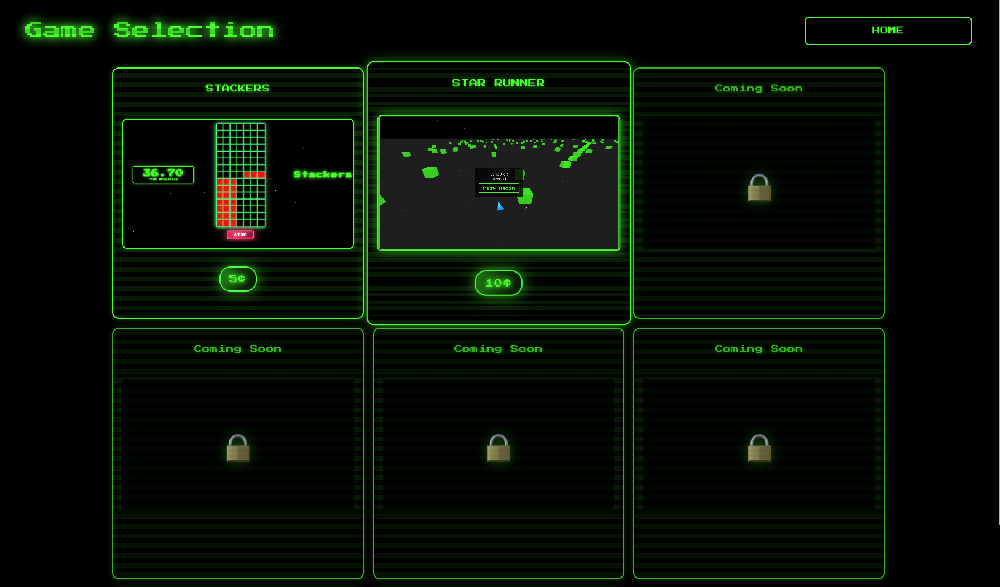
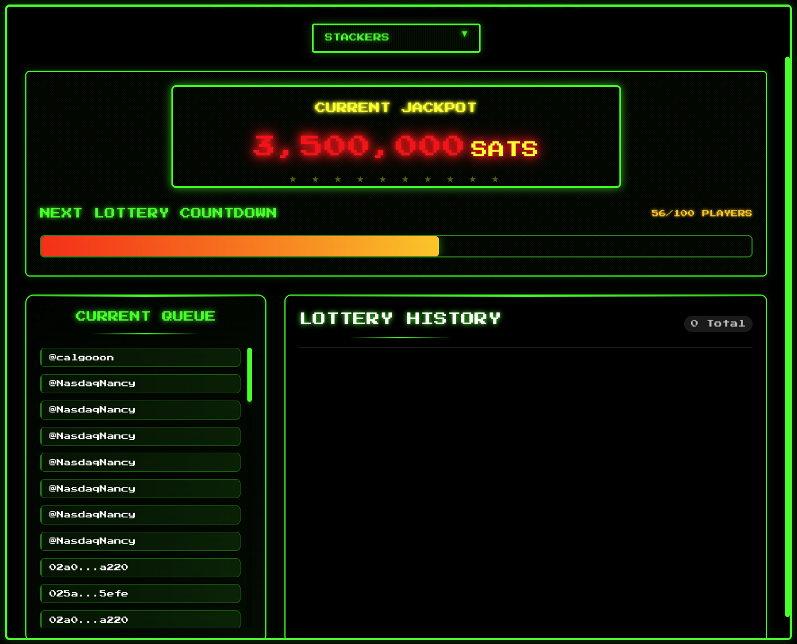

# Thryll Arcade Onboarding Guide

**Status:** Production
**Last Updated:** October 2025
**Contact/Support:** [Thryll Online](https://www.thryll.online/games)

---

## 1. What Is Thryll Arcade?

Thryll Arcade is a revolutionary blockchain-powered gaming platform that combines classic arcade entertainment with real rewards and competitive leaderboards. Built on BSV blockchain technology, Thryll provides players with a unique gaming experience where skill translates to tangible rewards, and every achievement is recorded transparently on-chain.

**Key Features:**
- **Multiple Game Titles** - Access diverse games including STACKERS, STAR RUNNER, and more
- **Blockchain Rewards System** - Earn actual BSV rewards based on performance and achievements
- **Competitive Leaderboards** - Compete globally with real-time ranking systems
- **Identity Integration** - Personalized gaming profiles tied to your BSV identity
- **Transparent Scoring** - All scores and achievements recorded on blockchain for fairness
- **Play-to-Earn Model** - Skills and performance directly translate to cryptocurrency rewards
- **Social Gaming** - Compare achievements with friends and the global community

**Target Users:** Gamers who appreciate skill-based challenges and want their gaming achievements to have real-world value. Perfect for arcade enthusiasts, competitive players, casual gamers exploring blockchain technology, and anyone interested in play-to-earn gaming models.

---

## 2. Before You Begin

### Prerequisites
- **BSV Wallet:** BSV Desktop Wallet or compatible wallet for receiving rewards
- **Web Browser:** Modern browser with JavaScript and WebGL support for game rendering
- **Identity Key:** BSV identity for personalized profile and reward tracking (recommended)
- **Internet Connection:** Stable connection for real-time gameplay and leaderboard updates

### Supported Platforms
- **Web-based:** Access via https://www.thryll.online/games
- **Cross-platform:** Compatible with desktop and tablet browsers
- **Mobile Responsive:** Optimized for various screen sizes
- **No Installation Required:** Instant play through web browser

### Initial Setup Recommendations
Before diving into Thryll Arcade:
- Ensure your BSV wallet is set up and funded (for certain premium features)
- Create or connect your BSV identity for full feature access
- Test your browser's game performance with a quick play session
- Familiarize yourself with the reward distribution system

---

## 3. Getting Started: Step-by-Step

### Step 1: Access Thryll Arcade
1. Navigate to **https://www.thryll.online/games** in your web browser
2. The Thryll Arcade homepage will display available games
3. Browse the game selection interface
4. Review featured games and current competitions

### Step 2: Choose Your First Game
1. Review available game titles on the main dashboard
2. Each game displays:
   - **Game thumbnail and description**
   - **Current top scores**
   - **Active player count**
   - **Reward pool information**
3. Click on a game title to view detailed information
4. Read the game rules and controls
5. Select **Play Now** to launch your chosen game

**Popular Game Titles:**
- **STACKERS** - Test your reflexes and timing in this precision stacking challenge
- **STAR RUNNER** - Navigate through cosmic obstacles in this endless runner
- **Additional titles** - New games added regularly to expand the arcade

### Step 3: Connect Your BSV Identity (Optional but Recommended)
1. Click on the **Profile** or **Connect Wallet** button
2. Select your BSV identity provider (BSV Desktop recommended)
3. Authorize the connection when prompted
4. Your profile will sync with your identity key
5. Personalized features unlock:
   - **Persistent score tracking**
   - **Reward accumulation**
   - **Achievement unlocks**
   - **Leaderboard presence**

### Step 4: Play Your First Game
1. Launch your selected game
2. Review the **controls and objectives** displayed on screen
3. Start with **practice mode** if available to learn mechanics
4. Play through the game:
   - Master game-specific controls
   - Achieve objectives for points
   - Track your score in real-time
5. Complete your game session
6. Your final score is automatically recorded

**Game Tips:**
- Start with easier difficulty levels to learn mechanics
- Pay attention to combo multipliers for higher scores
- Practice regularly to improve your leaderboard position
- Watch for special events with bonus rewards

### Step 5: Track Your Performance and Rewards
1. After completing a game, view your **score summary**
2. Check your **leaderboard position** - see where you rank globally
3. Review any **rewards earned** based on performance
4. Accumulated rewards transfer to your connected BSV wallet
5. Track your progress over time through the dashboard

### Step 6: Climb the Leaderboards
1. Access the **Leaderboards** section from the main menu
2. View rankings by:
   - **Global rankings** - compete worldwide
   - **Game-specific boards** - see top players per game
   - **Time periods** - daily, weekly, monthly, all-time
3. Set personal goals to reach higher ranks
4. Monitor your friends' positions if social features are connected
5. Participate in special tournaments for bonus rewards

---

## 4. Advanced Features

### Reward System Mechanics
- **Performance-Based Earnings:** Higher scores and achievements earn more rewards
- **Reward Pools:** Some games feature shared reward pools distributed among top performers
- **Bonus Multipliers:** Special events and challenges offer increased reward rates
- **Instant Payouts:** Earned rewards automatically transfer to your connected wallet
- **Transparent Distribution:** All reward distributions recorded on BSV blockchain

### Competitive Gaming Features
- **Tournament Mode:** Participate in scheduled tournaments with enhanced prize pools
- **Challenge Friends:** Create private competitions with custom rules
- **Achievement System:** Unlock special badges and recognition for accomplishments
- **Streak Bonuses:** Consecutive playing periods may earn bonus rewards
- **Seasonal Events:** Limited-time events with unique games and increased rewards

### Identity and Profile Management
- **Player Statistics:** Comprehensive tracking of all gaming metrics
- **Achievement Showcase:** Display your best accomplishments on your profile
- **Custom Avatars:** Personalize your player identity (if supported)
- **Privacy Controls:** Manage what information appears on public leaderboards
- **Multi-Game Tracking:** Unified profile across all Thryll Arcade games

### Social and Community Features
- **Player Rankings:** See how you stack up against the community
- **Score Sharing:** Share achievements on social platforms
- **Community Challenges:** Group objectives that reward collective participation
- **Developer Updates:** Stay informed about new game releases and features
- **Feedback System:** Contribute ideas for game improvements and new titles

---

## 5. Troubleshooting & FAQs

### Common Issues

| Problem | Cause | Solution |
|---------|-------|----------|
| Game won't load | Browser compatibility or plugins | Update browser; enable WebGL; disable conflicting extensions |
| Leaderboard not updating | Sync delay or connection issue | Refresh the page; wait a few moments for blockchain confirmation |
| Rewards not appearing | Wallet not connected | Ensure BSV wallet is properly connected and check wallet transaction history |
| Poor game performance | Hardware limitations or network | Close other browser tabs; check internet speed; reduce graphics quality if available |
| Score not recorded | Identity not connected | Connect your BSV identity before playing for persistent score tracking |
| Controls unresponsive | Input lag or browser issue | Refresh game; check if browser has focus; try different browser if problem persists |

### Tips for Maximum Rewards
- **Consistent Play:** Regular participation often qualifies for streak bonuses
- **Peak Performance Hours:** Some tournaments run at specific times with higher rewards
- **Strategy Over Speed:** Understanding game mechanics often beats rapid reflexes
- **Event Participation:** Special events typically offer the best reward-to-effort ratios
- **Community Engagement:** Follow Thryll updates for announcements about bonus periods

### Getting Help
- **Website:** Visit [Thryll Online](https://www.thryll.online/) for official documentation
- **Game Guides:** Access in-game tutorials and strategy guides
- **Technical Support:** Check browser console for error messages if games fail to load
- **Community Forums:** Join BSV gaming communities for tips and troubleshooting
- **Social Media:** Follow Thryll on social platforms for updates and support announcements

---

## 6. Learn More / Next Steps

### Best Practices for Thryll Arcade
- **Secure Your Identity:** Use a strong BSV identity setup to protect your profile and earnings
- **Regular Participation:** Consistent play helps maintain high leaderboard positions
- **Diversify Games:** Try multiple game titles to maximize earning potential
- **Learn Game Patterns:** Most arcade games have patterns that can be mastered
- **Track Your Stats:** Monitor your performance metrics to identify improvement areas

### Common Use Cases
- **Casual Entertainment:** Enjoy quality arcade games during leisure time
- **Competitive Gaming:** Climb leaderboards and establish yourself as a top player
- **Earning Rewards:** Generate supplemental income through skilled gameplay
- **Blockchain Exploration:** Learn about BSV technology through engaging gameplay
- **Social Competition:** Challenge friends and family to friendly gaming competitions

### Integration Opportunities
- **SocialCert:** Verify your gaming identity with social credentials for enhanced profile features
- **Metanet Highway:** Use your wallet to manage gaming rewards alongside other BSV transactions
- **BSV Desktop:** Integrate with the full BSV ecosystem for comprehensive blockchain functionality
- **Content Creation:** Stream your gameplay and share achievements across BSV social platforms
- **Tournament Platforms:** Connect with other BSV gaming services for cross-platform competitions

### Related Resources
- **Game Strategies:** Search for community-created guides and walkthroughs
- **BSV Gaming Ecosystem:** Explore other blockchain gaming platforms on BSV
- **Blockchain Gaming Benefits:** Learn about the advantages of blockchain-based gaming
- **Play-to-Earn Models:** Understand how blockchain enables new gaming economics
- **Developer Resources:** If interested in creating games, explore Thryll's developer documentation

### Stay Updated
- Follow **Thryll Online** social channels for:
  - New game releases and beta testing opportunities
  - Tournament announcements and special events
  - Reward system updates and bonus periods
  - Community highlights and top player features
  - Technical updates and platform improvements

---

**Quick Links:**
[BSV Desktop Guide](../metanet-desktop-mainnet.md) | [BSV Getting Started](../README.md) | [SocialCert Identity](SocialCert.md) | [Metanet Apps Catalog](https://metanetapps.com/)

---

*Thryll Arcade transforms gaming into rewarding experiences - where your skills matter, your achievements persist on blockchain, and your entertainment generates real value.*
