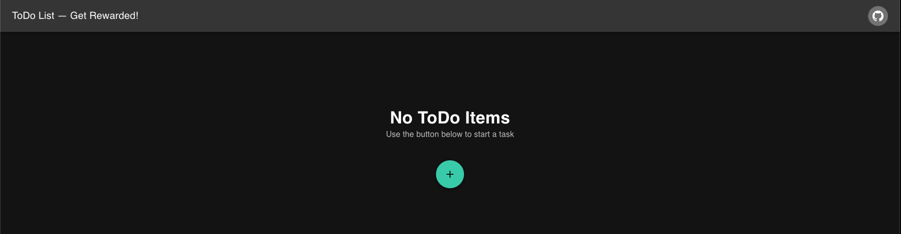
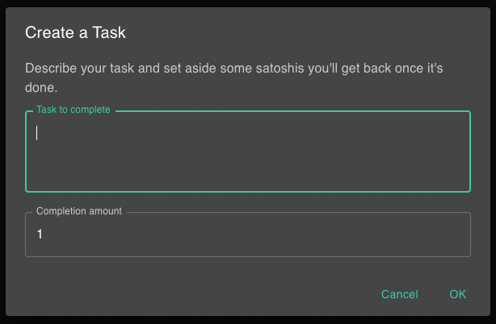

# Metanet ToDo Onboarding Guide

**Status:** Production
**Last Updated:** October 2025
**Contact/Support:** [Metanet ToDo](https://todo.metanet.app/)

---

## 1. What Is Metanet ToDo?

Metanet ToDo is a unique task management application that turns your to-do list into incentivized blockchain commitments. By attaching satoshi rewards to tasks, you create financial motivation to complete your goals. When you mark a task as done, the locked satoshis are released, providing both accomplishment and reward.

**Key Features:**
- **Incentivized Tasks** - Lock satoshis when creating tasks, release them upon completion
- **Real-time Progress** - Visual indicators show task status and completion
- **Blockchain Commitment** - Tasks are recorded on BSV blockchain for accountability
- **Celebration Rewards** - Get satisfying notifications when completing tasks
- **Minimum Value** - Set at 1 satoshi minimum for maximum flexibility
- **BSV Wallet Integration** - Works seamlessly with BRC-100 compatible wallets

**Target Users:** Anyone looking for extra motivation to complete tasks - developers, students, professionals, and anyone who wants to gamify productivity with real financial incentives.

---

## 2. Before You Begin

### Prerequisites
- **BSV Wallet:** BRC-100 compatible wallet (Metanet Desktop recommended)
- **Web Browser:** Modern browser with JavaScript enabled
- **BSV Balance:** Small amount of BSV for task incentives (even 1 satoshi works)

### Supported Platforms
- **Web-based:** Access via https://todo.metanet.app/
- **Cross-platform:** Works on desktop and mobile browsers
- **No Installation Required:** Pure web application

### Wallet Setup
If you don't have a BSV wallet yet, follow the [BSV Desktop Onboarding Guide](../metanet-desktop-mainnet.md) to get started. Make sure your wallet is running and funded before creating incentivized tasks.

---

## 3. Getting Started: Step-by-Step

### Step 1: Access Metanet ToDo
1. Navigate to **https://todo.metanet.app/** in your web browser
2. Ensure your BSV Desktop wallet is running in the background
3. The app will display an empty state if you have no tasks yet

### Step 2: Create Your First Task
1. Click **"Create a Task"** button
2. Enter your task description (e.g., "Complete code review," "Finish documentation")
3. Set the satoshi reward amount:
   - Minimum: 1 satoshi
   - Recommended: 100-10,000 satoshis depending on task importance
   - Higher amounts = stronger incentive
4. Click **"Create"** to lock the satoshis
5. Confirm the payment in your BSV wallet

### Step 3: Complete Tasks and Claim Rewards
1. Work on your task as planned
2. When finished, click the task to mark it as **"Done"**
3. The locked satoshis are released back to your wallet
4. Enjoy the celebration notification confirming your achievement
5. The task is permanently recorded on the blockchain as completed

### Step 4: Manage Your Task List
- View all active tasks with their associated satoshi values
- See real-time progress indicators
- Tasks persist until marked complete
- Review completed tasks in your wallet transaction history

---

## 4. Advanced Features

### Task Strategy Tips
- **High-Value Tasks:** Use larger satoshi amounts (1,000-10,000 sats) for important or difficult tasks
- **Daily Habits:** Create small recurring tasks (10-100 sats) for daily routines
- **Milestone Rewards:** Set bigger rewards for major project milestones
- **Progressive Incentives:** Increase reward amounts for consecutively completed tasks

### Productivity Techniques
- **Time Boxing:** Create tasks with specific time commitments
- **Task Decomposition:** Break large projects into smaller incentivized sub-tasks
- **Reward Scaling:** Match satoshi amounts to task difficulty and time investment
- **Accountability:** Share your task list with others to increase commitment

### Gamification Elements
- Celebration notifications provide positive reinforcement
- Financial commitment increases task completion rate
- Blockchain recording creates permanent achievement log
- Real satoshi rewards create tangible motivation

### Integration with Other Apps
- Combine with [Meter](./Meter.md) to track productivity metrics
- Use with [PeerPay](./PeerPay.md) to share rewards with collaborators
- Integrate blockchain commitments with other BSV apps

---

## 5. Troubleshooting & FAQs

### Common Issues

| Problem | Cause | Solution |
|---------|-------|----------|
| Task not completing | Waiting for blockchain confirmation | Wait a few seconds for transaction to confirm |
| Cannot create task | Insufficient BSV balance | Add BSV to your wallet |
| Wallet not connecting | BSV Desktop not running | Launch BSV Desktop and ensure it's connected to mainnet |
| Celebration not appearing | Browser notification blocked | Check browser notification settings |
| Reward not received | Transaction pending | Wait for blockchain confirmation; check wallet history |

### Important Tips
- **Start small:** Begin with 10-100 satoshi tasks to get comfortable
- **Be realistic:** Only create tasks you genuinely intend to complete
- **Regular reviews:** Check your task list daily for maximum effectiveness
- **Wallet monitoring:** Keep track of your locked satoshis vs. available balance
- **Refresh after spending:** Refresh the page to see updated task status

### Getting Help
- **Website:** [https://todo.metanet.app/](https://todo.metanet.app/)
- **BSV Community:** Community forums for support
- **Wallet Issues:** Refer to [BSV Desktop Guide](../metanet-desktop-mainnet.md)

---

## 6. Learn More / Next Steps

### Best Practices
- Create tasks immediately when you think of them
- Use descriptive task names for clarity
- Match reward amounts to task difficulty
- Complete tasks within a reasonable timeframe
- Review and adjust your incentive strategy regularly

### Use Cases
- **Coding Tasks:** Motivate yourself to complete code reviews, bug fixes, or feature development
- **Learning Goals:** Incentivize studying, reading documentation, or completing tutorials
- **Personal Projects:** Add accountability to side projects and creative work
- **Daily Habits:** Reinforce positive habits like exercise, meditation, or learning
- **Team Productivity:** Share task completion with team members for group accountability

### Integration Opportunities
- Demo to gamified productivity learners and developers
- Use as teaching tool for blockchain application development
- Integrate with time-tracking or project management workflows
- Combine with other Metanet apps for comprehensive productivity system

### Explore the BSV Ecosystem
- Try [Meter](./Meter.md) for blockchain-based counters and metrics
- Explore [Immutify](./Immutify.md) for timestamping important documents
- Learn more at [Metanet Apps Catalog](https://metanetapps.com/)

---

**Quick Links:**
[BSV Desktop Guide](../metanet-desktop-mainnet.md) | [BSV Getting Started](../README.md) | [Meter Guide](./Meter.md)

---

*Metanet ToDo - Turn tasks into blockchain commitments with real satoshi rewards for maximum productivity.*
