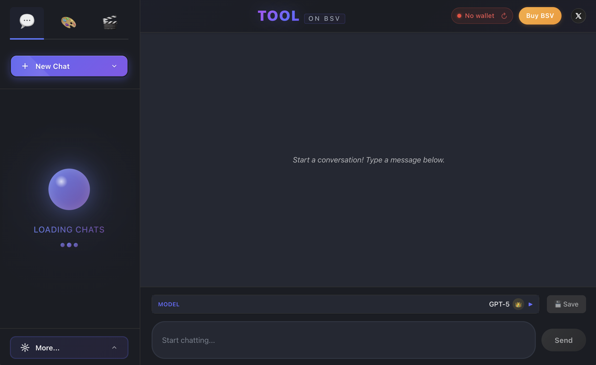
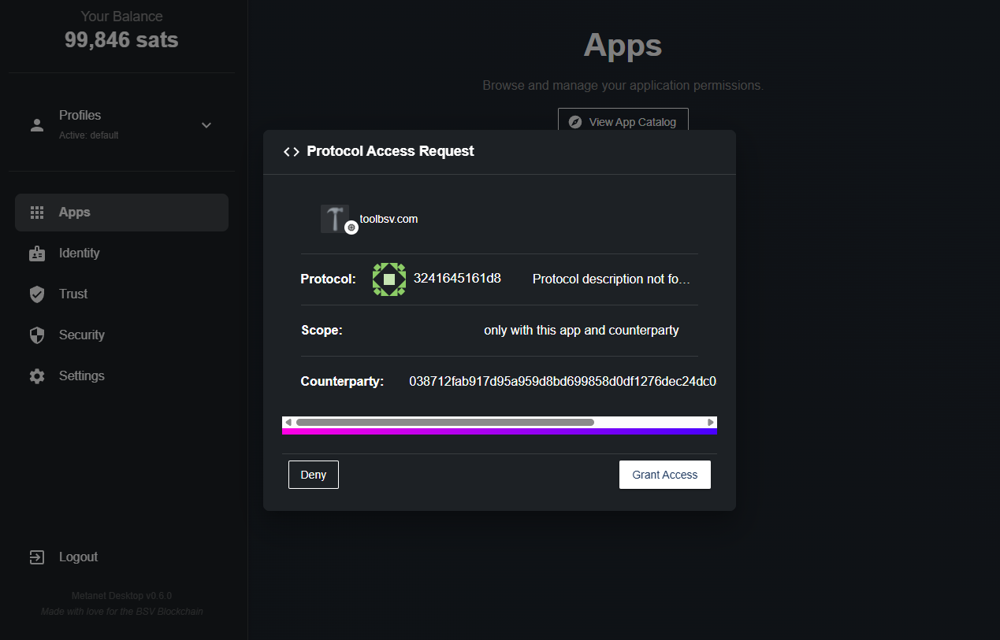
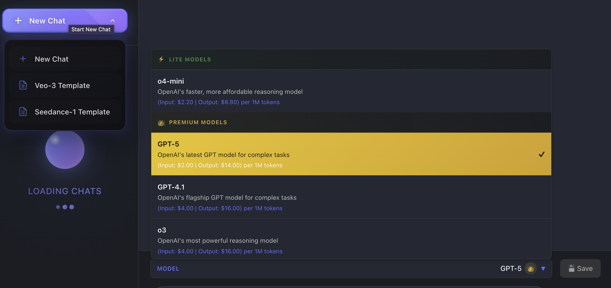
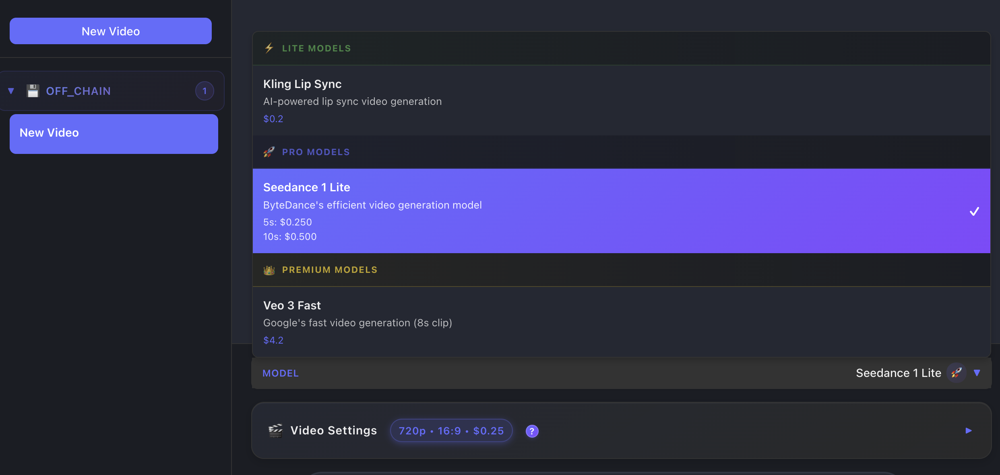
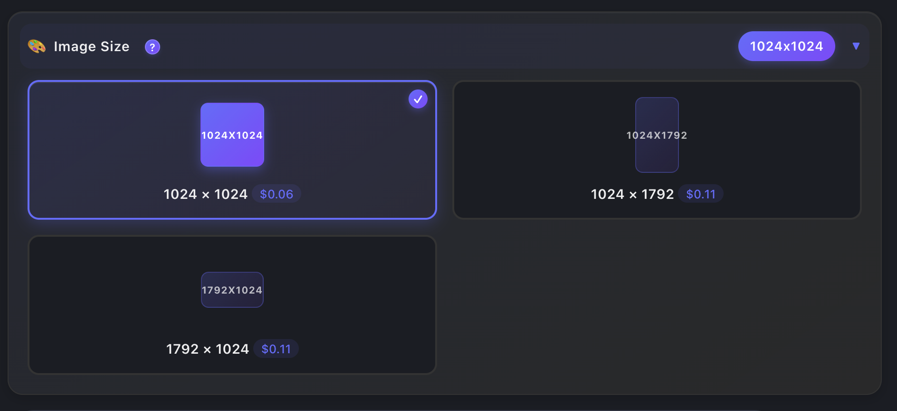
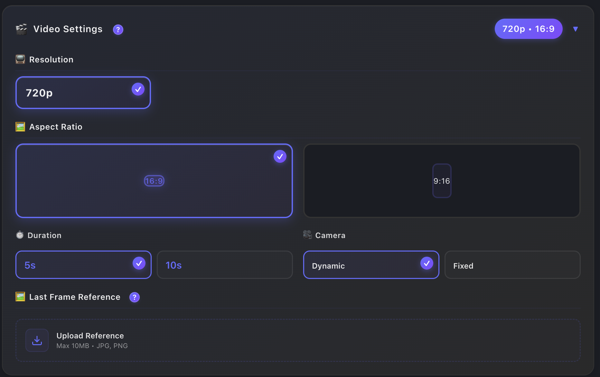
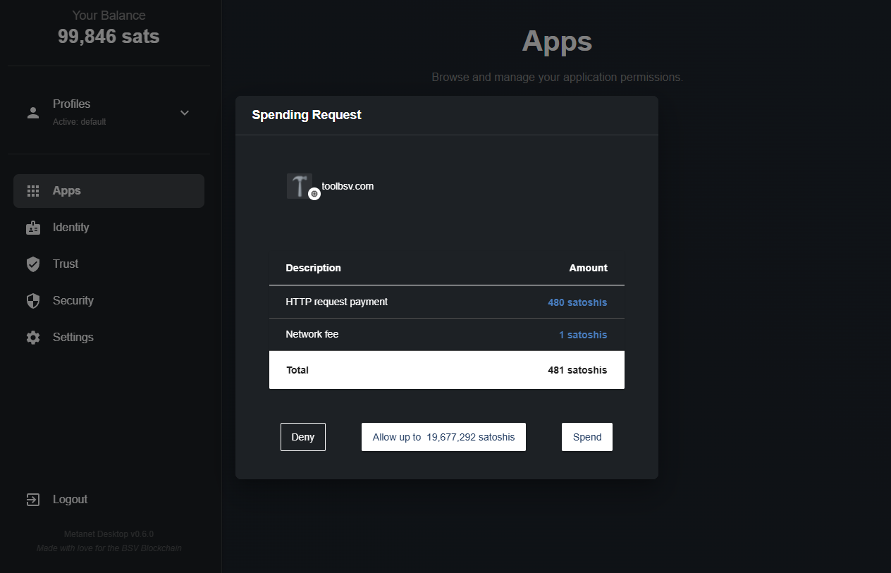
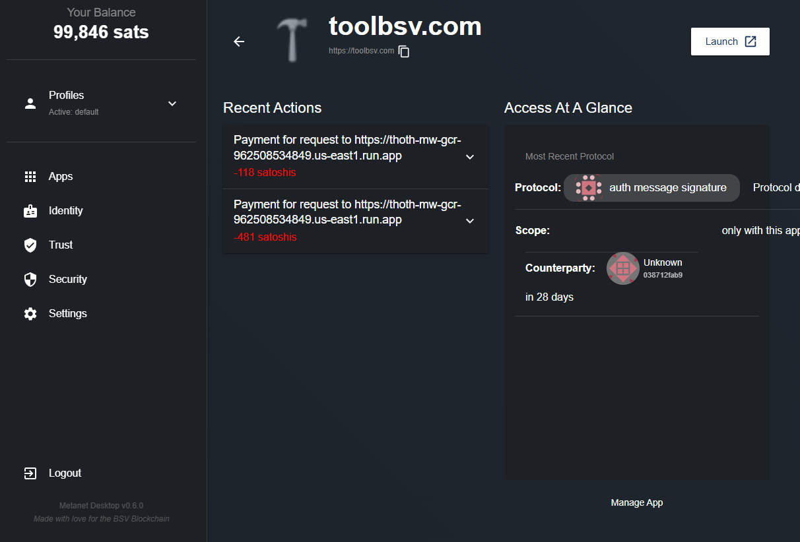

# ToolBSV Onboarding Guide

**Status:** Production
**Last Updated:** September 2025
**Contact/Support:** [@toolbsv](https://x.com/toolbsv) | [ToolBSV Website](https://toolbsv.com)

---

## 1. What Is ToolBSV?

ToolBSV is a revolutionary AI platform that replaces expensive subscriptions with **BSV micropayments**. Instead of paying monthly fees regardless of usage, you only pay for what you actually use - whether that's generating text, creating images, or producing videos.

**Key Features:**
- **Chat AI** with multiple language models
- **Image Generation** using various AI models with customizable sizes
- **Video Creation** with different generation engines and quality settings
- **Micropayment System** - pay per interaction, not per month
- **Cost Transparency** - see exactly what each model costs before using it
- **On-chain Persistence** - your interactions are securely stored on BSV blockchain

**Target Users:** Anyone seeking cost-effective AI tools without subscription commitments - developers, content creators, businesses, and individual users who want flexible, pay-as-you-go AI services.

---

## 2. Before You Begin

### Prerequisites
- **BSV Wallet:** BSV Desktop Wallet (required for micropayments)
- **Web Browser:** Modern browser with JavaScript enabled
- **BSV Balance:** Small amount of BSV for micropayments (transactions cost fractions of cents)

### Supported Platforms
- **Web-based:** Access via https://toolbsv.com
- **Cross-platform:** Works on desktop and mobile browsers
- **No Installation Required:** Pure web application

### Metanet Wallet Setup
If you don't have BSV Desktop Wallet yet, follow our [BSV Desktop Onboarding Guide](../metanet-desktop-mainnet.md) to get started. You'll need this wallet to make micropayments for AI services.

---

## 3. Getting Started: Step-by-Step

### Step 1: Access ToolBSV
1. Navigate to **https://toolbsv.com** in your web browser
2. The homepage will display the three main service categories
3. Ensure your BSV Desktop Wallet is running in the background

### Step 2: Connect Your Metanet Wallet
1. Click on any AI service (Chat, Images, or Video)
2. ToolBSV will automatically detect your Metanet wallet
3. A connection request popup will appear in BSV Desktop
4. **Grant permission** to allow ToolBSV to request payments from your wallet
5. Once connected, you'll see your wallet status in the ToolBSV interface

![*\ToolBSV interface showing successful wallet connection\]*](../../../assets/onboardings/bsv-apps/tool-app/toolbsv-connected.png)

### Step 3: Choose Your AI Service

#### Chat Section
- Select from multiple language models (GPT-style, Claude-style, and others)
- Each model displays its **cost per interaction** upfront
- Create new conversations or continue existing ones
- View conversation history securely stored on-chain

#### Images Section
- Choose from various image generation models
- See the **cost per image** before generating
- Input detailed prompts for better results
- Download or share generated images

#### Video Section
- Access different video generation engines
- View **cost per video** based on length and quality
- Create videos from text prompts
- Preview and download your generated content

### Step 4: Customize Your Generation Settings

#### Image Size Options
Different image sizes affect the final cost of generation. ToolBSV offers various dimensions with transparent pricing:

**Available sizes and costs:**
- **1024 × 1024 (Square):** $0.06 - Perfect for social media posts and profile images
- **1024 × 1792 (Portrait):** $0.11 - Ideal for vertical content and mobile displays
- **1792 × 1024 (Landscape):** $0.11 - Great for banners and wide format content

Each size is optimized for different use cases, allowing you to choose the most cost-effective option for your specific needs.

#### Video Settings and Quality
Video generation offers extensive customization options that directly impact the final cost:

**Customizable settings:**

**📺 Resolution:**
- **720p** - Standard quality for most applications

**🖼️ Aspect Ratio:**
- **16:9** - Traditional widescreen format for desktop and YouTube
- **9:16** - Vertical format optimized for mobile and social media stories

**⏱️ Duration:**
- **5 seconds** - Quick clips and animations
- **10 seconds** - Extended content with more detail

**🎥 Camera Movement:**
- **Dynamic** - Moving camera with cinematic effects
- **Fixed** - Static camera position for simpler content

**🖼️ Last Frame Reference:**
- Upload a reference image (Max 10MB, JPG/PNG) to guide the final frame of your video
- Helps ensure consistency with your brand or specific visual requirements

**Cost Impact:** Each setting combination shows the exact cost before generation, allowing you to balance quality and budget effectively.

### Step 5: Make Your First Micropayment
1. Choose your desired AI model and configure settings
2. Review the **exact cost** displayed before proceeding
3. Click **Generate/Submit** to proceed
4. BSV Desktop will request payment confirmation
5. **Approve the micropayment** (ranging from $0.06 to higher amounts based on settings)
6. Your AI request is processed immediately

### Step 6: View Results and History
- Your generated content appears immediately after payment
- All interactions are recorded on the BSV blockchain for transparency
- Access your history anytime through your connected wallet
- Export or share your generated content as needed

You can easily access your transaction history by clicking on the ToolBSV application within BSV Desktop. The image below shows how your history will appear, including the payment made for the previous AI task.

---

## 4. Advanced Features

### Cost Management
- **Real-time Cost Display:** See exactly what each interaction will cost before committing
- **Usage Tracking:** Monitor your spending through wallet transaction history
- **Settings Comparison:** Compare costs between different size and quality options
- **Budget Planning:** Estimate costs for multiple generations before proceeding

### On-Chain Benefits
- **Permanent Storage:** Your interactions are immutably stored on BSV blockchain
- **Transparency:** Full audit trail of all payments and generated content
- **Privacy:** No subscription tracking or personal data collection beyond blockchain transactions

### Multi-Model Access
- **Text Generation:** Access to various language models with different capabilities and costs
- **Image Creation:** Multiple image generation engines with size-based pricing
- **Video Production:** Comprehensive video models with granular quality controls

### Smart Settings
- **Preset Configurations:** Save your preferred settings for different content types
- **Budget Mode:** Automatically select most cost-effective options
- **Quality Comparison:** Preview settings impact on cost before generation

---

## 5. Troubleshooting & FAQs

### Common Issues

| Problem | Cause | Solution |
|---------|-------|----------|
| Wallet not connecting | BSV Desktop not running | Launch BSV Desktop and ensure it's connected to mainnet |
| Payment fails | Insufficient BSV balance | Add BSV to your Metanet wallet |
| High costs | Premium settings selected | Choose lower resolution or shorter duration options |
| Video upload fails | File size too large | Ensure reference images are under 10MB |
| Content not generating | Network connectivity | Check internet connection and retry |

### Getting Help
- **Twitter/X:** [@toolbsv](https://x.com/toolbsv) for updates and support
- **Community:** BSV blockchain community forums and Discord
- **Technical Issues:** Check BSV network status and Metanet wallet connectivity

---

## 6. Learn More / Next Steps

### Cost Optimization Tips
- Start with 1024×1024 images ($0.06) for the most economical option
- Use 5-second videos with fixed camera for basic video needs
- Experiment with aspect ratios - vertical content (9:16) works great for social media
- Upload reference images for videos to ensure better results and reduce regeneration costs

### Integration Opportunities
- Combine ToolBSV with other BSV blockchain applications
- Build workflows using multiple AI services with micropayment precision
- Explore BSV ecosystem for complementary tools and services

### Stay Updated
- Follow [@toolbsv](https://x.com/toolbsv) for new model additions and features
- Monitor updates for new resolution options and video settings
- Join the BSV community to discover new use cases and integrations

---

**Quick Links:**
[BSV Desktop Guide](../metanet-desktop-mainnet.md) | [ BSV Getting Started](../README.md) | [BSV Blockchain Tools](https://bsvblockchain.org/features/tools-libraries/)

---

*ToolBSV represents the future of AI monetization - no subscriptions, no waste, just pay for what you use with the power of BSV micropayments.*
