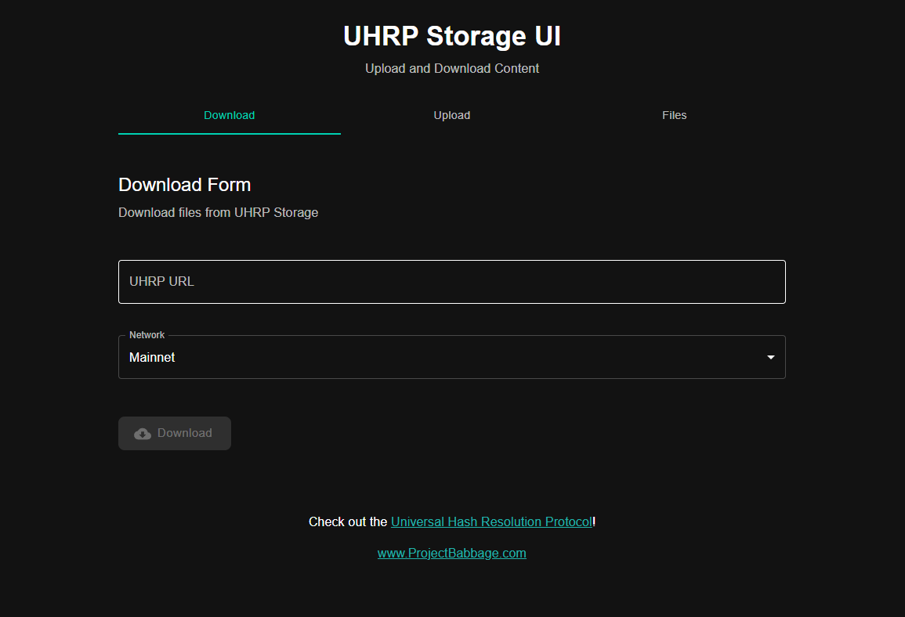
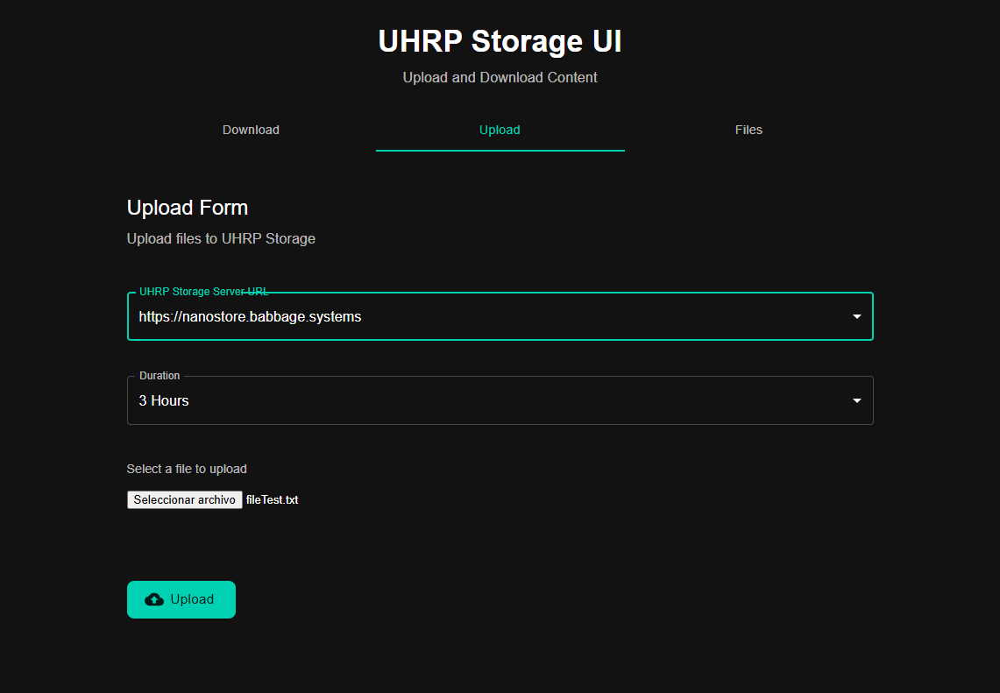
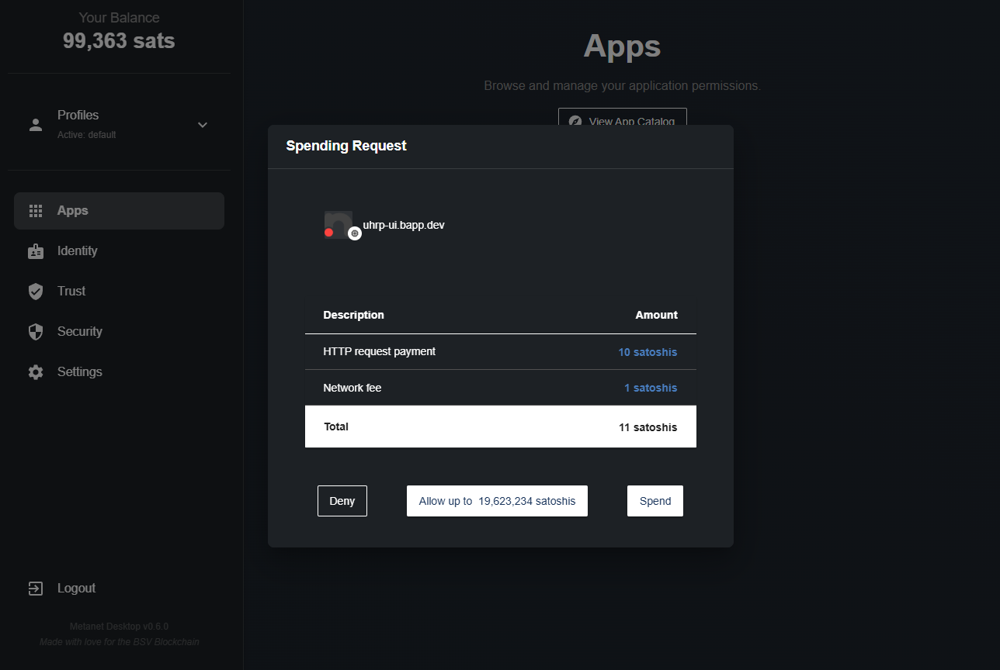
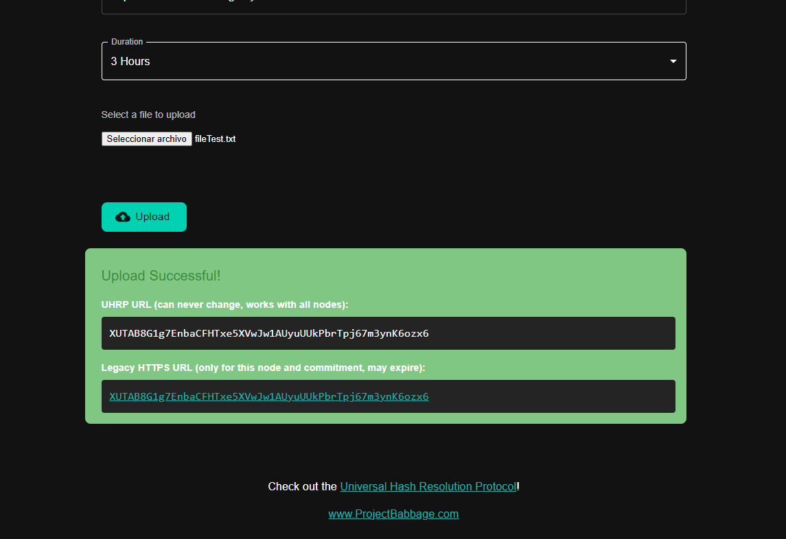
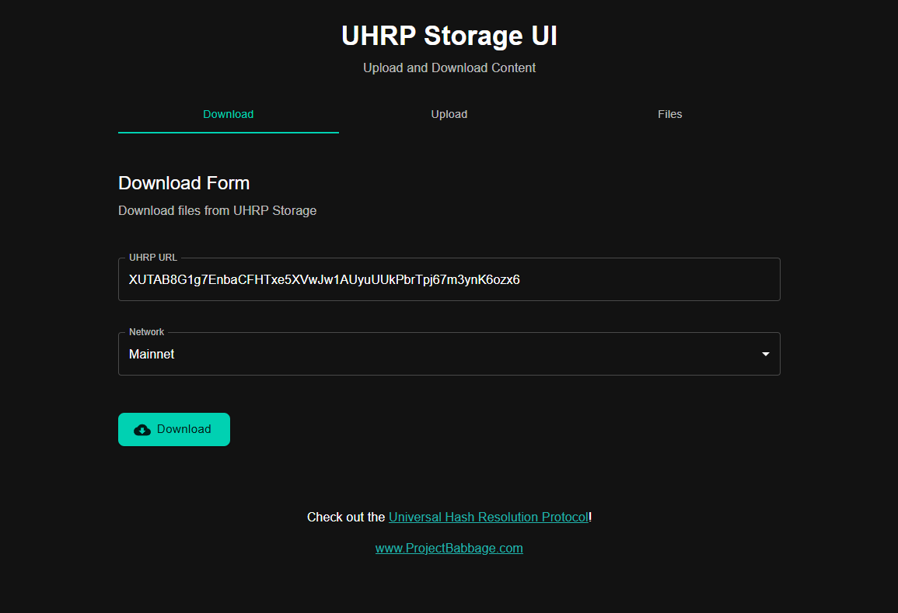
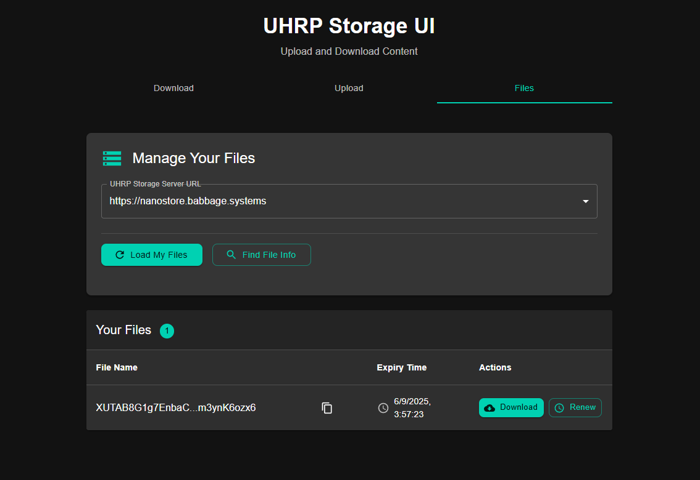

# 🗄️ UHRP Storage Guide

Welcome to the UHRP Storage onboarding!
Here you’ll learn how to securely store and validate data on BSV Blockchain using the [UHRP Storage app](https://uhrp-ui.bapp.dev/), following the UHRP protocol ([specification](https://bsv.brc.dev/overlays/0026)).

---

## 🌐 What is UHRP?

**UHRP (Universal HTTP Resource Protocol)** is a protocol for decentralized, secure, and verifiable file storage on BSV Blockchain.
It allows you to upload files, generate unique UHRP URLs for access, and ensure data integrity—making your files tamper-proof and always available.

- **Decentralized:** Files are stored across multiple servers, not just one provider.
- **Verifiable:** Every file has a unique UHRP URL, which proves its authenticity and integrity.
- **Compatible:** Works seamlessly with BSV Desktop for payments and identity.

---

## 🚀 Getting Started with UHRP Storage

The [UHRP Storage app](https://uhrp-ui.bapp.dev/) is fully compatible with BSV Desktop.
You can upload, download, and manage files using your wallet for secure payments.

When you access the app, you’ll see the main page:

> **Tip:** Make sure BSV Desktop is running and connected for seamless integration.

---

## 📤 Uploading a File

1. Go to the **Upload** section.
2. Select a storage server (default is fine for most users).
3. Choose how long you want your file stored.
4. Select your file (e.g., `fileTest.txt`).

The image below shows the upload process:

---

## 💳 Payment Confirmation

After clicking **Upload**, BSV Desktop will prompt you to confirm the payment for storing your file.

---

## 🔗 UHRP URL: Your File’s Unique Link

Once payment is complete, you’ll receive a **UHRP URL**—a unique link to your file, proving its authenticity and allowing easy access.

> **What is a UHRP URL?**
> It’s a special link that lets you download your file from any UHRP-compatible server, ensuring the file is exactly as you uploaded it.

---

## 📥 Downloading a File

To download a file:

1. Go to the **Download** section.
2. Paste your UHRP URL from the previous step.
3. Click **Download**.

The image below shows how simple it is:

---

## 📚 Listing Your Uploaded Files

You can view all files uploaded with your BSV Desktop profile:

1. Go to the **Files** section in the UHRP app.
2. Select the storage server you used.
3. Click **Load Files**.

Your uploaded files will appear, as shown below:

---

## 🎉 Conclusion & Next Steps

UHRP Storage makes decentralized file storage on BSV Blockchain simple, secure, and verifiable.
You control your data, prove its integrity, and access it anytime with UHRP URLs.

**Advantages:**
- Decentralized and censorship-resistant
- Verifiable data integrity
- Easy payments with BSV Desktop
- Simple upload, download, and management

---

## 🔗 Useful Links

- **Need BSV?** 👉 [Get BSV Guide](../get-bsv/README.md)
- **Create your wallet:** 👉 [BSV Desktop Guide](../metanet-desktop-mainnet.md)
- **Want to send/receive payments?** 👉 [Pay & Get Paid Guide](../pay-and-paid.md)
- **Explore more apps:** 👉 [Metanet Apps Catalog](https://metanetapps.com/)

---

If you have questions or need help, reach out to the BSV Blockchain Association community.
Enjoy secure, decentralized storage with UHRP and BSV Blockchain!

---
