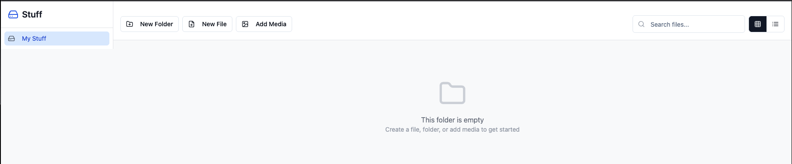
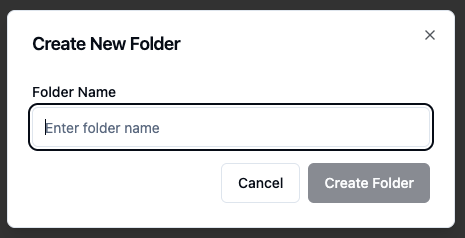

# Your Files and Stuff Onboarding Guide

**Status:** Production
**Last Updated:** October 2025
**Contact/Support:** [Lovable.dev](https://lovable.dev/)

---

## 1. What Is Your Files and Stuff?

Your Files and Stuff is a blockchain-powered file and folder management system that provides a decentralized, persistent catalog for organizing documents, markdown files, and media. Built on BSV blockchain technology, it enables you to create hierarchical file structures, write markdown content, and attach media via UHRP URLs - all stored immutably with cryptographic verification.

**Key Features:**
- **File Management** - Create and organize files with markdown support
- **Folder Hierarchy** - Build nested folder structures for logical organization
- **Markdown Support** - Write and preview markdown-formatted documents
- **Media Integration** - Attach images, videos, and audio via UHRP URLs
- **Blockchain-Backed Storage** - Persistent catalog recorded on BSV
- **Content Preview** - View markdown and media directly in the interface
- **Decentralized Architecture** - Files and metadata stored on blockchain infrastructure
- **UHRP Compatibility** - Seamless integration with UHRP Storage protocol

**Target Users:** Anyone needing organized, blockchain-based file management - content creators building knowledge bases, developers maintaining documentation, researchers organizing notes, educators creating course materials, or anyone seeking decentralized file system alternatives with markdown and media support.

---

## 2. Before You Begin

### Prerequisites
- **BSV Wallet:** BSV Desktop Wallet for blockchain transactions
- **Web Browser:** Modern browser with JavaScript enabled
- **BSV Balance:** Small amount for file creation and folder operations
- **UHRP Understanding:** Basic familiarity with UHRP URLs for media (helpful but not required)
- **Markdown Knowledge:** Understanding of markdown syntax for formatted documents (optional)

### Supported Platforms
- **Web-based:** Access via https://your-files-and-stuff.lovable.app/
- **Cross-platform:** Works on desktop and mobile browsers
- **No Installation Required:** Pure web application
- **Cloud-Free:** No centralized cloud storage dependency

### Understanding the System
Before creating your first file or folder, understand these concepts:

**File:** A document entry that can contain markdown text, metadata, and references to media

**Folder:** A container for organizing files and other folders hierarchically

**Markdown:** A lightweight markup language for formatted text (headings, lists, links, etc.)

**UHRP URL:** A Universal HTTP Resource Protocol link pointing to blockchain-stored media

**Blockchain Catalog:** Your file/folder structure metadata stored on BSV blockchain

**Media Types:** Images, videos, and audio files referenced via UHRP links

---

## 3. Getting Started: Step-by-Step

### Step 1: Access Your Files and Stuff
1. Navigate to **https://your-files-and-stuff.lovable.app/** in your web browser
2. The main dashboard loads showing your file system
3. Ensure your BSV Desktop Wallet is running
4. The interface displays your existing files and folders (empty on first visit)



### Step 2: Understanding the Dashboard
The main interface includes:
- **Root Directory View** - Top-level files and folders
- **Navigation Panel** - Browse through folder hierarchy
- **Action Buttons** - Create new files, folders, or media entries
- **File Preview Area** - View file contents and media
- **Search/Filter** - Locate files quickly (if available)

### Step 3: Create Your First Folder
1. Click **"Create New Folder"** button
2. A folder creation dialog appears
3. Enter a **folder name**:
   - Use descriptive names (e.g., "Project Documentation", "2025 Notes")
   - Consider your organizational strategy
4. Optionally add a **description** or metadata
5. Click **"Create"** or **"Confirm"**
6. Approve the blockchain transaction in BSV Desktop
7. Wait for confirmation
8. Your new folder appears in the main view



**Folder Organization Tips:**
- Create folders by project, topic, or date
- Use nested folders for complex hierarchies
- Keep folder names clear and consistent
- Plan structure before creating many folders

### Step 4: Create a File with Markdown Content
1. Navigate to the folder where you want to create the file (or stay in root)
2. Click **"Create New File"**
3. Enter **file name** (e.g., "Meeting Notes", "Project Plan")
4. Add **file extension** if desired (.md is common for markdown)
5. In the content area, write your document using **markdown syntax**:

```markdown
# Project Overview

## Objectives
- Complete user research
- Design mockups
- Implement features

## Timeline
Target completion: Q4 2025

## Resources
- [Design Guidelines](https://example.com)
- Research data in `/research` folder
```

6. Preview your markdown rendering (if preview available)
7. Click **"Save"** or **"Create File"**
8. Approve the blockchain transaction in BSV Desktop
9. File is created and stored in blockchain catalog

**Markdown Quick Reference:**
- `# Heading` - Creates headings (use #, ##, ### for levels)
- `**bold**` - Bold text
- `*italic*` - Italic text
- `- item` - Bullet list
- `[link](url)` - Hyperlinks
- `` `code` `` - Inline code

### Step 5: Add Media Files via UHRP URLs
Media files (images, videos, audio) are referenced via UHRP URLs rather than uploaded directly:

1. Click **"Add Media File"** or similar button
2. Select **media type**:
   - **Image** - Photos, graphics, diagrams
   - **Video** - Video content
   - **Audio** - Sound files, podcasts
3. Enter the **UHRP URL** for your media:
   - Obtain UHRP URLs by uploading media to UHRP Storage first
   - Example format: `uhrp://[hash]/[filename]`
4. Add **media title** or description
5. Optionally specify which file or folder to associate media with
6. Click **"Add"** or **"Create Media Entry"**
7. Approve blockchain transaction
8. Media reference is stored in catalog

**Getting UHRP URLs:**
- Use [UHRP Storage](UHRP%20Storage.md) to upload media first
- UHRP Storage provides the URL after upload
- Store URLs for future reference in Your Files and Stuff
- Media itself lives on UHRP network; catalog stores references

### Step 6: Navigate and Organize Your File System
1. **Browse folders** by clicking on folder names
2. **Navigate back** using breadcrumb navigation or back button
3. **Move files** between folders (if feature supported)
4. **Create nested folders** within existing folders
5. **Edit file contents** by selecting and modifying
6. **Delete items** if needed (creates blockchain record of deletion)
7. **Search files** using search functionality

**Organization Best Practices:**
- Group related files in themed folders
- Use consistent naming conventions
- Create index files in folders to describe contents
- Maintain folder hierarchy depth that's easy to navigate
- Regular maintenance to keep structure clean

---

## 4. Advanced Features

### Markdown Document Management
- **Rich Formatting:** Full markdown syntax support for complex documents
- **Code Blocks:** Include formatted code snippets in files
- **Tables:** Create tables for structured data in markdown
- **Cross-Linking:** Link between files using relative paths
- **Version Tracking:** Blockchain records document changes over time
- **Export Options:** Export markdown files for use in other systems

### Media and Asset Organization
- **UHRP Integration:** Native support for UHRP-based media storage
- **Multiple Media Types:** Handle images, videos, and audio in unified system
- **Media Galleries:** Organize collections of related media
- **Embedded Previews:** View media directly within the application
- **External Linking:** Reference media in markdown documents
- **Metadata Management:** Store information about media files

### Folder Hierarchy and Structure
- **Unlimited Nesting:** Create folders within folders to any depth
- **Virtual Paths:** Blockchain-based addressing for all files and folders
- **Folder Metadata:** Add descriptions and properties to folders
- **Bulk Operations:** Manage multiple files simultaneously
- **Archive Organization:** Structure for long-term knowledge preservation
- **Project Workspaces:** Dedicated folder structures for different projects

### Blockchain Persistence Features
- **Immutable Catalog:** File system structure permanently recorded
- **Change History:** Track all modifications and updates
- **Decentralized Access:** Access your files from any device with your identity
- **Censorship Resistance:** No central authority can delete your file structure
- **Cryptographic Verification:** Prove integrity of file metadata
- **Identity-Linked:** Your file system tied to your BSV identity

---

## 5. Troubleshooting & FAQs

### Common Issues

| Problem | Cause | Solution |
|---------|-------|----------|
| File not saving | Blockchain confirmation delay | Wait 30-60 seconds; avoid rapid file creation; check wallet balance |
| UHRP media not displaying | Invalid UHRP URL | Verify UHRP URL format; ensure media uploaded to UHRP Storage first |
| Folder hierarchy broken | Navigation state issue | Refresh page; clear browser cache; check blockchain confirmation |
| Cannot create file | Insufficient BSV balance | Add BSV to wallet for transaction fees |
| Markdown not rendering | Syntax error in markdown | Check markdown syntax; verify formatting; preview before saving |
| Lost file system access | Different identity/wallet | Use same wallet/identity as when files were created |

### Tips for Effective Use
- **Blockchain Awareness:** Each file/folder operation requires blockchain confirmation
- **UHRP Preparation:** Upload media to UHRP Storage before referencing in files
- **Markdown Preview:** Test markdown rendering before finalizing files
- **Regular Backups:** Export important content as backup outside blockchain
- **Organized Structure:** Plan folder hierarchy before creating many files
- **Identity Consistency:** Always use same wallet to maintain file system access

### Getting Help
- **Lovable.dev:** Visit creator's site for documentation and updates
- **UHRP Storage Guide:** Review [UHRP Storage](UHRP%20Storage.md) for media management
- **Markdown Resources:** Consult markdown syntax guides for formatting help
- **BSV Community:** Join forums for blockchain-based application support
- **Technical Issues:** Report problems through appropriate channels

---

## 6. Learn More / Next Steps

### Best Practices for File Management
- **Descriptive Names:** Use clear, searchable file and folder names
- **Consistent Structure:** Maintain logical organization across all folders
- **Markdown Standards:** Follow markdown best practices for readability
- **Media References:** Keep UHRP URLs organized and documented
- **Regular Maintenance:** Periodically review and reorganize file structure
- **Documentation:** Create README-style files in folders explaining contents

### Common Use Cases

**Knowledge Management:**
- Personal wiki or knowledge base
- Research notes and findings
- Study materials and course notes
- Reference documentation
- Idea capture and development

**Project Documentation:**
- Project plans and specifications
- Meeting notes and decisions
- Technical documentation
- Design documents
- Progress tracking

**Content Creation:**
- Blog post drafts
- Article outlines
- Story development
- Script writing
- Content calendars

**Educational Materials:**
- Course syllabi
- Lecture notes
- Assignment descriptions
- Resource collections
- Student guides

### Integration Opportunities
- **UHRP Storage:** Primary integration for media file management
- **ToolBSV:** Document AI-assisted content in Your Files and Stuff
- **Immutify:** Combine with proof-of-existence for timestamped documents
- **SocialCert:** Link file systems to verified identities
- **BSV Desktop:** Unified wallet for all blockchain interactions
- **Publishing Platforms:** Export markdown content to blogs and sites

### Understanding Blockchain File Systems
- **Decentralized Storage:** Learn about distributed file system architectures
- **UHRP Protocol:** Study Universal HTTP Resource Protocol specifications
- **Content Addressing:** Understand how blockchain addresses files
- **Metadata vs. Content:** Grasp difference between catalog and actual file storage
- **Identity-Based Access:** Explore cryptographic file system ownership

### Development and Customization
- **Custom Implementations:** Build specialized file management interfaces
- **API Integration:** Connect Your Files and Stuff to other applications
- **Automation Scripts:** Automate file creation and organization
- **Enhanced UI:** Create tailored interfaces for specific use cases
- **Backup Solutions:** Develop export and backup utilities

### Related Resources
- **UHRP Specification:** Technical documentation for UHRP protocol
- **Markdown Guide:** Comprehensive markdown syntax reference
- **BSV File Storage:** Explore other blockchain-based storage solutions
- **Decentralized Apps:** Discover complementary BSV applications
- **Knowledge Management:** Research personal knowledge management systems

### Stay Updated
- **Lovable.dev Updates:** Monitor for new features and improvements
- **UHRP Developments:** Follow UHRP protocol enhancements
- **BSV Ecosystem:** Explore new blockchain storage innovations
- **User Community:** Share tips and use cases with other users
- **Integration Examples:** Learn from others' file management workflows

---

**Quick Links:**
[BSV Desktop Guide](../metanet-desktop-mainnet.md) | [BSV Getting Started](../README.md) | [UHRP Storage](UHRP%20Storage.md) | [Immutify](Immutify.md)

---

*Your Files and Stuff transforms blockchain into a personal file system - organize your knowledge, documents, and media with the permanence and security of BSV blockchain.*
