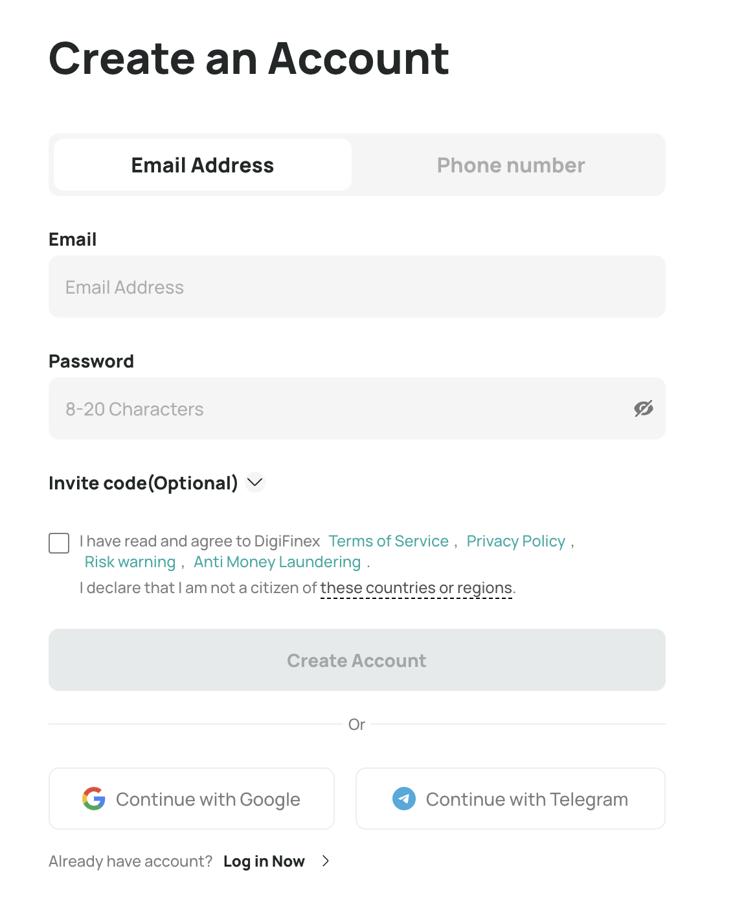
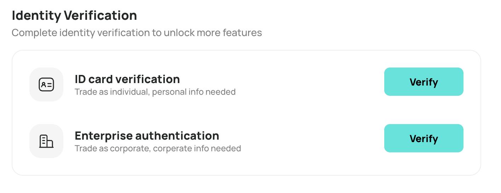
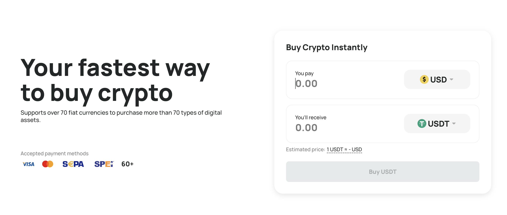
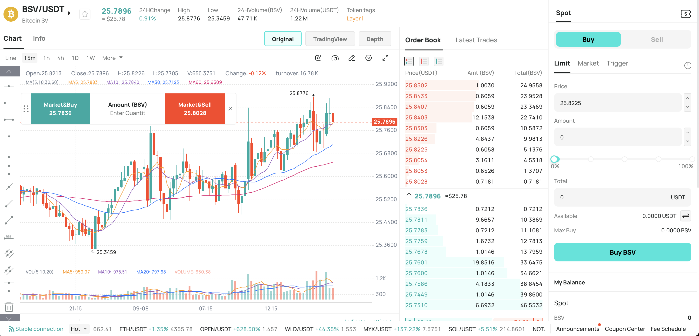
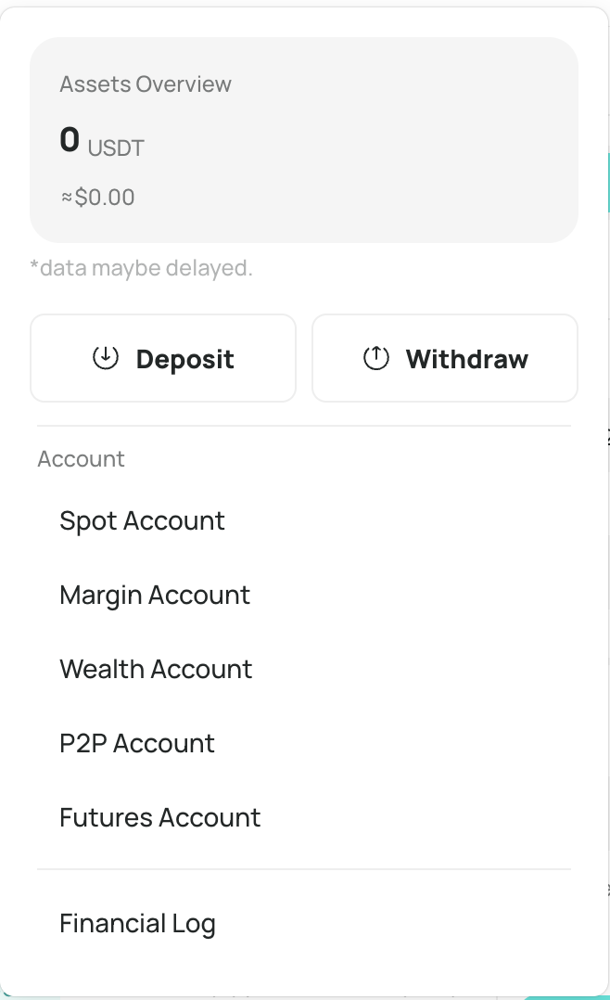

# ⚡ DigiFinex Exchange Onboarding Guide for BSV Tokens

**DigiFinex Exchange** ([digifinex.com](https://www.digifinex.com)) is a trusted global cryptocurrency platform offering secure, fast, and accessible trading services for over 700 digital assets, including Bitcoin SV (BSV).

---

## 🚀 What is DigiFinex Exchange?

DigiFinex provides users worldwide with a streamlined crypto trading experience backed by enterprise-grade security measures such as SSL encryption, multi-factor authentication, and cold wallet storage. It supports fiat deposits, margin trading, staking, and 24/7 multilingual customer assistance, making it an all-inclusive platform for crypto investors.

---

## 📝 How to Buy BSV on DigiFinex Exchange

### 1. Access DigiFinex Exchange

Go to [https://www.digifinex.com](https://www.digifinex.com).
Optionally, download the DigiFinex mobile app for iOS or Android for convenient trading anytime, anywhere.

---

### 2. Create an Account & Complete KYC

- Click **Register** on the website or app.
- Enter your **email address or phone number** and create a strong password.
- Complete the puzzle captcha and enter the verification code sent to your email or phone.
- Submit your registration form.
- Complete **KYC verification** by uploading your government-issued ID, selfie, and proof of address to unlock higher withdrawal limits and full trading features.

---

### 3. Deposit Funds

- Access the **Wallet** or **Assets** section.
- Choose to deposit fiat via bank transfer or credit/debit card (subject to availability).
- Alternatively, deposit stablecoins such as USDT or other cryptocurrencies for faster trading.

---

### 4. Buy BSV Tokens

- Go to the **Spot Market** or **Buy Crypto** section.
- Select **BSV** from the list of cryptocurrencies.
- Choose your payment method (crypto transfer, bank card, or other supported methods).
- Enter the amount of BSV you want to purchase and confirm the order.

---

### 5. Manage Your BSV

- Store your newly acquired BSV safely in your DigiFinex wallet.
- Trade BSV against other currencies, stake for rewards, or transfer to your external wallet for enhanced security.

---

## 🔒 Security and Support

DigiFinex uses multi-layer security, including two-factor authentication and real-time transaction alerts.
If you encounter any difficulties, DigiFinex provides 24/7 customer support accessible via the website and app.

---

## 🚀 Next Steps

You can now transfer your BSV to personal wallets for additional control and security.

- **Need a wallet?**
  👉 [Create your Metanet Desktop Wallet](../metanet-desktop-mainnet.md)

- **Want to learn how to transfer BSV to Metanet Desktop?**
  👉 [How to transfer BSV to Metanet Desktop](https://example.com) <!-- Replace with actual link later -->

---

DigiFinex makes it simple and secure to start your BSV journey.
For questions or community support, reach out to the BSV Blockchain Association.

---
