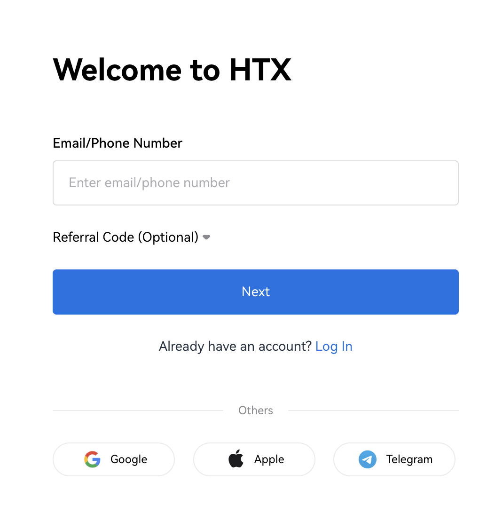
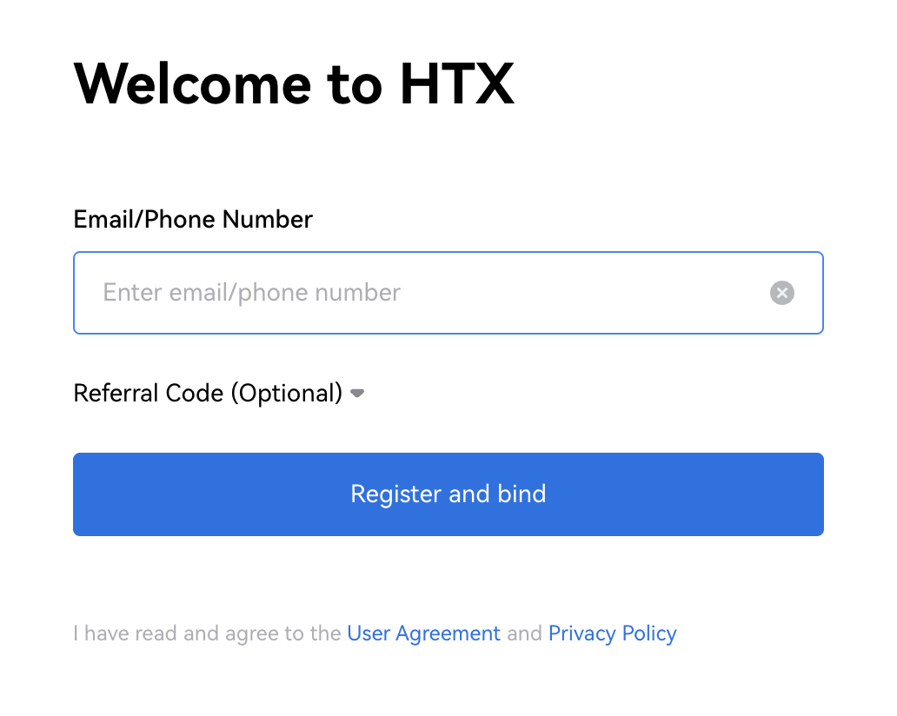
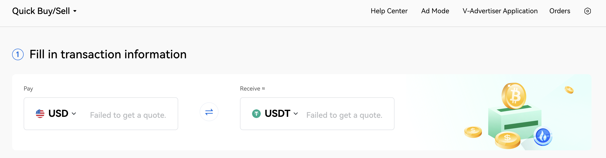
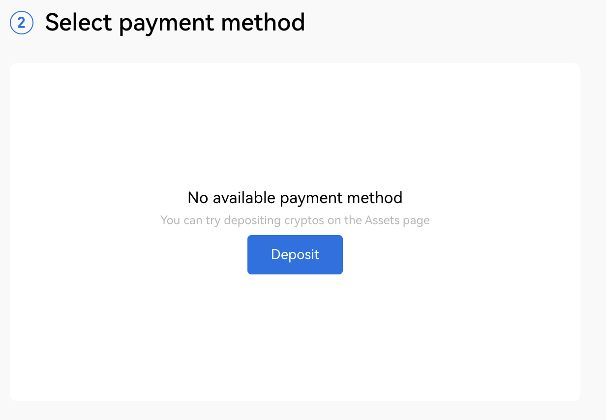
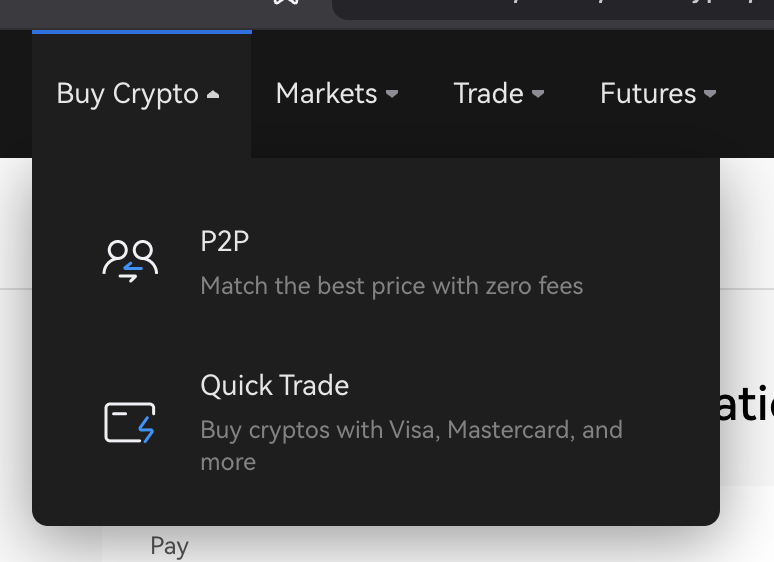
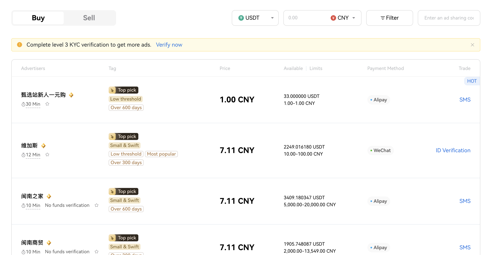
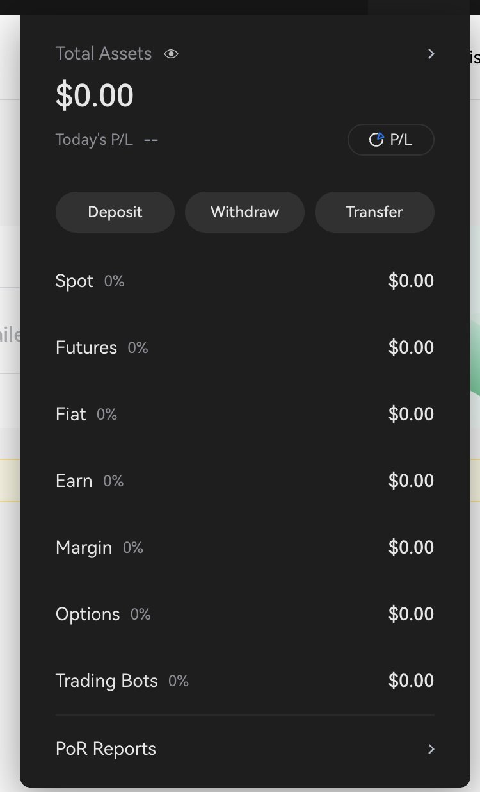

# ⚡ HTX Exchange Onboarding Guide for BSV Tokens

**HTX Exchange** ([htx.com](https://www.htx.com)) is a leading global cryptocurrency exchange offering a wide range of digital assets, including BSV (BSV). It provides a secure, fast, and user-friendly platform for buying, selling, and trading BSV tokens.

---

## 🚀 What is HTX Exchange?

HTX Exchange allows users worldwide to trade over 700 cryptocurrencies, including BSV. The platform offers secure storage options, multiple payment methods, and a comprehensive trading experience with spot, futures, and options trading. HTX ensures account safety with multi-factor authentication and a proof-of-reserves policy guaranteeing asset security.

---

## 📝 How to Buy BSV on HTX Exchange

### 1. Access HTX Exchange

Go to [https://www.htx.com](https://www.htx.com).
You can also download the HTX mobile app for iOS or Android for on-the-go trading.

---

### 2. Create an Account & Complete KYC

- Click **Sign Up** on the website or app.
- Register using your **email address or phone number**.
- Set a strong password and complete anti-bot verification.
- Verify your email or phone with the received code.
- Complete the **KYC verification** by submitting necessary identity documents to enable trading.

---

### 3. Deposit Funds

- Deposit fiat currency via credit/debit card or global bank transfer.
- Alternatively, deposit stablecoins like USDT for smoother trading operations.

---

### 4. Buy BSV Tokens

- Navigate to the **Buy Crypto** or **Spot Market** section on the platform.
- Select **BSV** as the cryptocurrency you want to purchase.
- Choose your payment method (credit/debit card, bank transfer, or P2P trading).
- Enter the amount of BSV to buy and confirm the purchase.

HTX also supports BSV P2P trading, enabling you to buy directly from other users with escrow protection.

---

### 5. Manage Your BSV

- Store your purchased BSV securely within your HTX exchange wallet.
- You can trade BSV against other cryptocurrencies, stake, or transfer to external wallets for additional security.

---

## 🔒 Security and Support

HTX employs multi-layer security features such as multi-factor authentication and real-time alerts for unusual account activity.
If you face any issues during your BSV purchase or trading, HTX offers 24/7 customer support through the website and app.

---

HTX Exchange makes acquiring and managing BSV simple and secure for both new and experienced users.

---

## 🚀 Next Steps

Now that you have BSV, you can transfer it to your wallet for secure storage and use.

- **Need a wallet?**
	👉 [Create your BSV Desktop Wallet](../metanet-desktop-mainnet.md)

- **Want to learn how to transfer BSV to BSV Desktop?**
	👉 [How to transfer BSV to BSV Desktop](../legacy-bridge.md) 

---

Orange Gateway makes it easy to start your journey with BSV Blockchain.
If you have questions or need help, reach out to the BSV Blockchain Association community.

---
