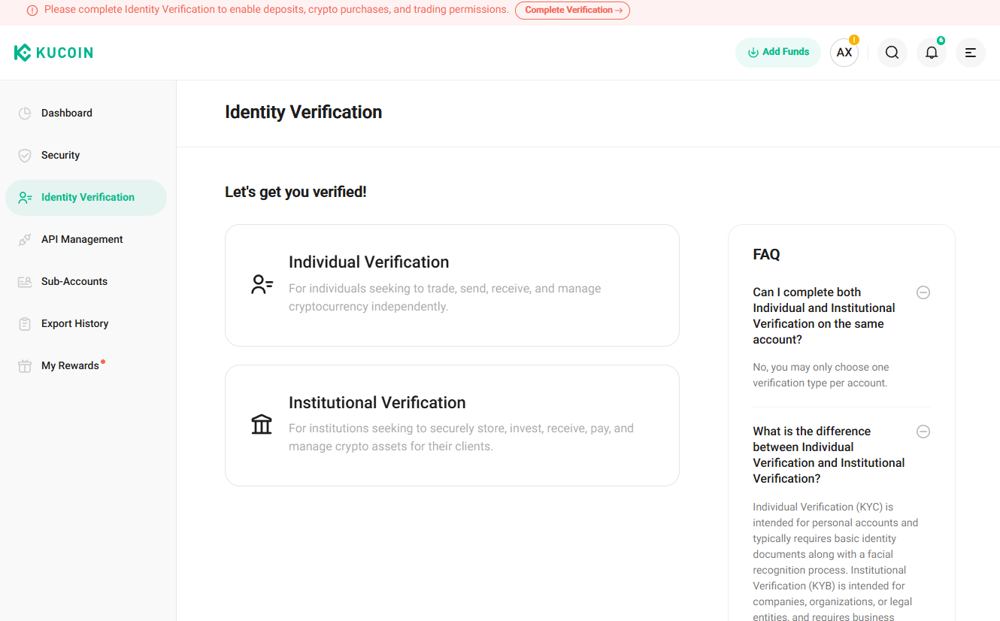
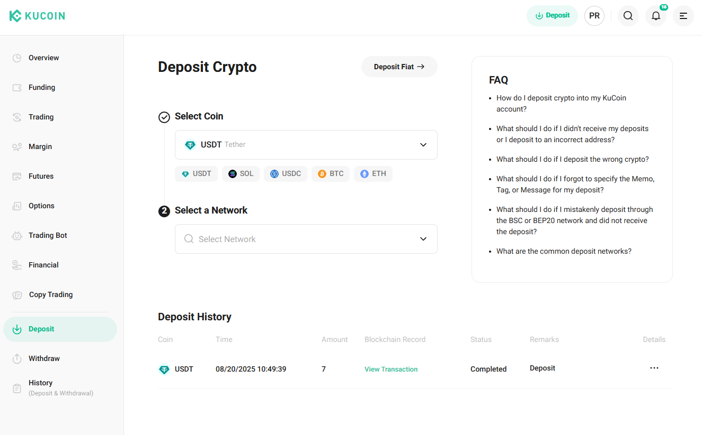
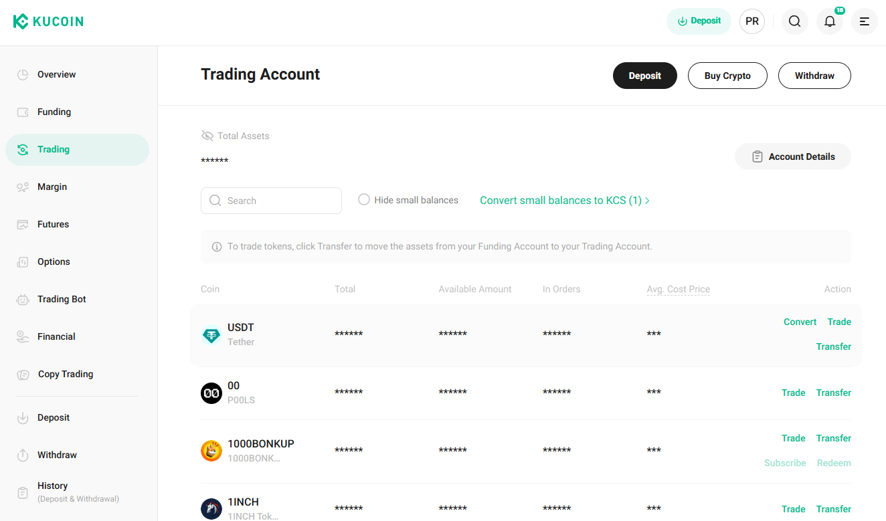
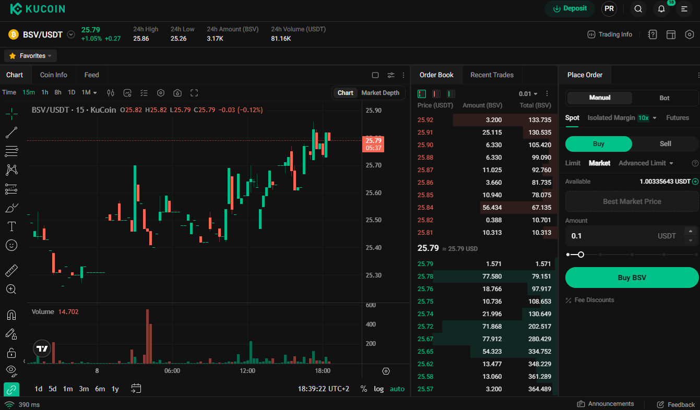
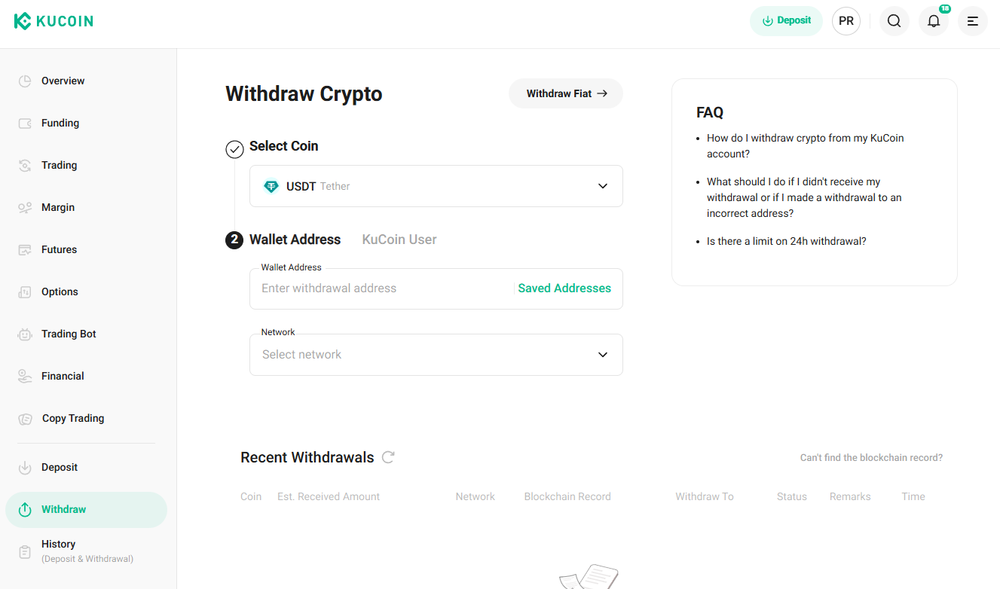

# 🏦 How to Buy BSV with Kucoin

Welcome to the Kucoin onboarding guide!
Kucoin is a global cryptocurrency exchange where you can buy, sell, and transfer BSV Blockchain tokens. This guide will walk you through every step—from creating your account to withdrawing BSV to your own wallet.

---

## 🌟 What is Kucoin?

**Kucoin** is a popular crypto exchange known for its wide range of coins, user-friendly interface, and strong security.
With Kucoin, you can:

- Buy BSV using USDT (Tether)
- Trade BSV on the spot market
- Withdraw BSV to your personal wallet

---

## 📝 Step-by-Step: Get BSV on Kucoin

---

### 1️⃣ Create Your Kucoin Account

Go to [Kucoin Sign Up](https://www.kucoin.com/ucenter/signin?backUrl=https%3A%2F%2Fwww.kucoin.com%2F) and register for a new account.

---

### 2️⃣ Complete KYC (Identity Verification)

After registration, you’ll need to verify your identity to unlock trading and withdrawals.

- Go to **Identity Verification** in your profile.
- Follow the steps: add MFA (mobile device), verify your email, and upload your ID document.

> **Tip:** KYC is required for most exchanges to comply with regulations and enable deposits/withdrawals.

---

### 3️⃣ Deposit Funds

Once verified, log in and click **Deposit** to add funds to your Kucoin account.

You can deposit:
- **Cryptocurrency** (e.g., USDT, BTC)
- **Fiat money** (e.g., EUR, USD)

Choose your preferred method, deposit the amount you want to use for buying BSV, and proceed.

---

### 4️⃣ Buy BSV on the Spot Market

#### 4.1 Transfer USDT to Trading Account

Kucoin uses the **Spot Market** for buying BSV.
Spot trading means buying or selling crypto at the current market price.

- First, transfer your deposited funds to your **Trading Account** ([Kucoin Trading Account](https://www.kucoin.com/assets/trade-account)).
- It’s recommended to use **USDT** (Tether), as BSV is traded against USDT (BSV/USDT pair).

> **Why USDT?**
> The BSV/USDT pair means you exchange USDT for BSV. For example, if 1 BSV = 10 USDT, buying 0.1 BSV costs 1 USDT.

---

#### 4.2 Exchange USDT for BSV

- Go to [Kucoin BSV/USDT Spot Market](https://www.kucoin.com/trade/BCHSV-USDT).
- Make sure you select **BSV/USDT** as the trading pair.

- On the right, select **Spot**, then **Buy**, and choose **Market** (to buy at the current price).
- Enter the amount of USDT you want to spend.
- Click **BUY** to complete your purchase.

> **Example:**
> If you want to buy 0.5 BSV and the price is 10 USDT per BSV, you’ll need 5 USDT.

---

#### 4.3 Check Your BSV Balance

Return to your [Trading Account](https://www.kucoin.com/assets/trade-account) to see your BSV balance.

---

### 5️⃣ Withdraw BSV to Your Wallet

To transfer BSV to your personal wallet:

- Go to your **Trading Account** and click **Withdraw**.
- Select **BSV** as the coin.
- Enter your BSV wallet address (double-check for accuracy!).

> **Important:**
> Always verify your wallet address before withdrawing. Sending to the wrong address may result in loss of funds.

---

## 🎯 Conclusion & Next Steps

Kucoin is a powerful exchange for buying and managing BSV, but it requires KYC and spot trading.
While it’s a bit more complex than some payment ramps, it offers flexibility and security for larger purchases.

> **Coming Soon:**
> A dedicated tutorial for withdrawing BSV directly to BSV Desktop, including how to generate your wallet address.

---

## 🔗 Useful Links

- **Create your wallet:** 👉 [BSV Desktop Guide](../metanet-desktop-mainnet.md)
- **Get BSV:** 👉 [Get BSV Guide](README.md)
- **Send/Receive Payments:** 👉 [Pay & Get Paid Guide](../pay-and-paid.md)
- **Withdraw to BSV Desktop:** 👉 [How to transfer BSV to BSV Desktop](../legacy-bridge.md) 

---

If you have questions or need help, reach out to the BSV Blockchain Association community.
Enjoy your BSV Blockchain journey with Kucoin!

---
