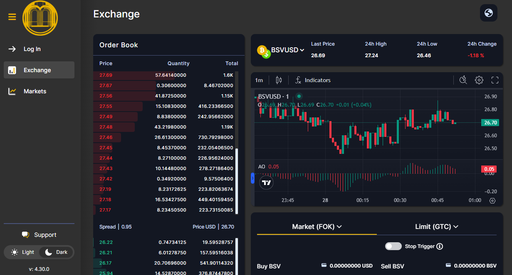
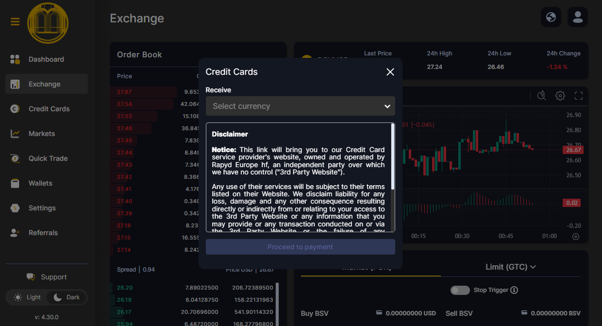

# 🍊 Orange Gateway

**Orange Gateway** ([exchange.orangegateway.com](https://exchange.orangegateway.com/)) is a user-friendly exchange where you can easily acquire BSV Blockchain currency.
It’s designed for simplicity, speed, and accessibility—making it a great choice for both new and experienced users.

---

## 🌟 What is Orange Gateway?

Orange Gateway is a digital asset exchange platform that allows you to buy, sell, and manage cryptocurrencies, including BSV Blockchain.
One of its standout features is the ability to purchase up to **100 euros per month** in BSV without identity verification (KYC), simply using your credit card. This makes onboarding fast and hassle-free.

---

## 📝 How to Buy BSV with Orange Gateway

### 1. Access Orange Gateway

Go to [exchange.orangegateway.com](https://exchange.orangegateway.com/).

You’ll see a homepage like this:

---

### 2. Create an Account & Login

Click **Login** and sign up using any of the available methods.
Once registered, log in to your account.

---

### 3. Buy BSV Without KYC

To use the payment ramp without KYC or personal data, click **Credit Cards** in the left sidebar.

You’ll see a screen like this:

---

- Select **BSV** as the currency you want to receive.
- Choose your payment currency (e.g., EUR, USD).
- Enter the amount of BSV you wish to buy (up to 100 euros/month without KYC).
- Click **Proceed to Payment**.

That’s it! You’ve acquired BSV quickly and easily.

---

## 🚀 Next Steps

Now that you have BSV, you can transfer it to your wallet for secure storage and use.

- **Need a wallet?**
	👉 [Create your BSV Desktop Wallet](../metanet-desktop-mainnet.md)

- **Want to learn how to transfer BSV to BSV Desktop?**
	👉 [How to transfer BSV to BSV Desktop](https://example.com) <!-- Replace with actual link later -->

---

Orange Gateway makes it easy to start your journey with BSV Blockchain.
If you have questions or need help, reach out to the BSV Blockchain Association community.

---
