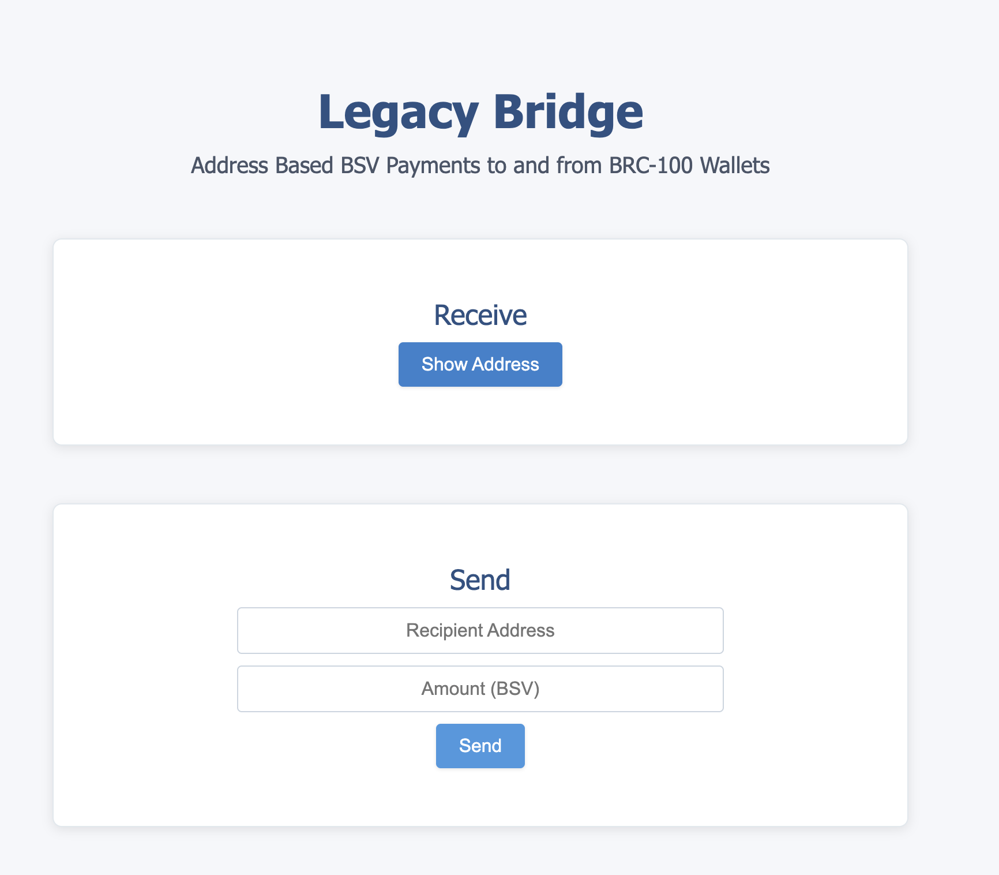
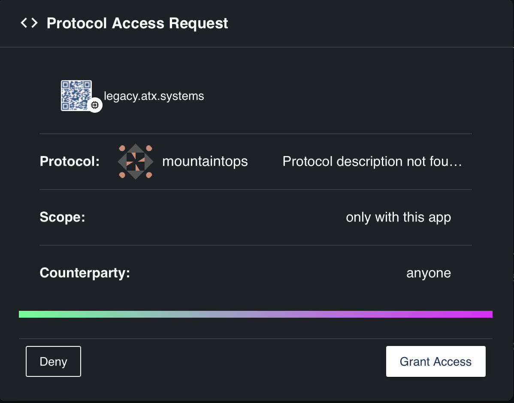
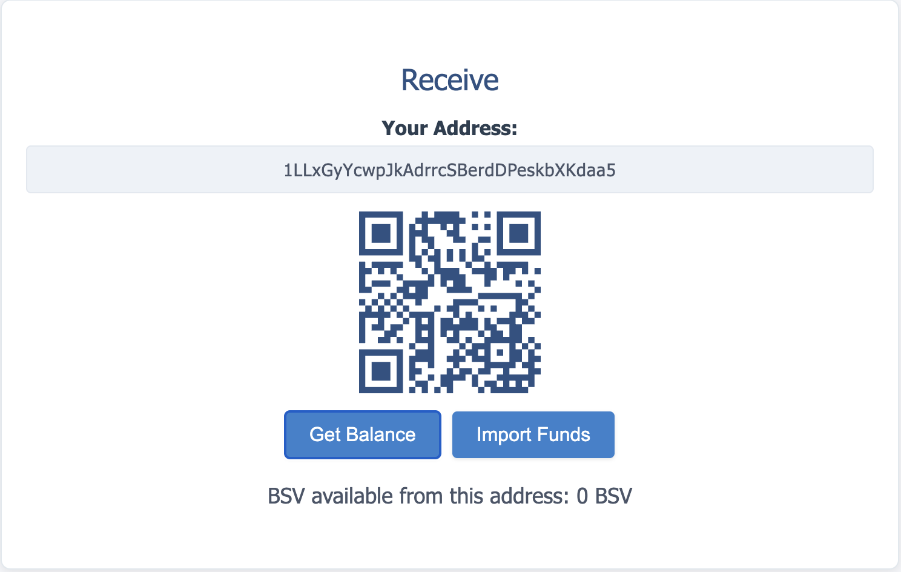
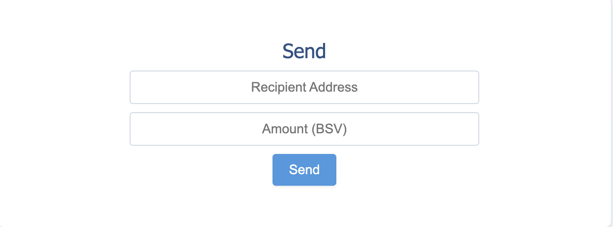
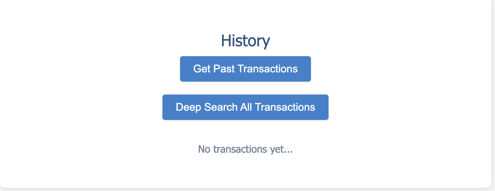

# 🔗 Legacy Bridge Onboarding Guide

**Status:** Production
**Last Updated:** September 2025
**Contact/Support:** BSV Blockchain Association Community

---

## 1. What Is Legacy Bridge?

Legacy Bridge is a BSV blockchain tool that enables seamless fund transfers between traditional cryptocurrency exchanges and modern BRC-100 wallets, specifically designed to work with Metanet Desktop wallets. The system acts as a conversion layer that bridges the compatibility gap between legacy address formats used by exchanges and modern BSV wallet standards.

**Key Features:**
- Legacy address-based BSV payments to and from BRC-100 wallets
- Exchange-to-wallet fund transfers without format conversion issues
- Core functionality including receiving funds, displaying addresses, sending transactions, and viewing transaction history
- Seamless integration with Metanet Desktop wallets

---

## 2. Before You Begin

### 2.1. Prerequisites

**Essential Requirements:**
- **Metanet Desktop Wallet** - Your BRC-100 compatible BSV wallet
- **Web browser** - Chrome, Firefox, Safari, or Edge
- **BSV funds on an exchange** - Funds in a traditional exchange like KuCoin, Kraken, or others
- **Internet connection** - Stable connection for blockchain transactions

### 2.2. Supported Platforms

- **Web-based** - Access through any modern web browser
- **Compatible with** - All operating systems (Windows, macOS, Linux)
- **Wallet Integration** - Works with Metanet Desktop and other BRC-100 wallets

### 2.3. Exchange Compatibility

Legacy Bridge works with traditional exchanges that use legacy address formats, including:
- KuCoin
- Kraken
- Digifinex
- Orange
- Htx
- Any other major BSV-supporting exchanges

---

## 3. Getting Started: Step-by-Step

### Step 1: Set Up Your Metanet Desktop Wallet

If you don't have a Metanet Desktop wallet yet:

1. **Download Metanet Desktop** from [https://metanet.bsvb.tech/](https://metanet.bsvb.tech/)
2. **Install and configure** your wallet following the setup wizard
3. **Secure your recovery keys** in a safe place
4. **Note your wallet's receiving address** for later use

👉 **Detailed Guide:** [Metanet Desktop Wallet Setup](./metanet-desktop-mainnet.md)

### Step 2: Access Legacy Bridge

1. **Visit the Legacy Bridge platform** at [https://legacy.atx.systems/](https://legacy.atx.systems/)

2. **Connect your Metanet Desktop wallet** when prompted

3. **Grant necessary permissions** for the application to interact with your wallet

### Step 3: Prepare Your Exchange Funds

**Before using Legacy Bridge, ensure you have:**
- BSV available in your exchange account
- Withdrawal permissions enabled on your exchange
- Sufficient funds to cover both the transfer amount and network fees

### Step 4: Generate Legacy Address

1. **In Legacy Bridge**, select "Receive Funds" or similar option
2. **Generate a legacy-compatible address** that your exchange can recognize
3. **Copy the generated legacy address** carefully
4. **Verify the address format** matches what your exchange expects

### Step 5: Initiate Exchange Withdrawal

1. **Log into your exchange account**
2. **Navigate to BSV withdrawal section**
3. **Paste the legacy address** generated by Legacy Bridge
4. **Enter the amount** you want to transfer
5. **Confirm the withdrawal** following your exchange's security procedures

### Step 6: Monitor the Transfer

1. **Return to Legacy Bridge** to monitor the incoming transaction
2. **Check transaction status** in the application dashboard
3. **Wait for blockchain confirmations** (typically 6 confirmations for security)
4. **Click import to send funds to you metanet wallet**
4. **Verify funds arrival** in your connected Metanet Desktop wallet

### Step 7: Send funds to a recipient wallet (Optional)

1. **Enter your adress in the Legacy Bridge**
2. **Enter the ammount to send** within your funds
3. **Send the funds to the wallet**

---

## 4. Advanced Features

### 4.1. Transaction History

- **View all transfers** made through Legacy Bridge
- **Export transaction records** for accounting purposes
- **Track confirmations** and transaction status in real-time

### 4.2. Multiple Exchange Support

- **Use different legacy addresses** for different exchanges
- **Manage multiple incoming transfers** simultaneously
- **Switch between mainnet and testnet** for testing purposes

### 4.3. BRC-100 Integration

Legacy Bridge leverages the **BRC-100 standard** features:
- **Payment Internalization with BRC-29** for standardized payment handling
- **BKDS Integration** for secure key derivation
- **SPV Verification** using BRC-67 for transaction validation

---

## 5. Security & Best Practices

### 5.1. Address Verification

- **Always double-check** the legacy address before withdrawing from exchanges
- **Use small test amounts** first to verify the process works correctly
- **Never share your private keys** or Privileged Identity Key

### 5.2. Transaction Safety

- **Verify network fees** before initiating transfers
- **Wait for full confirmations** before considering transactions complete
- **Keep records** of all transaction IDs for reference

### 5.3. Wallet Security

- **Keep Metanet Desktop updated** to the latest version
- **Secure your recovery keys** offline in multiple safe locations
- **Use strong authentication** methods when available

---

## 6. Troubleshooting & FAQs

### 6.1. Common Issues

| Problem | Cause | Solution |
|---------|-------|----------|
| Exchange rejects address | Legacy format not recognized | Regenerate address in Legacy Bridge |
| Funds not appearing | Insufficient confirmations | Wait for 6+ blockchain confirmations |
| Wallet connection fails | Browser compatibility | Try different browser or refresh |
| High fees | Network congestion | Wait for lower network traffic |

### 6.2. Support Channels

- **BSV Blockchain Association Community**
- **Legacy Bridge Documentation**
- **Metanet Desktop Support**
- **Exchange Customer Support** (for withdrawal issues)

---

## 7. Learn More / Next Steps

### 7.1. Enhanced BSV Experience

Now that you can transfer funds from exchanges to your modern BSV wallet:

- **Explore Metanet Apps** at [https://metanetapps.com/](https://metanetapps.com/)
- **Make peer-to-peer payments** using connected applications
- **Store and manage** your BSV securely in Metanet Desktop

### 7.2. Additional Resources

- **Business Guide:** Understanding BSV blockchain for business applications
- **Technical Guide:** Deep dive into BRC-100 standards and implementation
- **Community Resources:** Join BSV blockchain developer and user communities

### 7.3. Recommended Workflow

**Complete BSV Onboarding Stack:**
1. **Legacy Bridge** → Transfer funds from exchanges
2. **Metanet Desktop** → Secure wallet management
3. **PeerPay** → Send and receive payments
4. **Metanet Apps** → Explore blockchain applications

---

**Quick Links:**
[Metanet Desktop Guide](./metanet-desktop-mainnet.md) | [Get BSV Guide](./get-bsv/README.md) | [Pay & Get Paid Guide](./pay-and-paid.md) | [Home](../README.md)

---

*Legacy Bridge makes it easy to transition from traditional cryptocurrency exchanges to modern BSV blockchain applications. Start your journey today and unlock the full potential of BSV blockchain technology.*
