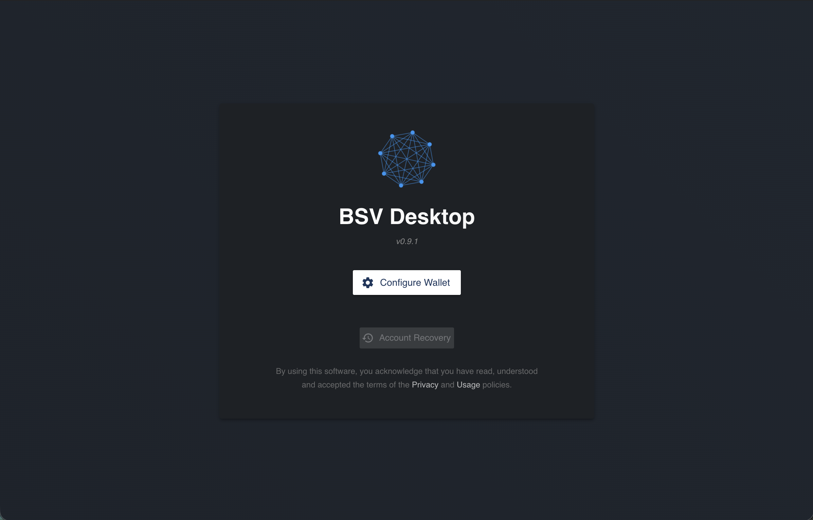
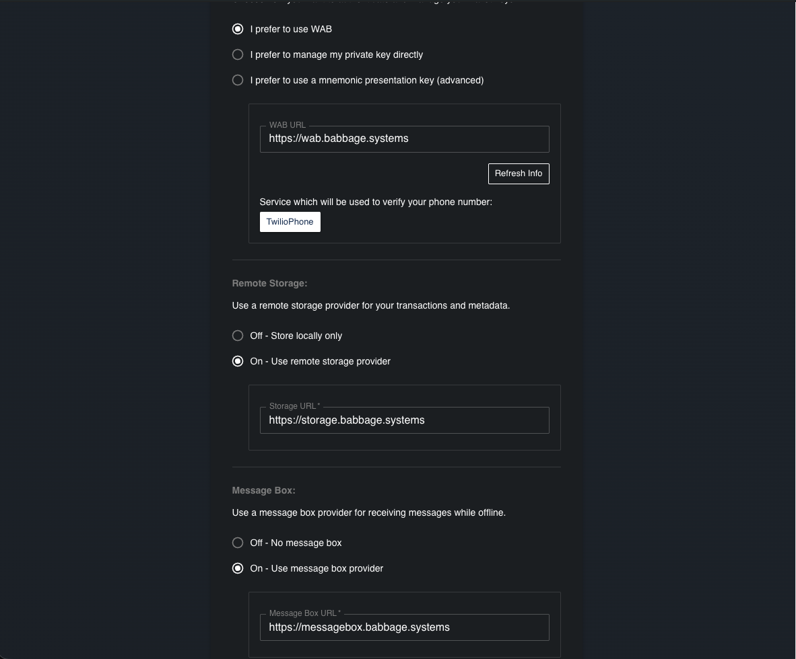
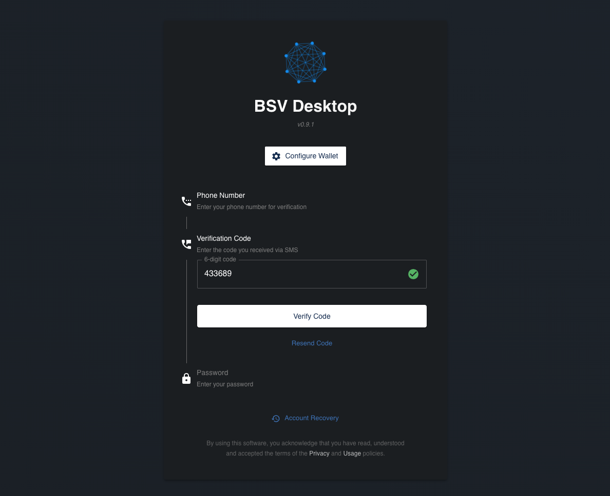
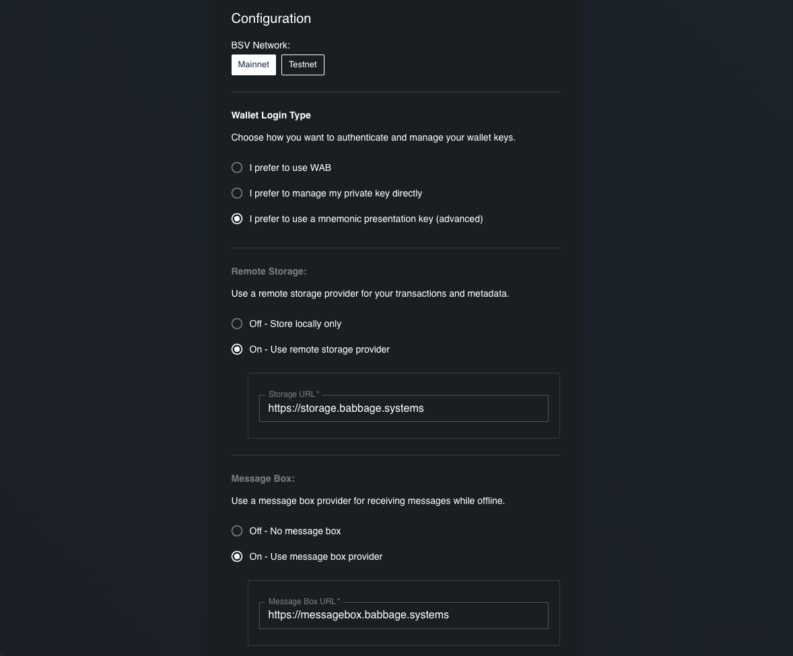
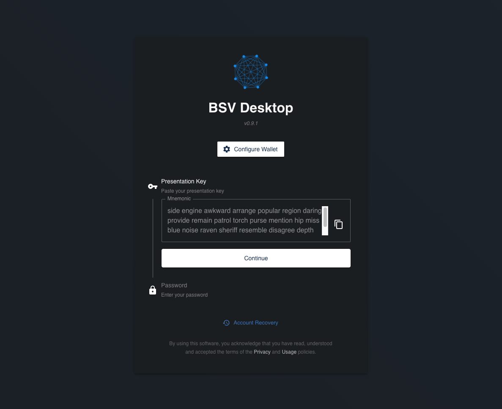
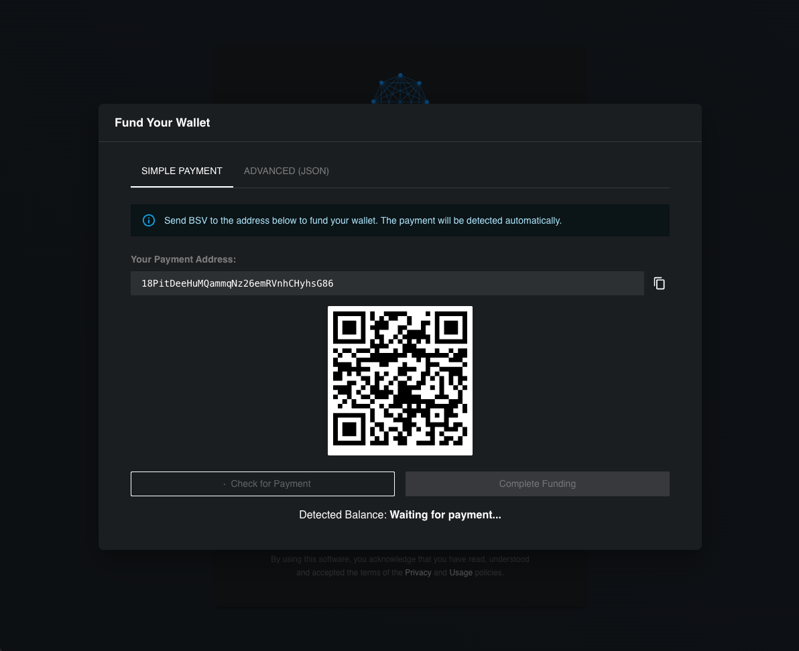

# 🪪 BSV Desktop Wallet

Welcome to your first step with BSV Blockchain: **BSV Desktop**!
BSV Desktop is a modern wallet designed to make your experience with BSV Blockchain simple, secure, and powerful—whether you’re a beginner or an advanced user.

---

## 🌐 What is BSV Desktop?

BSV Desktop is a wallet for BSV Blockchain, allowing you to manage your digital assets, explore blockchain applications, and interact with the BSV ecosystem.
It’s built for security, ease of use, and flexibility—making it the perfect starting point for anyone interested in BSV Blockchain.

- **Website:** [Download BSV Desktop](https://desktop.bsvb.tech/)

---

## 🖥️ System Requirements & Availability

BSV Desktop is available for:

- **Windows**
- **macOS**
- **Linux**

Before installing, make sure your system meets the basic requirements listed on the [official website](https://desktop.bsvb.tech/).

---

## 🎁 Key Benefits of BSV Desktop

🔒 Security & Recovery

BSV Desktop offers advanced security features, including optional phone-based recovery and multi-key backup. Your assets are protected, and you have multiple ways to recover your wallet if needed.

⚡ Instant Access

Get started in minutes! The setup is quick, and you receive a small amount of BSV (Satoshis) as a welcome gift to explore the blockchain.

🌍 Multi-Network Support

Easily switch between BSV Blockchain’s mainnet and testnet, perfect for both real transactions and experimentation.

🧩 App Integration

Connect with a growing catalog of blockchain applications directly from your wallet.

💡 User-Friendly Design

Intuitive interface designed for both new users and experienced developers.

---

## 🛠️ Installation Guide

1. **Go to the official website:**
	 [https://desktop.bsvb.tech/](https://desktop.bsvb.tech/)
2. **Download the version for your operating system.**
3. **Run the installer and follow the setup wizard.**
4. **Launch BSV Desktop.**

---

## 🚀 Configuration & Wallet Creation

When you launch BSV Desktop, you will be greeted by the initial verified start screen. This is your gateway to the Metanet.

To begin creating your wallet, click on **Configure Wallet**.

### Choose Your Wallet Type

BSV Desktop offers two distinct ways to create and manage your identity. Choose the one that fits your needs:

#### 1. WAB (Wallet Authentication Backend) - Recommended
*   **Easy Recovery:** Uses your phone number. If you lose your device, you can recover your wallet easily.
*   **Welcome Gift:** You receive a small amount of Satoshis to get started immediately.
*   **User Experience:** Streamlined and user-friendly.

#### 2. Mnemonic (Traditional)
*   **Self-Sovereign:** No phone number required.
*   **Manual Recovery:** You are solely responsible for your recovery phrase (12 words). If you lose it, your funds are lost forever.
*   **No Gift:** You must fund the wallet yourself before using it.

---

### Option A: WAB Setup (Recommended)

1.  **Configuration**:
    In the configuration screen, ensure the **Network** is set to `Mainnet` (or `Testnet` for development).
    
     
    
    *   **WAB Server**: Defines the identity provider. Default: `https://wab.babbage.systems`. Click **Refresh Info** to update server details.
    *   **Remote Storage**: Your wallet balance and history can be stored on a secure remote server (`https://storage.babbage.systems`) or locally. Remote is recommended for cross-device access.
    *   **Messagebox**: The communication hub for peer-to-peer transactions and token transfers. Default: `https://messagebox.babbage.systems`.

2.  **Verification**:
    After applying settings, click **Create new Identity**. You will be asked to enter your phone number.
    
    
    
    Enter the code received via SMS. Once verified, your wallet is ready and funded!

### Option B: Mnemonic Setup

1.  **Configuration**:
    Select **"I prefer to use a mnemonic presentation key"**.
    
    
    
    Click **Apply Configuration** to proceed.

2.  **Generate Key**:
    Click on **Generate Random Mnemonic**.
    
    
    
    > [!IMPORTANT]
    > **Write down your mnemonic phrase and store it safely.** This is the ONLY way to recover your wallet.

3.  **Confirm**:
    Verify you have saved your phrase.
    
    
    
    Click **Continue**.

4.  **Fund Your Wallet**:
    Unlike WAB, a mnemonic wallet starts empty. You will see a funding screen.
    
    
    
    You must send BSV to the displayed address to activate the wallet.
    Need BSV? Check our [Get BSV Guide](get-bsv/README.md).

---

## 🧩 Discover Metanet Apps

Unlock the full potential of your new wallet by exploring the Metanet ecosystem.

> [!TIP]
> **Browse the App Catalog**
> Visit **[MetanetApps.com](https://metanetapps.com/)** to find applications for social media, finance, storage, and more.

Your wallet is the key to logging in and interacting with all these applications seamlessly.

---

## 💡 Unlock the Power of BSV Blockchain

With BSV Desktop, you can:

- Make micropayments and transactions easily
- Verify and upload files and data securely
- Build and use apps for data integrity, traceability, and tokenization

Whether you’re a user or a developer, BSV Desktop opens the door to the full potential of BSV Blockchain.

---

## 💸 Need BSV?

Ready to get started?
👉 [Learn how to get BSV](get-bsv/README.md)

---

## 📚 More Resources

- [BSV Desktop Guide](metanet-desktop-mainnet.md)
- [Get BSV Guide](get-bsv/README.md)
- [Explore Metanet Apps](https://metanetapps.com/)

---

If you have questions or need help, reach out to the BSV Blockchain Association community.
Enjoy your journey with BSV Desktop and BSV Blockchain!

---
