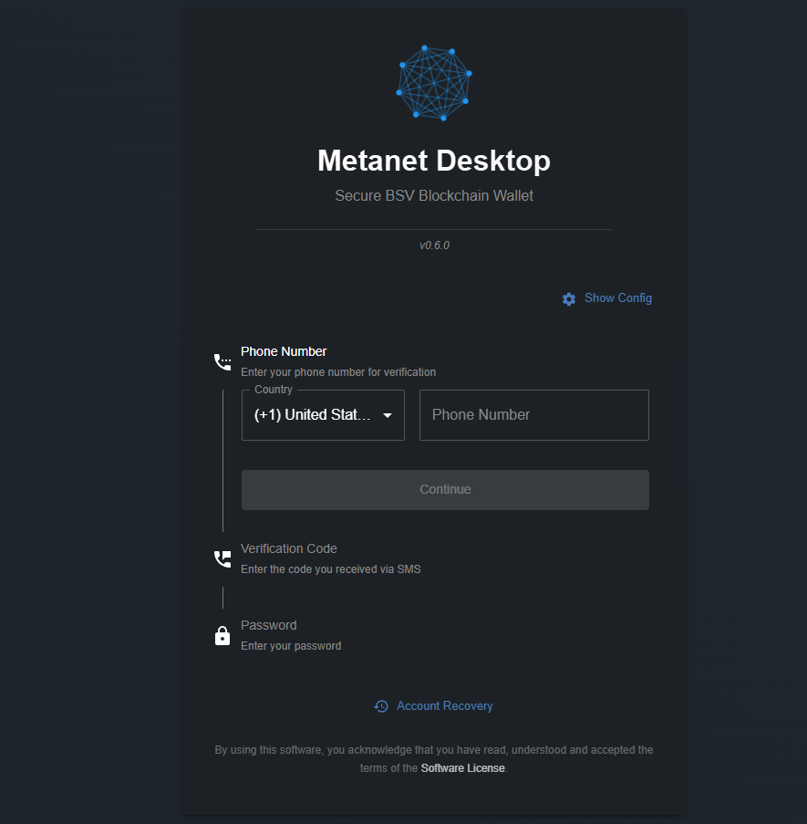
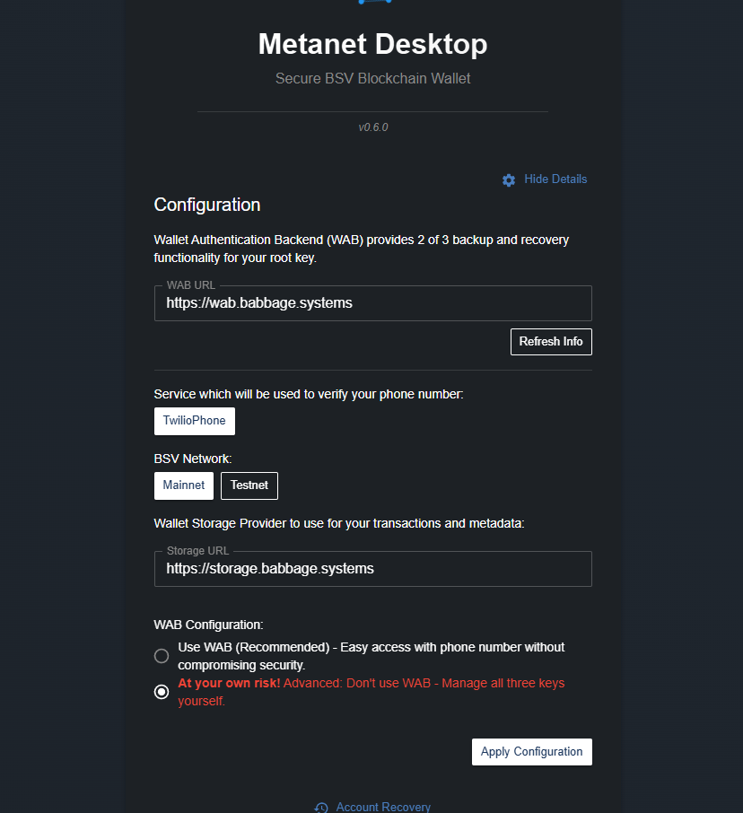
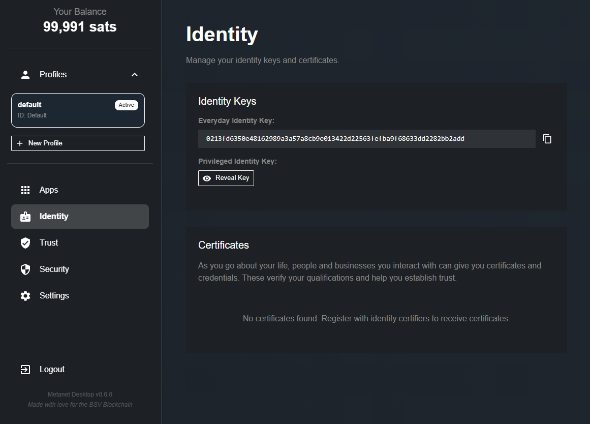

# 🪪 BSV Desktop Wallet

Welcome to your first step with BSV Blockchain: **BSV Desktop**!
BSV Desktop is a modern wallet designed to make your experience with BSV Blockchain simple, secure, and powerful—whether you’re a beginner or an advanced user.

---

## 🌐 What is BSV Desktop?

BSV Desktop is a wallet for BSV Blockchain, allowing you to manage your digital assets, explore blockchain applications, and interact with the BSV ecosystem.
It’s built for security, ease of use, and flexibility—making it the perfect starting point for anyone interested in BSV Blockchain.

- **Website:** [Download BSV Desktop](https://metanet.bsvb.tech/)

---

## 🖥️ System Requirements & Availability

BSV Desktop is available for:

- **Windows**
- **macOS**
- **Linux**

Before installing, make sure your system meets the basic requirements listed on the [official website](https://metanet.bsvb.tech/).

---

## 🎁 Key Benefits of BSV Desktop

🔒 Security & Recovery

BSV Desktop offers advanced security features, including optional phone-based recovery and multi-key backup. Your assets are protected, and you have multiple ways to recover your wallet if needed.

⚡ Instant Access

Get started in minutes! The setup is quick, and you receive a small amount of BSV (Satoshis) as a welcome gift to explore the blockchain.

🌍 Multi-Network Support

Easily switch between BSV Blockchain’s mainnet and testnet, perfect for both real transactions and experimentation.

🧩 App Integration

Connect with a growing catalog of blockchain applications directly from your wallet.

💡 User-Friendly Design

Intuitive interface designed for both new users and experienced developers.

---

## 🛠️ Installation Guide

1. **Go to the official website:**
	 [https://metanet.bsvb.tech/](https://metanet.bsvb.tech/)
2. **Download the version for your operating system.**
3. **Run the installer and follow the setup wizard.**
4. **Launch BSV Desktop.**

---

## 🚀 First Launch & Configuration

When you start BSV Desktop for the first time, you’ll see the initial verification screen:

- You’ll be asked for a phone number (optional but recommended for recovery).
- Before creating your wallet, click **Show Config** to review and customize your setup.

---

### ⚙️ Configuration Options

After clicking **Show Config**, you’ll see:

- **BSV Network:**
	Select **Mainnet** to use the real BSV Blockchain, or **Testnet** for testing.
- **WAB Configuration:**
	Choose whether to use your mobile phone for recovery.
	- **Recommended:** Use your phone for easier recovery.
	- **No phone:** You’ll need to securely store three private keys yourself.

---

## 🔑 Backup & Security

After configuration, you’ll be shown your recovery keys.
**Important:**
- Save your recovery key in a safe place.
- Never share your private keys with anyone.

---

## 🎉 Welcome to Your Wallet

Once setup is complete, you’ll see your wallet dashboard:

- **Your Balance:**
	You’ll receive 99,991 Satoshis as a welcome gift to start exploring BSV Blockchain.
- **Identity Tab:**
	Shows your unique Identity Key and Private Key (keep this confidential).
- **Apps Tab:**
	Here you’ll find applications registered to your wallet.
	(Check the next sections to start using your wallet with apps!)

---

## 🧩 Discover Metanet Apps

Explore the catalog of available applications:
[https://metanetapps.com/](https://metanetapps.com/)

Don’t worry—upcoming sections will guide you through your first app integrations!

---

## 💡 Unlock the Power of BSV Blockchain

With BSV Desktop, you can:

- Make micropayments and transactions easily
- Verify and upload files and data securely
- Build and use apps for data integrity, traceability, and tokenization

Whether you’re a user or a developer, BSV Desktop opens the door to the full potential of BSV Blockchain.

---

## 💸 Need BSV?

Ready to get started?
👉 [Learn how to get BSV](get-bsv/README.md)

---

## 📚 More Resources

- [BSV Desktop Guide](metanet-desktop-mainnet.md)
- [Get BSV Guide](get-bsv/README.md)
- [Explore Metanet Apps](https://metanetapps.com/)

---

If you have questions or need help, reach out to the BSV Blockchain Association community.
Enjoy your journey with BSV Desktop and BSV Blockchain!

---
