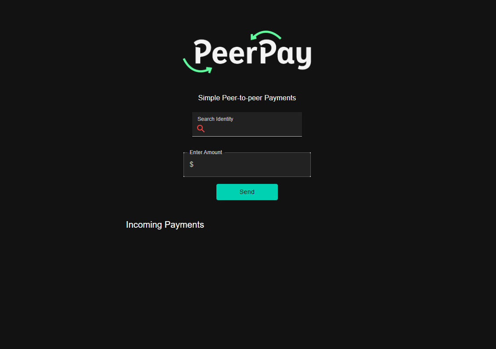
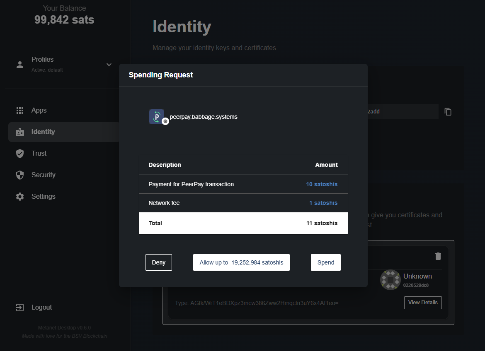
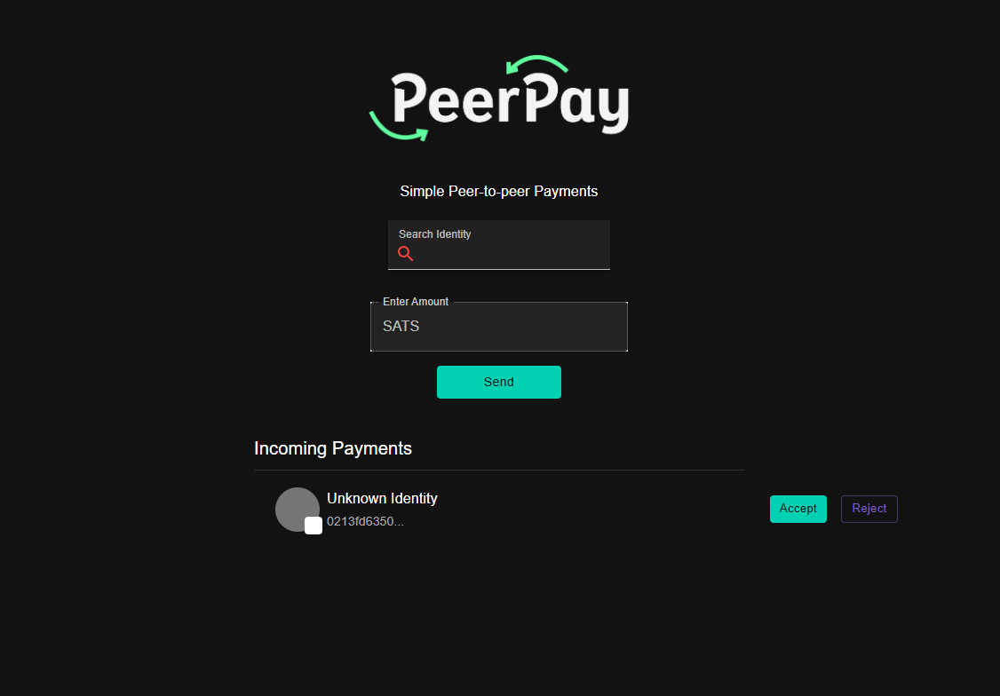

# 💸 Pay & Get Paid with BSV Desktop

Welcome to the guide for making and receiving payments using **BSV Desktop** and connected applications.
If you haven’t created your wallet yet, start here: 👉 [Create your BSV Desktop Wallet](../metanet-desktop-mainnet.md)
Need BSV to get started? 👉 [How to get BSV](get-bsv/README.md)

---

## 🏦 How Payments Work

BSV Desktop is your gateway to the BSV Blockchain ecosystem.
While the wallet itself is for managing your identity and applications, payments are made through connected apps like [PeerPay](https://peerpay.babbage.systems/).

---

## 🚀 Sending Payments

1. **Open BSV Desktop** and go to [PeerPay](https://peerpay.babbage.systems/).
    PeerPay will automatically detect your wallet.

    

2. **To send a payment, you need:**
    - The recipient’s **Identity Key** (public key)
    - The amount of BSV you want to send (check your balance in BSV Desktop)

3. **Enter the details and click `Send`.**

4. **Security Confirmation:**
    BSV Desktop will prompt you to confirm the transaction for security.

    

5. **Click `Send` in BSV Desktop to complete the payment.**

---

## 📨 Receiving Payments

1. **Share your Identity Key** (public key) with the sender.
    Find it in BSV Desktop under the **Identity** tab:

    

    > ⚠️ **Important:** Only share your Identity Key. Never share your Privileged Identity Key (private key).

2. **Check for incoming payments:**
    Go to [PeerPay](https://peerpay.babbage.systems/).
    Pending payments will be listed for you to accept.

    

3. **Click `Accept` to receive the payment.**
    Your balance will update in BSV Desktop.

---

## 🌐 More Applications

Explore more apps that work with BSV Desktop at [metanetapps.com](https://metanetapps.com/).

---

## 📝 Quick Links

- **Create your wallet:** 👉 [BSV Desktop Guide](../metanet-desktop-mainnet.md)
- **Get BSV:** 👉 [Get BSV Guide](get-bsv/README.md)

---

If you have questions or need help, reach out to the BSV Blockchain Association community.
Enjoy seamless payments with BSV Desktop and BSV Blockchain!

---

